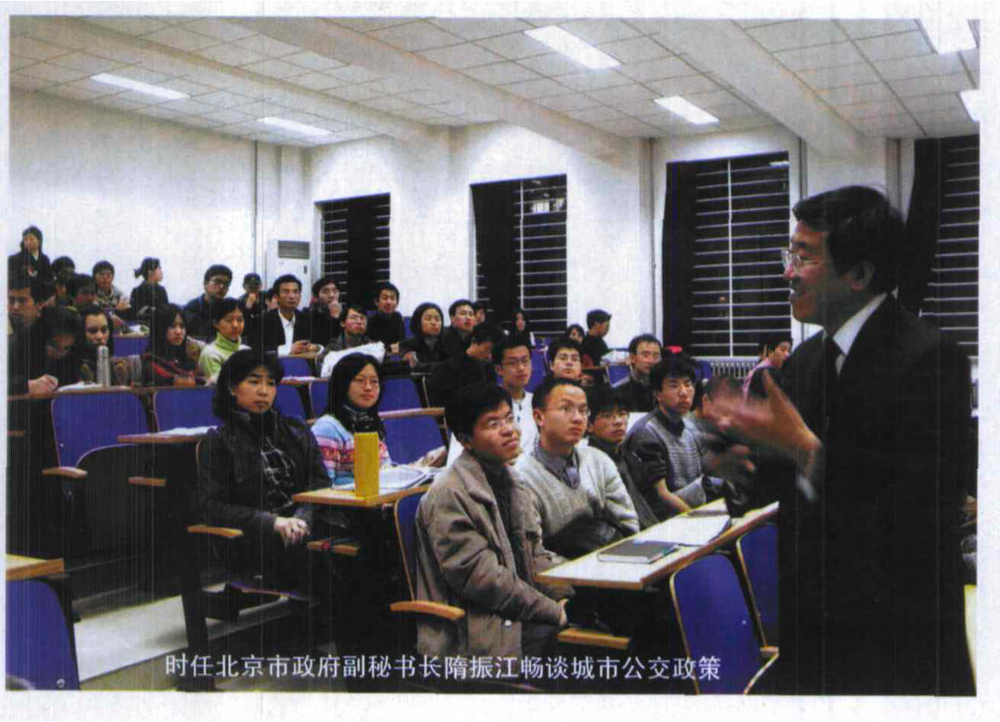

# 中国贝迩示范课程——在绿色MBA教学探索中“渐入佳境”

Published

March 1, 2006

**文／何钢　图／贾峰**

来自清华大学经管学院的研究生张昌华没有想到一个课程会如此大地改变他的人生道路。在2005年6月举办的第二届中国跨越式发展国际论坛暨第四届贝迩年会上，因为他和生物柴油研究小组的精彩研究报告而被河北正和生物能源有限公司邀请做总裁助理。再三思考之后，他决定自己成立一个环保咨询公司，开始了创业经历的“冒险”与体验。

作为课程的发起和设计者，每次聊起贝迩示范课程，贾峰（贝迩项目中国协调人）总是那么激动。最让他得意的是那些选课的学生，他们来自不同学校、不同专业领域，运用不同的专业术语，在贝迩课堂里，他们创新的思维和激扬的活力与教学互动，使授课者受益匪浅；同时，课程想要表达和传授的可持续发展理念已深深植入同学们的心田，而成果将会在这些中国未来的政治精英和商界领袖的工作实践中得以体现。

## 贝迩课程的落地与生根

2000年BELL项目进入中国以来，国家环保总局宣教中心的目标之一就是协助北大、清华、人大和复旦等大学管理学院开设绿色管理课程，将绿色内容渗透到企业管理、市场营销、会计和供应链等课程之中，但直到2004年还未有相对独立和完整的课程开发出来。2003年，国家环保总局宣教中心副主任贾峰到华盛顿大学公共政策学院学习，亲身体会了国外环境教学的全过程，老师的精彩授课和学生的积极互动以及丰富多彩的授课方式让他惊喜，也让他时时有“若我的同胞也有机会分享我的经历该有多好”的冲动，从那时起，贾峰就有了回国开一门课的想法。但是，选择什么样的主题以及采用什么样的教学模式还并不清晰。

继2002年夏季有11个省份拉闸限电之后，2003年春季中国能源供应短缺的信号更为强烈，与此同时环境污染与生态破坏的危机并未扭转。“没有一个国家像中国这样面临如此巨大的经济发展和保护环境的双重压力，既要保持连续20多年年均9%的经济增长速度，又要遏制环境恶化的趋势。”在这样的背景下，以风能、太阳能、生物质能为代表的可再生能源技术的市场化成为潜在的热点。因此，若能以风能发电等环境技术为主题开发一门课程，不仅有助于培养中国未来可持续发展方面的人才，而且可能为以上技术的市场化提供解决方案。

北京大学作为一所历史悠久的名校，不仅与时代紧密联系在一起，也在诸多方面走在时代前沿，尤其是文、理、商、工、医的综合优势和多学科背景，使其成为新思想的发源地。诸多方面的综合优势，让“环境技术的市场化”的第一站落户北大。

贾峰的设想很快得到了北京大学环境学院江家驷院长和张世秋教授的积极回应。江院长热情洋溢地致信贾峰：“环境问题是一个系统的问题，需要系统的思维方式和解决方案，相信你们的课程一定会是一个很好的探索。”他本人还多次到贝迩课程现场观摩。张教授本人是环境经济学领域的专家，对于环境问题的长期关注和思考也让她对课程非常感兴趣，并欣然与贾峰共同执教贝迩课程。事实上，这门课程以“绿色管理”的课程名称同步出现在2004年春季清华大学经管学院的选课目录中，有十几位清华的MBA选修了该课。

## 贝迩课程的成长与绽放

2004年2月13日，“环境技术的市场化”在北大开讲，其开放式的教学方式、教学主题与社会现实的紧密联系、教学内容的新颖和创新、选课学生专业背景的多元化，为专家学者、政府官员、工商企业和非政府组织代表、学生提供了一个平等、开放和多样化的交流平台，不仅赢得了众多学子的青睐，也获得了各界的广泛关注和好评。

世界资源研究所企业可持续发展部主任、BELL项目全球主管马克先生2003年两度来到中国，他认为贝迩示范课程很有创意，为选课学生提供了一个可以进行多维思考和开展环境创业的渠道，也使投资者和技术持有人对技术市场化的前景多了份信心。环境与可持续发展课程不应该仅限于环境管理及企业社会责任，应该拓展学科渠道，增强其多样性。只有这样，学生才能够在将来的企业经营活动中以可持续发展的眼光来看待和解决问题，来自社会和环境方面的挑战对企业而言不仅仅是压力和负担，更是进一步发展的机会，一个可持续发展的企业才是明天最有竞争力的企业。

在2004年的课程中，精选了太阳能利用、风力发电、生物柴油、燃气化、沼气应用、有机肥、有机食品、汽车共享、可持续交通等九项位居环境技术前沿、深具市场化潜能，且为全球环境界所称道，并已经引起了投资商关注的技术。

| 时间 | 主题 | 教师/专家 | 单位/职务或职称 | 地点 |
|----|----|----|----|----|
| 2月13日 | 课程介绍 | 贾峰 / 张世秋 | — | 哲学楼101 |
| 2月13日 | 我国沼气工程商业化发展和国家行动计划 | 顾树华 | 清华大学教授 | 哲学楼101 |
| 2月13日 | 太阳能风能在我国能源供应中的战略地位 | 李俊峰 | 国家发改委能源所研究员 | 哲学楼101 |
| 2月13日 | 生物柴油技术进展与产业前景 | 袁昊 | 石油大学（北京）副教授 | 哲学楼101 |
| 2月13日 | 生态肥的应用与农业面源污染防治 | 叶广涛 | 长江生物科技有限公司策略经理 | 哲学楼101 |
| 2月13日 | 有机食品介绍 | 陈丛红 | 北京天地生有机食品有限公司总经理 | 哲学楼101 |
| 2月13日 | 公交优先系统在中国的实践 | 何东全 | 美国能源基金会北京代表处交通项目主管 | 哲学楼101 |
| 2月20日 | 机遇与挑战：环境问题及其社会响应 | 张世秋 | — | 同上 |
| 2月20日 | Flexcar，能借到为什么还要买？ | 贾峰 | — | 同上 |
| 2月27日 | 环境法与企业可持续发展 | 贾峰 | — | 同上 |
| 2月27日 | 关于建立中国超级基金机制的设想 | 齐东平 | 中国人民大学商学院教授 | 同上 |
| 3月5日 | 环境绩效推动企业持续发展的内在机制 | 杨东宁 | 北京大学光华管理学院 | 同上 |
| 3月5日 | 国际环境公约履行与中国企业创业机会 | 宋小智 | 国家环保总局对外合作中心副主任 | 同上 |
| 3月5日 | 学生研究小组研究计划介绍 | 各小组代表 | 作业和小组研究计划提交 | 同上 |
| 3月12日 | 可持续能源：企业案例与策略 | 伊文 | 壳牌中国公共事务部经理 | 同上 |
| 3月12日 | 京都议定书与技术的应用 | 徐海龙 | 壳牌中国燃气化业务开发经理 | 同上 |
| 3月12日 | 环境会计与审计 | 王立彦 | 北京大学光华管理学院教授 | 同上 |
| 3月12日 | 生态农业与中国农业的未来 | 傅企平 | 联合国环境全球500佳—浙江滕头村党支部书记、全国人大代表 | 同上 |
| 3月19日 | 经济发展模式的变革 | 林自新 | 中国科协自然科学和社会科学联盟委员会委员，科技部前秘书长、科技日报社社长 | 同上 |
| 3月19日 | 企业环境健康与安全 | 方爱伦 | 通用电气国际公司亚洲环境健康安全项目总监 | 同上 |
| 3月19日 | 北京交通面临的挑战与机遇 | 隋振江 / 刘晓明 | 北京市政府副秘书长 / 北京市交通委员会副主任 | 同上 |
| 3月22日 晚6:30–8:30 | 东西方环境对话：人类文明与可持续发展 | 曲格平 | 中国全国人大常委会环境资源委员会前主任委员、中华环保基金会理事长 | 北京图书馆北配楼报告厅 |
| 3月22日 晚6:30–8:30 | 东西方环境对话：人类文明与可持续发展 | 莫里斯·斯特朗 | 联合国秘书长特别顾问兼加拿大华校长、世界银行行长高级顾问、国际金融论坛大会主席 | 北京图书馆北配楼报告厅 |
| 4月2日 | 学生研究小组首次讲演 | 贾峰、张世秋 | — | 哲学楼101 |
| 4月9日 | 绿色供应链管理与案例物流 | 宋华 | 中国人民大学商学院教授 | 同上 |
| 4月9日 | 可持续发展与企业创新首次讲演评估和讲演技巧 | 贾峰、张世秋 | — | 同上 |
| 4月10日 | 国民营生态农业、有机食品和沼气应用实地考察 | 江建 / 戈爱晶 | 课程助教 | 留民营 |
| 4月16日 | 环境经济政策与环境管理制度 | 张世秋 | — | 哲学楼101 |
| 4月23日 | 绿色贸易壁垒，中国入世后的双刃剑 | 叶汝求 | 国家环境保护总局前副局长、国务院参事、教授 | 同上 |
| 4月23日 | 环境技术推广：格林科尔的经验与教训 | 胡晓晖 | 格林克尔总裁 | 同上 |
| 4月30日 | 环境新闻检索与资料收集 | 贾峰 | — | 自定 |
| 4月30日 | 学生研究小组讨论 | — | — | 自定 |
| 5月7日 | 绿色建筑的市场前景分析 | 罗伯特·瓦特申 | 自然资源保护委员会国际能源项目主任 | 哲学楼101 |
| 5月7日 | 环境公共政策与环境技术的市场化 | 贾峰 | — | 哲学楼101 |
| 5月14日 | 各研究小组集中答疑和指导 | 贾峰、张世秋 | — | 同上 |
| 5月21日 | 学生研究小组第二次讲演 | 贾峰、张世秋 | — | 同上 |
| 5月29–30日 | 第四中国跨越式发展国际环境论坛暨学生研究小组第三次演讲 | — | — | 北京大学英杰交流中心 |

2004年度贝迩绿色示范课程“环境技术的市场化”课表 {.table-striped .caption-top .table}

在2005年新一届贝迩课程中，又增加了排污权交易、清洁发展机制等一些发达国家和国际社会比较成熟的环境管理手段和工具，探讨如何借助市场的手段在中国推广。

贝迩课程的特色是定期邀请来自政府、企业、非政府组织的杰出代表前来演讲或讲座，他们与同学们分享了自己长期研究成果或实践经验。正是这样大信息量的环保一线人员的参与，大大丰富了课程的含金量，也极大地扩展了同学们的视野和思路。

时任北京市政府副秘书长隋振江在贝迩课堂上畅谈城市公交政策，摄影：贾峰

贝迩课程还为每个课题小组选聘了该领域最好的专家作为研究顾问，同学们在研究过程中有任何问题都可以与顾问联系随时请教。对国内尚无相关研究的课题小组，授课教师专门联系了华盛顿大学参与西雅图汽车共享项目的美国同学组成跨太平洋交流小组。

而通过综合评定选择优秀的小组与参加“中国跨越式发展环境论坛”的国内外专家同台演讲，是北京大学“环境技术的市场化”贝迩绿色示范课程的延伸，也是选课同学展示研究成果的舞台。一门课程，用国际论坛来展示学生的才华，让学生们着实过了一把瘾。

## 贝迩课程的创新与魅力

对于怎样开好这样一个课程，其实在刚开始也没有确定性的规划和蓝图，但是通过在开课的过程中不断摸索，不断有“让人惊喜的东西出现”。张世秋教授说：“我们最初选择这九项技术，并没有奢望他们做得很好，只是希望通过团队的工作，培养学生的团队意识和团队协作的能力；但事实上，他们做得非常棒，大大超过了我们的预期。”对于这一点，贾峰授课后感慨道，“这首先让你感觉到做老师的乐趣，当然也有很大的压力。在课程即将结束时，面对同学们提交的研究报告，我时常有落伍的感觉。因为他们的研究已经突破了我的知识存储，我不得不去追赶年青人。”

环境问题以其变化性、复杂性、不确定性和冲突性的特点必然要求系统的思维方式，从环境保护的历史来看，公众环境意识的觉醒是环境保护的最直接和深刻的推动力，而政府、企业、市场也成为环境保护的三大支柱，这就意味着环境保护的历史进程需要多方参与共同推进。这也正是课程的立足点之一。

正是这样一个开放的课程，吸引了许多优秀的学生前来选课。据了解，选课的同学来自北京大学、清华大学、中国人民大学、北京林业大学、中国农业大学、中国石油大学、中国科学院等，还有外地学校如浙江大学的学生，涵盖环境、经济、管理、法律、公共政策等十几个专业，从本科到博士等在校生，也包括一些环保NGO和企业的人员，还有前来取经的其他高校的老师。贝迩课程就像一个磁场，把关注环保的思考者和行动者都吸引了过来；贝迩课程也像一个熔炉，寻找高品位铁矿，汇入各家才学催化，点燃学员热情燃烧，锻造环保新人。

## MBA绿色品牌共享贝迩未来

当然，学生们是贝迩课程的最大和最直接的受益者，他们是大陆第一批获得贝迩证书的幸运儿，更重要的通过这样一个整合的平台，学员们在“视野、综合能力和素质”等方面都得到了全面的提升；前沿定位和高端接触也赋予了学生方向感与责任感。戈爱晶是北大环境学院的硕士研究生，也是第一届贝迩课程的助教，在领到贝迩证书时喜不自禁，非常自豪地说：“选择贝迩，也是接受挑战，而在享受这个过程中，收获成长的乐趣，我喜欢这样的过程。”现在在联合利华工作的她回忆起贝迩来，仍然感慨万千。

而每一个走过贝迩的学员都有自己深刻的体验和感受。“开阔了眼界，学到了知识，交到了朋友。”“这是一个开放的课程。只要自己去争取，就可以获得很多。”课程最小的学员、北京大学光华管理学院的周天同学，也分享“贝迩的日子是快乐和充实的，渗透了贝迩精神的今天、明天也会是美好的。”

贝迩课程从开设到现在，已经走过两年时光，在摸索中渐露头角，在关注中前进，在前进中完善。我们希望会有更多像张昌华这样的学生成长起来，他们将是具有良好环境意识和扎实知识的一代青年，并将在未来的社会实践中引导中国社会走上可持续发展之路。

多方参与、文明对话、国际论坛、研究实践构成了贝迩课程的关键词，也打造了贝迩课程的品牌。第一届贝迩绿色课程的主要成果已经于2005年六五世界环境日出版。在这本名为《环境技术市场化——北京大学贝迩绿色示范课程成果汇编》的蓝色封面小书里，汇集了第一届贝迩课程的探索和思考。“意在透过环境技术市场化这个题目来调整高等教育人才培养和社会实践锻炼之间的供求关系，培育具备可持续发展思想、掌握相关知识和技能的复合型人才。”书的出版见证了课程在这条路上的前进步伐。
