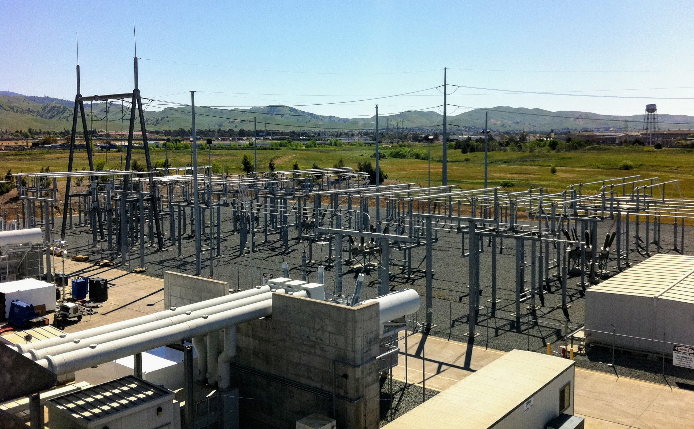

# Gang He, PhD

Associate Professor  
Marxe School of Public and International Affairs  
Baruch College  
City University of New York  
Email: gang.he@baruch.cuny.edu

[ DeepPolicyLab](https://deeppolicylab.github.io) [ CUNYprofile](https://www.baruch.cuny.edu/profiles/faculty/Gang-He) [ LinkedIn](https://linkedin.com/in/hegang) [ YouTube](https://www.youtube.com/@DrGangHe) [ ORCID](https://orcid.org/0000-0002-8416-1965) [ Web of Science](https://www.webofscience.com/wos/author/record/N-4549-2013) [ Scopus](https://www.scopus.com/authid/detail.uri?authorId=55607981900) [ Semantic Scholar](https://www.semanticscholar.org/author/Gang-He/49430802) [ Dimensions](https://app.dimensions.ai/details/entities/publication/author/ur.013573776475.50) [ Google Scholar](https://scholar.google.com/citations?user=vf90AuEAAAAJ) [ Research Gate](https://www.researchgate.net/profile/Gang-He-19)

Gang He is an energy scholar, researcher, and teacher whose research focuses on the intersection of energy systems, climate policy, and sustainable development. He is an Associate Professor at the [Marxe School of Public and International Affairs](https://marxe.baruch.cuny.edu/homepage/our-community/faculty-and-staff/full-time-faculty/), Baruch College, City University of New York (CUNY). He also serves as Doctoral Faculty in [Earth and Environmental Sciences](https://www.gc.cuny.edu/people/gang-he) at the CUNY Graduate Center, and is a Faculty Affiliate at the [CUNY Institute for Demographic Research](https://www.cuny.edu/about/centers-and-institutes/demographic-research/). He is the founder and director of the [Deep Energy and Climate Policy Lab](https://deeppolicylab.github.io), aiming at deep analysis and deep insights for deep decarbonization.

He teaches [Energy, Climate, and Society](https://drganghe.github.io/energy-climate-society/) at the undergraduate level, and [Energy and Climate Policy](https://drganghe.github.io/energy-climate-policy/) and [Program Evaluation](https://drganghe.github.io/program-evaluation/) at the graduate level. He organizes the [Climate Guest Speakers](https://drganghe.github.io/climate-guest-speakers/) series which brings in experts and professionals to talk about climate challenges and solutions to inspire the next generation of climate leaders.

His research explores how the world can achieve carbon neutrality by mid-century to address climate change—and how the clean energy transition can be made more sustainable, resilient, and equitable. His leading and collaborative [work](posts.llms.md#category=paper) has appeared in high-impact interdisciplinary and field journals such as [*Nature*](posts/2022-10-nature-cost-savings-of-global-solar-pv-value-chains/index.llms.md), [*Nature Communications*](posts/2020-05-ncomms-rapid-re-cost/index.llms.md), [*Nature Energy*](posts/2023-07-nenergy-climate-change-impacts-supply-demand-match/index.llms.md), [*Nature Water*](posts/2023-08-naturewater-global-assessment-of-the-carbon-water-tradeoff-of-dry-cooling/index.llms.md), [*One Earth*](posts/2020-08-oneearth-coal-just-transition/index.llms.md), [*Environmental Science & Technology*](posts/2016-est-switch-china/index.llms.md), and [*Energy Policy*](posts/2013-ep-carbon-offsetters-paradox/index.llms.md).

His research has been [supported](https://deeppolicylab.github.io/projects.html) by a diverse range of sources, including federal and state agencies, NGOs, foundations, and industry partners. His work has been [reported](media.llms.md) by leading outlets such as *Nature*, *The Economist*, *The New York Times*, *Scientific American*, *Carbon Brief*, *National Geographic*, and *E&E News*.

His work has informed policy discussions and processes. His research findings have been [cited](notable-policy-citations.llms.md) in notable reports by global institutions such as the IPCC (AR6), IIASA, World Bank, UNEP, IRENA, WTO, SEI, IISD, CSIS, and Brookings. He testified for the [New York State Climate Leadership and Community Protection Act](posts/2019-nyclcpa-testimony/index.llms.md) and has advised the New York State Climate Action Council’s [Scoping Plan](posts/2021-12-nysclcpa-scoping-plan-draft/index.llms.md). He has also been involved in the [U.S.-China collaboration on energy and climate change](posts/2024-06-us-china-working-group-on-enhancing-climate-action/index.llms.md) as an expert member in the energy transition sub-working group of the U.S.-China Working Group on Enhancing Climate Action in the 2020s.

He has been selected as Asia 21 Young Leaders (2007), Aspen Environment Forum Scholars (2011), Young Scholar of the Institute for New Economic Thinking (2013), [ITIF Energy Innovation Policy and Management Scholar](https://itif.org/events/2019/05/19/2019-itif-energy-innovation-boot-camp-for-early-career-scholars/) (2019), [Public Intellectuals Program Fellow](https://www.ncuscr.org/twenty-leading-china-specialists-selected-for-ninth-round-of-public-intellectuals-program/) (2025) of the National Committee on US-China Relations, and recognized as [World’s Top 2% Scientists](posts/stanford-elsevier-top-2percent-scientists/index.llms.md) (2024, 2025) on the Stanford/Elsevier Top 2% Scientists List.

He has worked for the [Department of Technology and Society](https://www.stonybrook.edu/commcms/est/faculty/affiliated-faculty/GangHe) at Stony Brook University, the [Energy Technology Area](https://eta.lbl.gov/people/gang-he) at Lawrence Berkeley National Laboratory, and the [Program on Energy and Sustainable Development](https://pesd.fsi.stanford.edu/people/Gang_He) at Stanford University. He received his Ph.D. in [Energy and Resources](https://erg.berkeley.edu/people/gang-he/) from University of California, Berkeley. He also holds an M.A. in Climate and Society from Columbia University, and a B.S. and M.S. in Geography from Peking University.

## Recent Posts

Check out the latest  [Papers](posts.llms.md#category=paper) ,  [News](posts.llms.md#category=news) ,  [Events](posts.llms.md#category=event) , and  [More »](posts.llms.md)

##### Renewable integration and AI demand reshaped power grids in 2025

*Nature Reviews Clean Technology*

Jan 20, 2026

##### New Grant to Study the Drivers and Impacts of Domestic Clean Energy Manufacturing

Dec 17, 2025

##### 17 Lex Society Feature Story: Research That Powers Change

Dec 16, 2025

[All Posts »](posts.llms.md)
