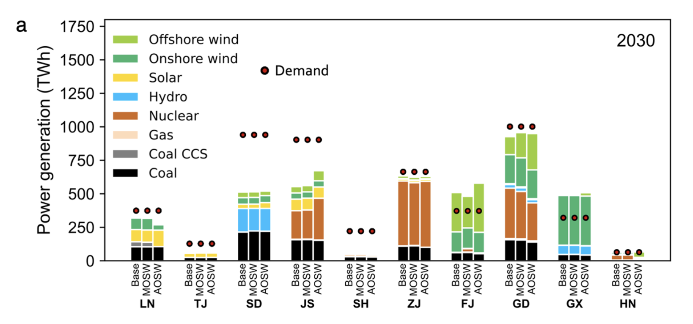

# Gang He

Associate Professor  
Marxe School of Public and International Affairs  
Baruch College  
City University of New York  
Email: gang.he@baruch.cuny.edu

Gang He

Associate Professor of Energy and Climate Policy  
Marxe School of Public and International Affairs  
Baruch College  
City University of New York  
Email: gang.he@baruch.cuny.edu

[Full Bio](bio.llms.md)

       

Recent Posts

##### Receiving the Sandi Cooper Award for Outstanding Research for Associate Professors

May 21, 2026

##### Fourth Annual Conference on Climate Research, Teaching, and Collaboration

Apr 15, 2026

##### Brown China Summit Renewable Energy Panel

Mar 14, 2026

[More posts](posts.llms.md)

Latest Papers

##### Aligning offshore wind deployment with local priorities to accelerate power system decarbonization

Apr 21, 2026

##### Renewable integration and AI demand reshaped power grids in 2025

Jan 20, 2026

##### Imported solar photovoltaics contributed to health and climate benefits in the United States

Oct 8, 2025

[More papers](posts.llms.md#category=paper)

Featured Posts

##### New Grant to Study the Drivers and Impacts of Domestic Clean Energy Manufacturing

Dec 17, 2025

##### Included in World’s Top 2% Scientists List 2025

Sep 19, 2025

##### Selected as Public Intellectuals Program Fellow

Aug 13, 2025

[More featured](posts.llms.md#category=featured)
