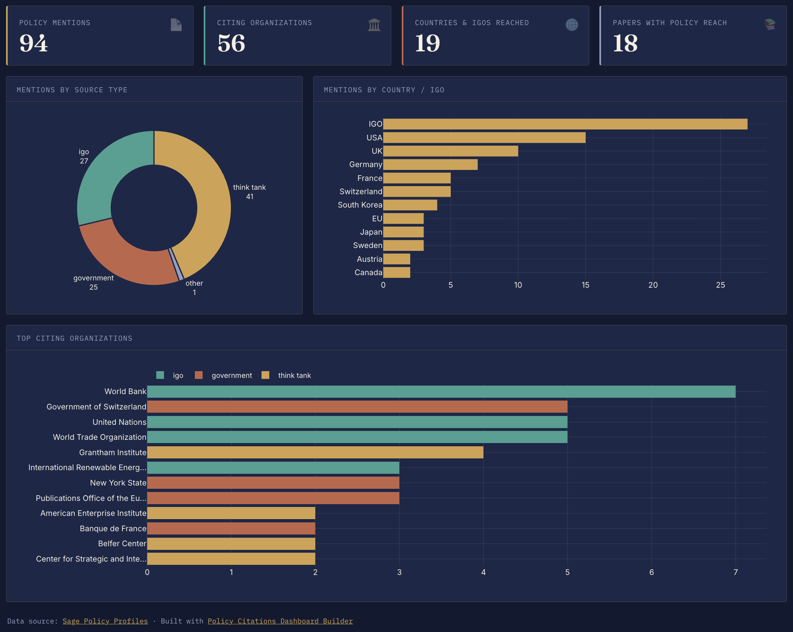

# Guide to create a Policy Citations Dashboard

tool

guide

Author

Gang He

Published

July 6, 2026

[](https://policy-citations-dashboard.vercel.app)

Policy Citations Dashboard Builder, built by Gang He using Codex

## Overview

The [Policy Citations Dashboard Builder](https://policy-citations-dashboard.vercel.app) turns a Sage Policy Profiles exported CSV into an interactive dashboard. You do not need to register for the dashboard builder itself. The CSV is processed in your browser, and you can save a standalone HTML dashboard to host on your own website or share with others.

This guide walks you through:

- create or access your Sage Policy Profiles account
- connect your researcher profile with ORCID
- download your policy citation data as a CSV file
- import the CSV into the dashboard builder
- customize and save your dashboard

## 1. Create a Sage Policy Profiles account

Go to [Sage Policy Profiles](https://policyprofiles.sagepub.com/) and create a free account.

After signing up, sign in to your account and check that your researcher profile is available. If you already have an account, you can skip this step and sign in directly.

## 2. Link your profile with ORCID

In Sage Policy Profiles, connect your researcher profile to your ORCID iD.

This helps Sage Policy Profiles identify your publications and match them with policy documents. If you do not already have an ORCID iD, create one at [ORCID](https://orcid.org/) first, then return to Sage Policy Profiles and link it.

## 3. Download your policy citation data

Open your Sage Policy Profiles researcher profile and look for the policy citations or policy impact data export option.

Download the export as a CSV file. The file is commonly named something like:

``` text
policy-impact-export.csv
```

Keep the CSV file as downloaded. You do not need to edit it before importing it to the dashboard builder.

## 4. Open the Dashboard Builder

Go to [Policy Citations Dashboard Builder](https://policy-citations-dashboard.vercel.app).

The builder runs in your browser. It does not require an account, and the imported CSV is not sent to a server for processing.

## 5. Upload your CSV file

In the dashboard builder:

1.  Select **Choose CSV**.
2.  Pick the `policy-impact-export.csv` file you downloaded from Sage Policy Profiles.
3.  Wait for the dashboard preview to appear.

The builder will summarize your policy mentions, citing organizations, countries or IGOs reached, cited papers, topics, and policy citation timeline.

## 6. Customize the dashboard

Before saving, you can adjust:

- dashboard title
- subtitle
- data source label
- data source URL
- main theme colors

Theme color changes update the preview automatically. Use **Default colors** if you want to return to the original palette.

## 7. Save and share

When the preview looks right, use **Save HTML** to save a standalone dashboard file.

You can open this HTML file in a browser, share it with collaborators, or host it on a website. The downloaded dashboard includes the transformed data, the visual layout, the data source line, and a link back to the dashboard builder.

You can also save individual charts as PNG or JPG using the chart save buttons in the dashboard preview.

## Troubleshooting

If the dashboard does not load after upload, check that the file is a CSV export from Sage Policy Profiles and includes columns such as `Source title`, `Source country`, `Published on`, `Cited research titles`, and `Topics`.

If the dashboard appears but some sections are empty, the exported CSV may not include those fields for your profile yet.

If you changed the colors and want to start over, select **Default colors**.

## Privacy note

The dashboard builder is designed as a browser-only static site. Your CSV is processed locally in your browser session.
