# What’s New & Updated

Posts on papers, events, news, and more

### [Fourth Annual Conference on Climate Research, Teaching, and Collaboration](posts/2026-04-15-fourth-baruch-climate-conference/index.llms.md)

Gang speaks in the Baruch Climate Conference on sustainable, resilient, and efficient clean energy supply chains

Apr 15, 2026

Baruch Climate Conference

### [Brown China Summit Renewable Energy Panel](posts/2026-brown-china-summit-renewable-energy-panel/index.llms.md)

Gang joins experts to discuss supply chains and renewable energy development in China.

Mar 14, 2026

Brown China Summit

### [Renewable integration and AI demand reshaped power grids in 2025](posts/2026-01-nrct-grid-decarbonization-year-in-review/index.llms.md)

[*Nature Reviews Clean Technology*](posts/2026-01-nrct-grid-decarbonization-year-in-review/index.llms.md)

The importance of renewable integration into grids came to the forefront in 2025. New challenges in stability, storage, AI demand, and policy changes defined a year that tested whether power systems can become reliable, flexible, and equitable in a net-zero world.

Jan 20, 2026

Gang He

### [New Grant to Study the Drivers and Impacts of Domestic Clean Energy Manufacturing](https://deeppolicylab.github.io/news/2025-12-17-sloan-grant-drivers-and-impacts-domestic-manufacturing.html)

Gang He, Kaifang Luo, Michael Davidson, Ahmad Lashkaripour, Ilaria Mazzocco, and Minghao Qiu are awarded a \$750,000 new Alfred P. Sloan Foundation grant to study the drivers and impacts of domestic clean manufacturing interventions, resulting from an Open Call on Energy System Interactions in the United States.

Dec 17, 2025

Alfred P. Sloan Foundation

### [17 Lex Society Feature Story: Research That Powers Change](posts/2025-12-baruch-17-lex-society-feature-story/index.llms.md)

Renowned energy scholar Gang He, PhD, is shaping policy, advancing climate solutions, and preparing Baruch students to lead the way—thanks to your support.

Dec 16, 2025

Meghan Goff

### [播客｜到底还要不要合作了？清洁能源全球供应链的收益与前景](posts/2025-10-podcast-global-clean-energy-supply-chains/index.llms.md)

与碳笑风声的刘尚炜、邱明昊及何盼几位老师讨论清洁能源全球供应链。

Oct 29, 2025

TanXiaoFengSheng

### [Imported solar photovoltaics contributed to health and climate benefits in the United States](posts/2025-10-oneearth-imported-solar-pv-health-climate-benefits-in-the-united-states/index.llms.md)

[*One Earth*](posts/2025-10-oneearth-imported-solar-pv-health-climate-benefits-in-the-united-states/index.llms.md)

We estimate that imported solar panels in the U.S. displaced 305 TWh of fossil generation, avoided 178 million tons of CO₂, and prevented 595 premature deaths between 2014 and 2022.

Oct 8, 2025

Minghao Qiu, Gang He, Peter Marcotullio

[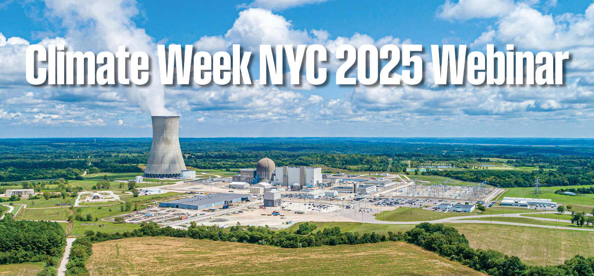](https://deeppolicylab.github.io/events/2025-09-23-nyc-climate-week-nuclear-energy-panel/index.html)

### [Climate Week NYC 2025: The Role of Nuclear Energy in Decarbonization and Powering the AI Era](https://deeppolicylab.github.io/events/2025-09-23-nyc-climate-week-nuclear-energy-panel/index.html)

Join us to discuss the role of nuclear energy in decarbonization and powering the AI era during Climate Week NYC 2025.

Sep 23, 2025

Marxe School

[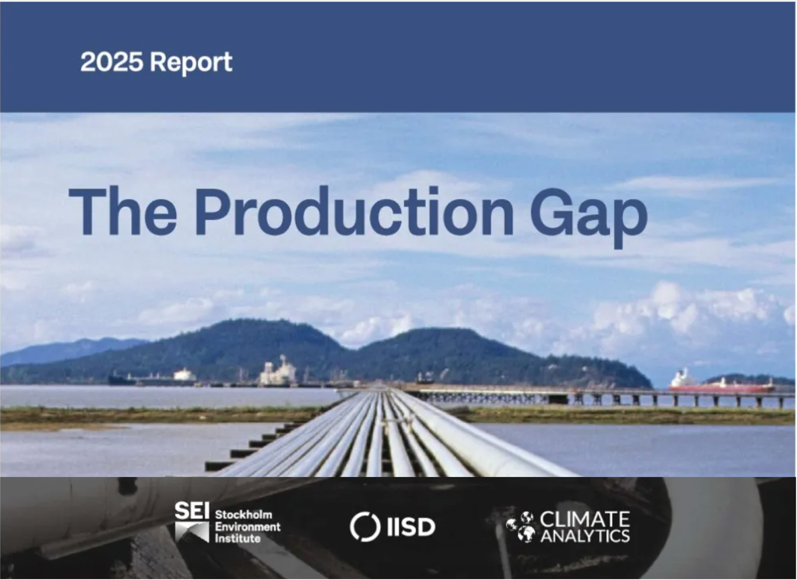](posts/2025-09-production-gap-report-2025/index.llms.md)

### [Production Gap Report 2025](posts/2025-09-production-gap-report-2025/index.llms.md)

Gang serves as a reviewer for the Production Gap Report 2025

Sep 22, 2025

SEI, Climate Analytics, IISD

[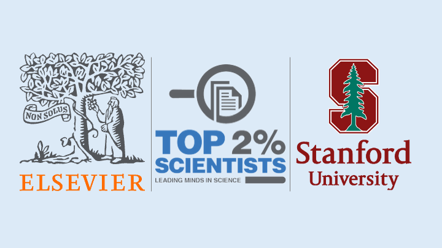](posts/stanford-elsevier-top-2percent-scientists/index.llms.md)

### [Included in World’s Top 2% Scientists List 2025](posts/stanford-elsevier-top-2percent-scientists/index.llms.md)

Thank you for supporting our work!

Sep 19, 2025

Stanford/Elsevier

[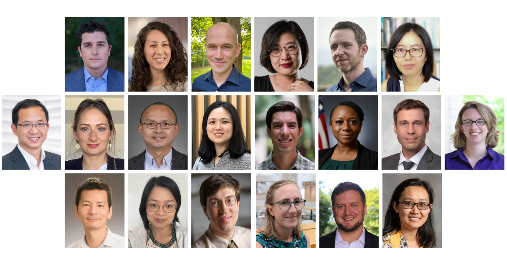](https://www.ncuscr.org/twenty-leading-china-specialists-selected-for-ninth-round-of-public-intellectuals-program/)

### [Selected as Public Intellectuals Program Fellow](https://www.ncuscr.org/twenty-leading-china-specialists-selected-for-ninth-round-of-public-intellectuals-program/)

Gang He was selected as a Ninth Round Public Intellectuals Program Fellow of the National Committee on US-China Relations.

Aug 13, 2025

National Committee on US-China Relations

[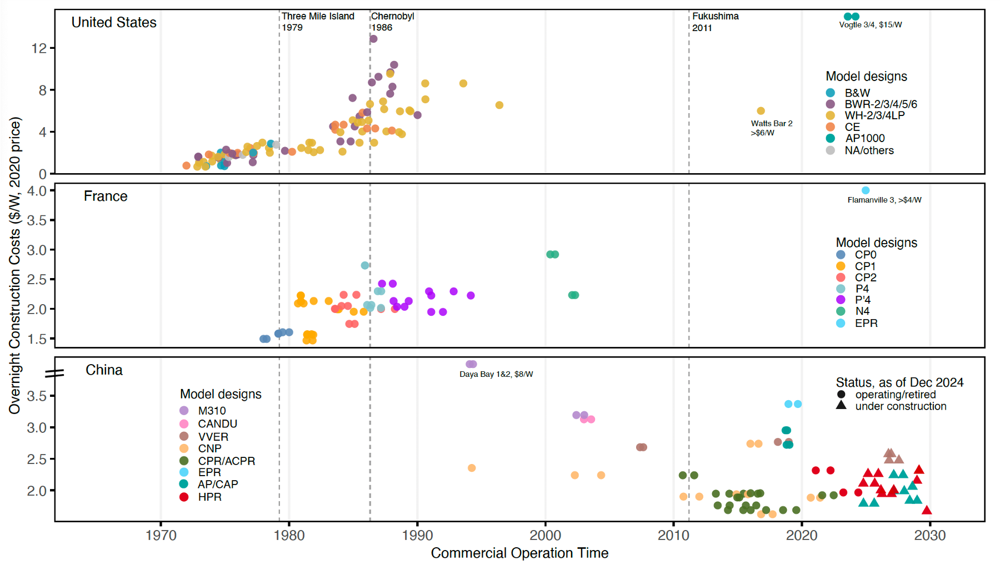](posts/2025-07-nature-breaking-the-cost-curse-of-nuclear-power/index.llms.md)

### [Can China break the ‘cost curse’ of nuclear power?](posts/2025-07-nature-breaking-the-cost-curse-of-nuclear-power/index.llms.md)

[*Nature*](posts/2025-07-nature-breaking-the-cost-curse-of-nuclear-power/index.llms.md)

Escalating construction expenses threaten to derail global progress on atomic energy. China offers lessons on how to rein in costs.

Jul 28, 2025

Shangwei Liu, Gang He, Minghao Qiu, Daniel M. Kammen

[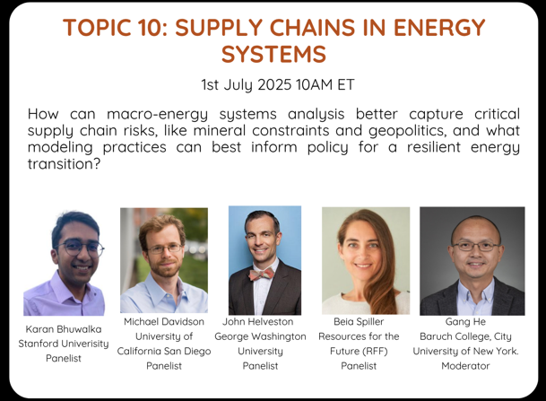](https://deeppolicylab.github.io/events/2025-07-01-mes-supply-chains-in-energy-systems-panel/index.html)

### [Macro-Energy Systems Speaker Series: Supply Chains in Energy Systems](https://deeppolicylab.github.io/events/2025-07-01-mes-supply-chains-in-energy-systems-panel/index.html)

Join us to discuss how macro-energy systems analysis can better capture critical supply chain risks.

Jul 1, 2025

Macro-Energy Systems

[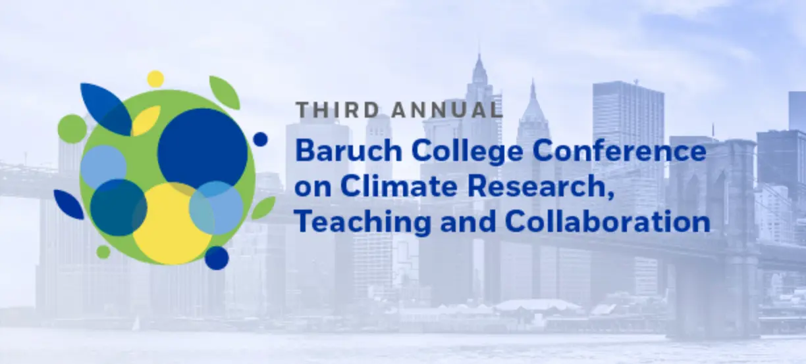](posts/2025-03-06-third-baruch-climate-conference/index.llms.md)

### [Third Annual Conference on Climate Research, Teaching, and Collaboration](posts/2025-03-06-third-baruch-climate-conference/index.llms.md)

Gang speaks in the Baruch Climate Conference on benefits of solar PV for health and climate in the EU

Mar 6, 2025

Baruch Climate Conference

[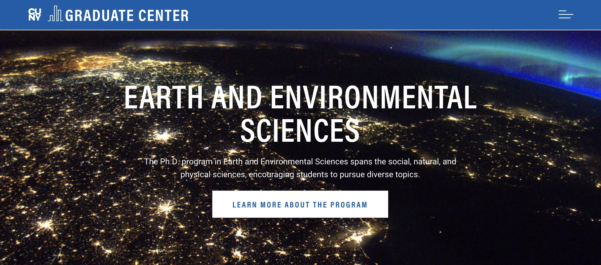](posts/2025-01-joining-doctoral-faculty-ees-graduate-center/index.llms.md)

### [Joining the Doctoral Faculty of the Earth and Environmental Sciences Program at the Graduate Center](posts/2025-01-joining-doctoral-faculty-ees-graduate-center/index.llms.md)

Welcome motivated doctoral students to work with us through the EES program.

Jan 22, 2025

Gang He

[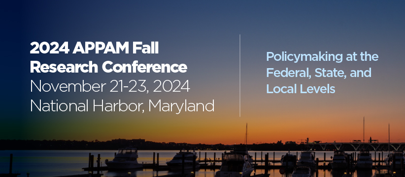](posts/2024-11-appam-climate-change-impacts-and-responses-assessment-politics-and-policy/index.llms.md)

### [Participating APPAM 2024](posts/2024-11-appam-climate-change-impacts-and-responses-assessment-politics-and-policy/index.llms.md)

Gang will be organizing one session, presenting one paper and one poster

Nov 21, 2024

Gang He

[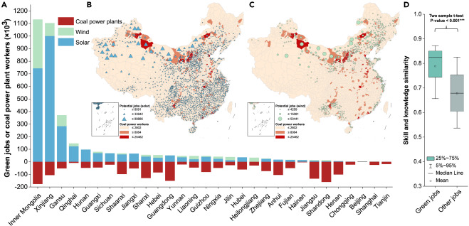](posts/2024-11-oneearth-coal-power-workers-shift-green-jobs/index.llms.md)

### [Fewer than 15% of coal power plant workers in China can easily shift to green jobs by 2060](posts/2024-11-oneearth-coal-power-workers-shift-green-jobs/index.llms.md)

[*One Earth*](posts/2024-11-oneearth-coal-power-workers-shift-green-jobs/index.llms.md)

A coal power worker needs to travel 194 (178–242) km on average to access a green job. Only 11%–14% of existing coal power workers will transition to green jobs by 2060.

Nov 5, 2024

Huihuang Wu, Junfeng Liu, Xiurong Hu, Gang He, Yuhan Zhou, Xian Wang, Ying Liu, Jianmin Ma, Shu Tao

### [New Grant: Exploring Energy Burden Among the Older Adults and People with Disabilities in New York City Public Housing Communities](https://deeppolicylab.github.io/projects/2024-ssa-energy-burden-older-adults-people-with-disabilities-nyc.html)

Gang He, Kaifang Luo, Hilary Botein, and Frank Heiland were awarded an SSA grant.

Nov 1, 2024

NYRDRC

[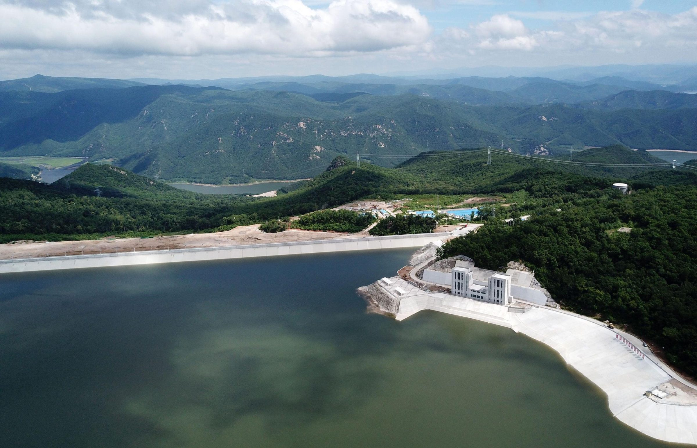](posts/2024-10-china-needs-to-optimise-pumped-hydro-and-battery-storage-mix/index.llms.md)

### [China needs to optimise pumped hydro and battery storage mix](posts/2024-10-china-needs-to-optimise-pumped-hydro-and-battery-storage-mix/index.llms.md)

Optimising existing pumped hydro installations, and accelerating battery storage buildout, is the most cost-effective approach, write three experts.

Oct 28, 2024

Liqun Peng, Jiang Lin, Gang He

### [Power Systems Decarbonization: Technology, Policy Responses, and Implications](posts/2024-10-24-pku-lecture-power-systems-decarbonization/index.llms.md)

Gang is invited to give an online guest lecture at Peking University

Oct 24, 2024

CESE

### [Climate Week NYC 2024: Clean Energy Global Supply Chains Panel](https://deeppolicylab.github.io/events/2024-09-26-nyc-climate-week-clean-energy-global-supply-chains-panel/index.html)

Join us to discuss the role of clean energy global supply chains in achieving climate goals during Climate Week NYC 2024.

Sep 26, 2024

Deep Policy Lab

### [Included in World’s Top 2% Scientists List 2024](posts/2024-09-16-stanford-elsevier-top-2percent-scientists/index.llms.md)

Thank you for supporting our work!

Sep 17, 2024

Stanford/Elsevier

[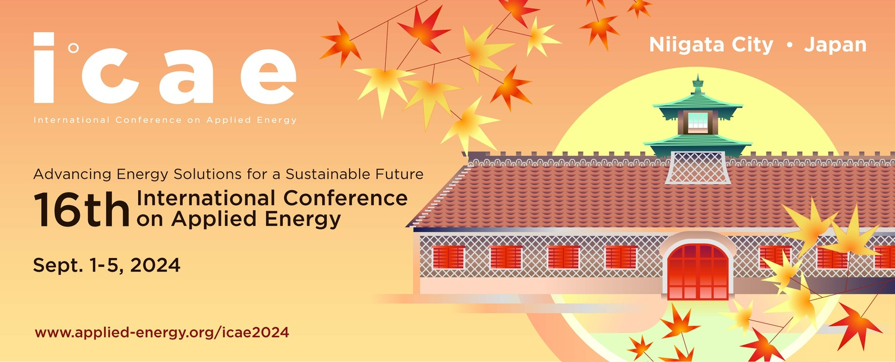](posts/2024-09-03-icae-key-note-speech-clean-energy-global-supply-chains/index.llms.md)

### [ICAE Keynote: Cost Saving, Climate, and Health Effects of Solar PV Global Supply Chains](posts/2024-09-03-icae-key-note-speech-clean-energy-global-supply-chains/index.llms.md)

Gang is invited to give an online keynote speech in the International Conference on Applied Energy 2024.

Sep 3, 2024

ICAE2024

### [Workshop on Open Modeling Carbon Neutrality of the Power Sector](https://deeppolicylab.github.io/events/2024-07-19-workshop-on-open-modeling-carbon-neutrality-of-the-power-sector/index.html)

Developing a community to enable open and safe modeling and data sharing.

Jul 19, 2024

Deep Policy Lab

### [U.S.-China Working Group on Enhancing Climate Action in the 2020s](posts/2024-06-us-china-working-group-on-enhancing-climate-action/index.llms.md)

Gang is invited to serve as an external expert in the energy transition sub-working group of the U.S.-China Working Group on Enhancing Climate Action in the 2020s

Jun 24, 2024

Gang He

### [Teaching Program Evaluation](posts/2024-05-teaching-program-evaluation/index.llms.md)

Lectures, stories, and case studies on Program Evaluation.

May 18, 2024

Gang He

[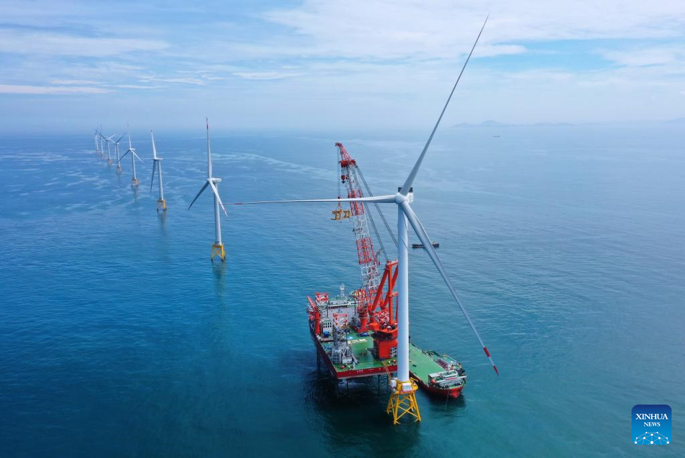](posts/2024-05-06-webinar-accelerating-offshore-wind-promotes-carbon-neutrality/index.llms.md)

### [Research Webinar: Accelerating offshore wind development enhances energy security and promotes carbon neutrality in China’s coastal regions](posts/2024-05-06-webinar-accelerating-offshore-wind-promotes-carbon-neutrality/index.llms.md)

New report explores the impacts of offshore wind development on the power generation, transmission networks in China’s power system and more importantly, energy independence of these coastal provinces.

May 6, 2024

LBL ETA

### [Role of Global Clean Energy Supply Chains in Achieving Climate Goals](posts/2024-03-27-pku-lecture-role-of-global-clean-energy-supply-chains/index.llms.md)

Gang is invited to give a guest lecture at Peking University

Mar 27, 2024

CESE

[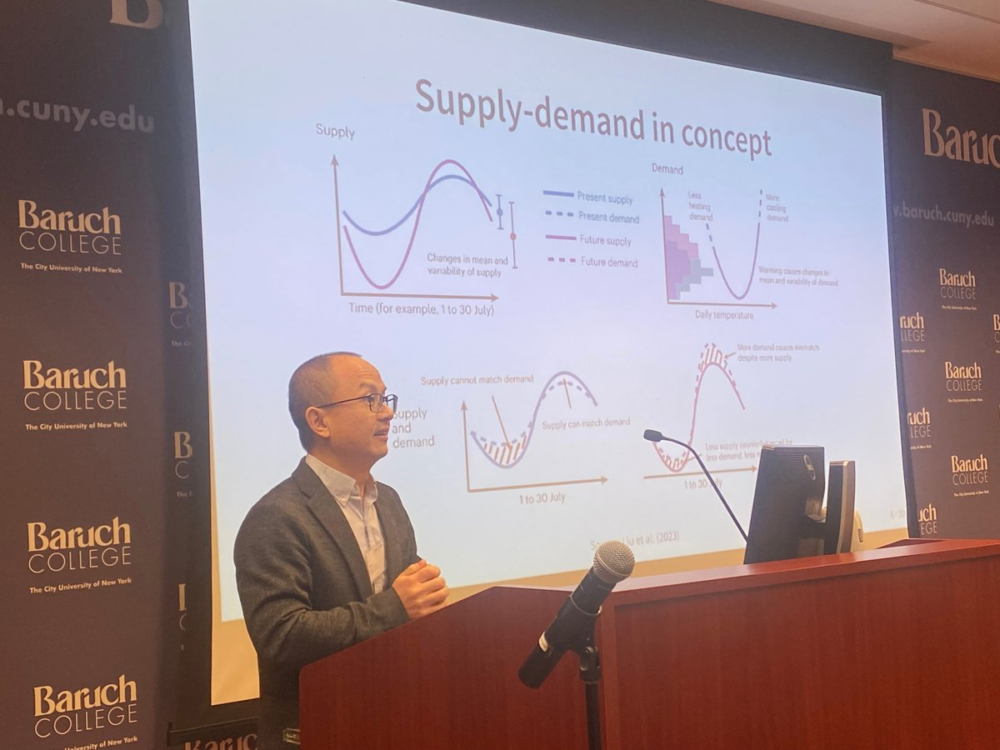](posts/2024-03-22-baruch-faculty-research-award/index.llms.md)

### [Winning the Baruch Faculty Research Award](posts/2024-03-22-baruch-faculty-research-award/index.llms.md)

Dr. Gang He won the Baruch Faculty Research Award in the Third Annual Faculty Cross-College Faculty Research Symposium for his collaborative work on climate impacts on energy systems.

Mar 22, 2024

Provost’s Newsletter

### [Baruch College Conference on Climate Research, Teaching, and Collaboration](posts/2024-02-22-baruch-climate-conference/index.llms.md)

Gang speaks in the Baruch Climate Conference on global clean energy supply chains

Feb 22, 2024

Baruch Climate Conference

[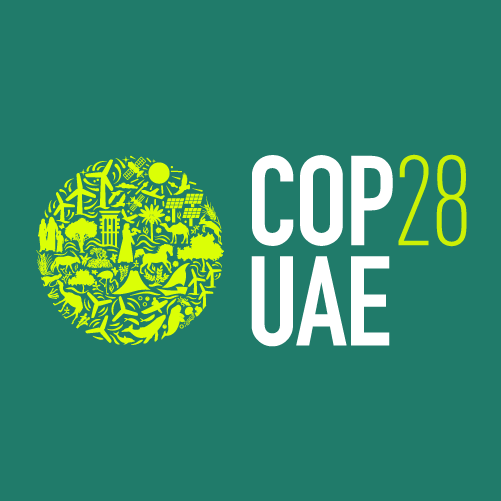](posts/2023-12-just-resilient-sustainable-clean-energy-supply-chains/index.llms.md)

### [Advancing a just, resilient, and sustainable clean energy supply chain](posts/2023-12-just-resilient-sustainable-clean-energy-supply-chains/index.llms.md)

The global clean energy supply chain stands at a critical intersection of immense benefits and pressing challenges.

Dec 5, 2023

Gang He, Daniel M Kammen, Muhammad Husni Mubarok, Shoon So Oo

[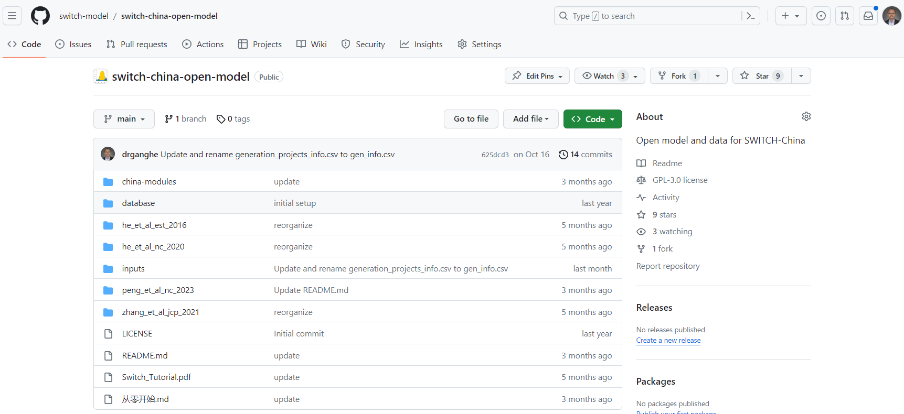](posts/2023-11-switch-china-open-model/index.llms.md)

### [SWITCH-China: Open Source Model for the World’s Largest Power System](posts/2023-11-switch-china-open-model/index.llms.md)

Open model to study China’s clean power transition

Nov 13, 2023

SWITCH China

[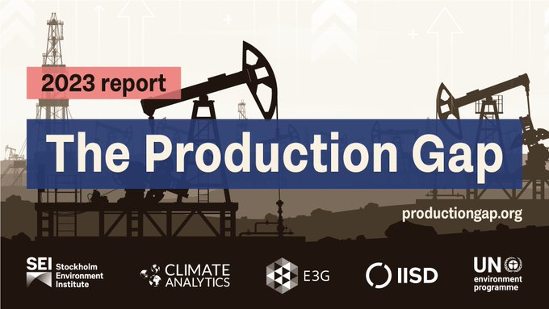](posts/2023-11-unep-production-gap-report-2023/index.llms.md)

### [UNEP releases the Production Gap Report 2023](posts/2023-11-unep-production-gap-report-2023/index.llms.md)

Gang joins a global expert team that contributed to the Production Gap Report 2023

Nov 8, 2023

SEI, Climate Analytics, E3G, IISD, UNEP

### [Deploying solar photovoltaic energy first in carbon-intensive regions brings gigatons more carbon mitigations to 2060](posts/2023-10-commsee-deploying-solar-pv-first-in-carbon-intensive-regions/index.llms.md)

[*Communications Earth & Environment*](posts/2023-10-commsee-deploying-solar-pv-first-in-carbon-intensive-regions/index.llms.md)

The results call for strategic international coordination of PV industrial chain to increase GHG net mitigation.

Oct 11, 2023

Shi Chen, Xi Lu, Chris P. Nielsen, Michael B. McElroy, Gang He, Shaohui Zhang, Kebin He, Xiu Yang, Fang Zhang, Jimin Hao

[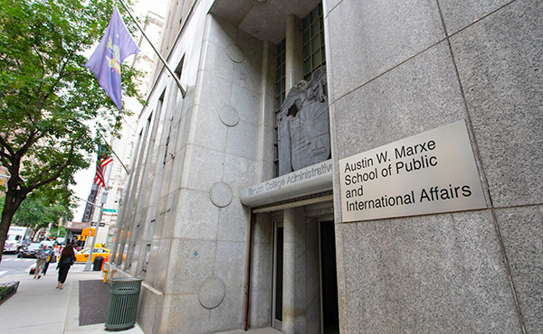](posts/2023-08-joining-marxe-school-baruch-college-cuny/index.llms.md)

### [Joining the Marxe School of Public and International Affairs](posts/2023-08-joining-marxe-school-baruch-college-cuny/index.llms.md)

Welcome new collaborations

Aug 25, 2023

Gang He

### [Heterogeneous effects of battery storage deployment strategies on decarbonization of provincial power systems in China](posts/2023-08-ncomms-heterogeneous-effects-of-battery-storage-deployment-strategies/index.llms.md)

[*Nature Communications*](posts/2023-08-ncomms-heterogeneous-effects-of-battery-storage-deployment-strategies/index.llms.md)

We find heterogeneous strategies provide the lowest system costs; however, carbon emissions depend on carbon prices.

Aug 11, 2023

Liqun Peng, Denise L. Mauzerall, Yaofeng D. Zhong, Gang He

[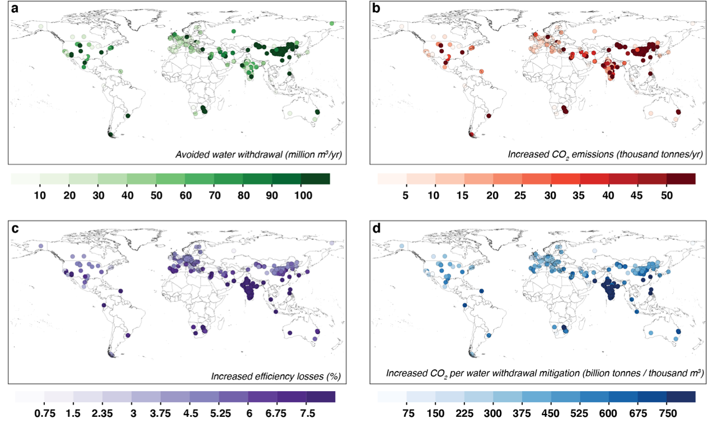](posts/2023-08-naturewater-global-assessment-of-the-carbon-water-tradeoff-of-dry-cooling/index.llms.md)

### [Global assessment of the carbon–water tradeoff of dry cooling for thermal power generation](posts/2023-08-naturewater-global-assessment-of-the-carbon-water-tradeoff-of-dry-cooling/index.llms.md)

[*Nature Water*](posts/2023-08-naturewater-global-assessment-of-the-carbon-water-tradeoff-of-dry-cooling/index.llms.md)

We build a global unit-level framework to investigate CO₂ emissions and the energy penalty due to the deployment of dry cooling.

Aug 7, 2023

Yue Qin, Yaoping Wang, Shiyu Li, Hang Deng, Niko Wanders, Joyce Bosmans, Liangdian Huang, Chaopeng Hong, Edward Byers, Daniel Gingerich, Jeff M. Bielicki, Gang He

### [Climate change impacts on planned supply–demand match in global wind and solar energy systems](posts/2023-07-nenergy-climate-change-impacts-supply-demand-match/index.llms.md)

[*Nature Energy*](posts/2023-07-nenergy-climate-change-impacts-supply-demand-match/index.llms.md)

Up to 32% or 44% of non-Antarctic land areas for wind or solar, respectively, are projected to experience supply–demand match reductions by the end of this century under an intermediate emission scenario.

Jul 24, 2023

Laibao Liu, Gang He, Mengxi Wu, Gang Liu, Haoran Zhang, Ying Chen, Jiashu Shen, Shuangcheng Li

### [Post-Doctoral Researcher in Power System, Air Pollution, and Human Health Modeling](posts/2023-05-post-doc-supply-chain-power-system-environment-human-health/index.llms.md)

My research group is recruiting a post-doc.

May 23, 2023

Gang He

[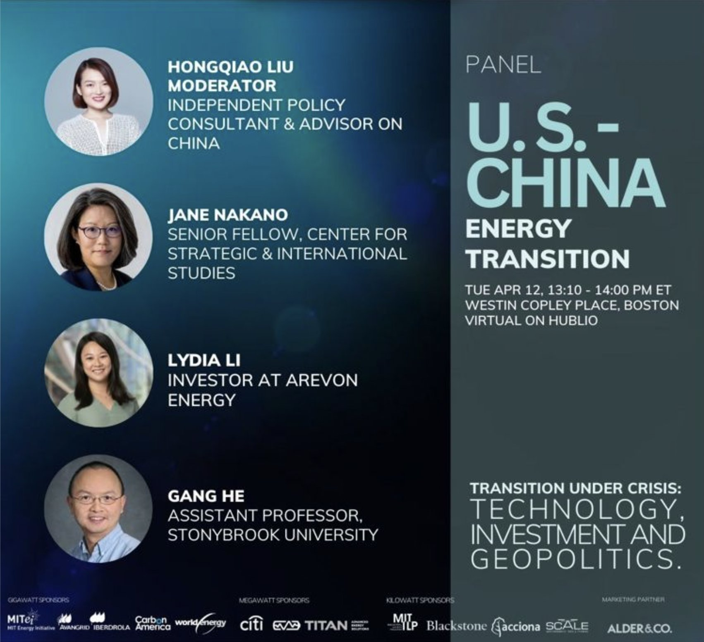](posts/2023-04-12-mit-energy-conference-us-china-energy-transition/index.llms.md)

### [MIT Energy Conference U.S. China Energy Transition](posts/2023-04-12-mit-energy-conference-us-china-energy-transition/index.llms.md)

Gang joins experts to discuss the U.S.-China energy transition.

Apr 12, 2023

MIT Energy Conference

[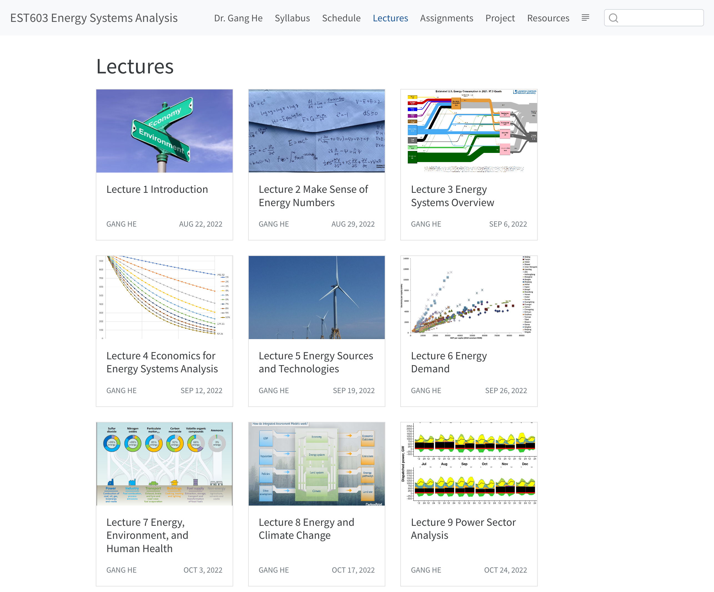](posts/2022-12-energy-systems-analysis-open-course/index.llms.md)

### [Open Course on Energy Systems Analysis](posts/2022-12-energy-systems-analysis-open-course/index.llms.md)

Gang opens his Energy Systems Analysis class and hopes the energy community finds it useful.

Dec 15, 2022

Gang He

### [Best poster award in IAMC 2022](posts/2022-12-iamc-2022-best-poster-award/index.llms.md)

Our solar global supply chain paper won the best poster award in the IAMC 2022 annual meeting.

Dec 1, 2022

IAMC2022

[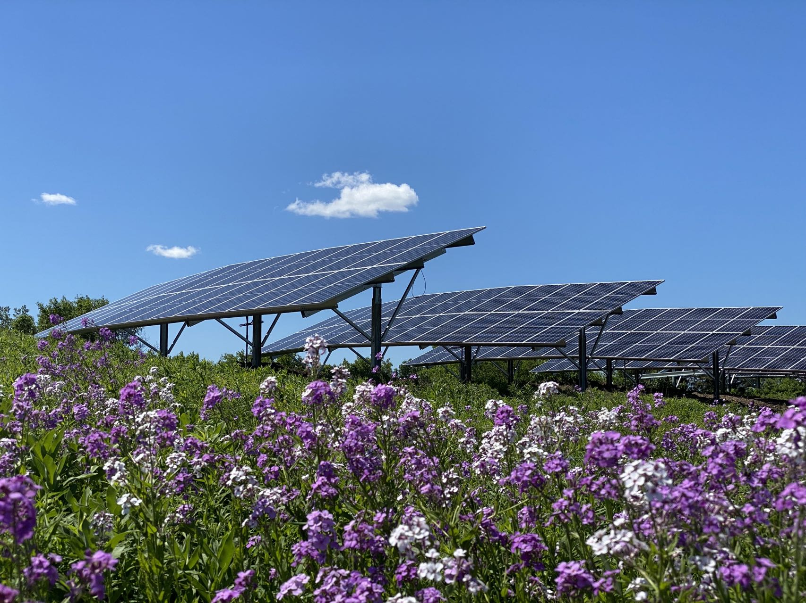](posts/2022-11-nature-solar-paper-summary/index.llms.md)

### [The Cost of Going Solo in Solar](posts/2022-11-nature-solar-paper-summary/index.llms.md)

A summary of our 2022 *Nature* paper.

Nov 21, 2022

John Paul Helveston, Gang He, Michael R. Davidson

[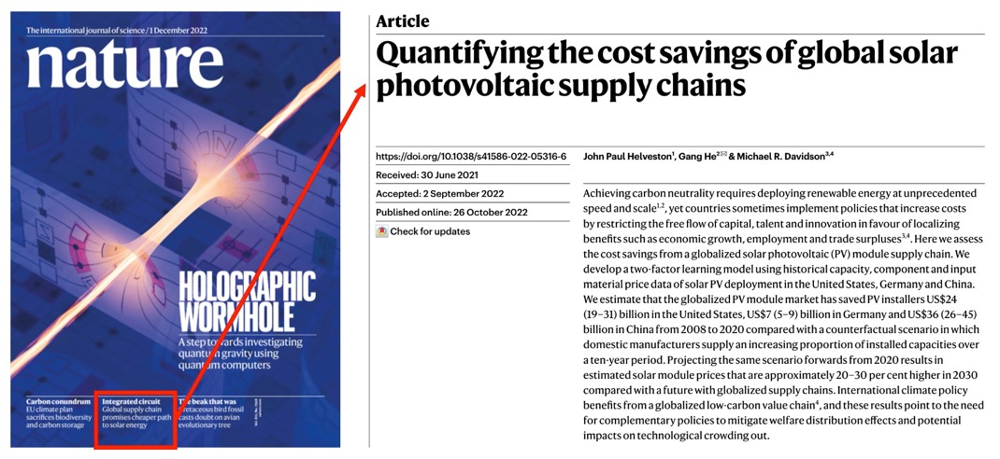](posts/2022-10-nature-cost-savings-of-global-solar-pv-value-chains/index.llms.md)

### [Quantifying the cost savings of global solar photovoltaic supply chains](posts/2022-10-nature-cost-savings-of-global-solar-pv-value-chains/index.llms.md)

[*Nature*](posts/2022-10-nature-cost-savings-of-global-solar-pv-value-chains/index.llms.md)

Globalized supply chains have saved solar installers in the U.S., Germany, and China \$67B from 2008–2020, and solar prices will be 20–30% higher in 2030 if countries move to produce domestically.

Oct 26, 2022

John Paul Helveston, Gang He, Michael R. Davidson

[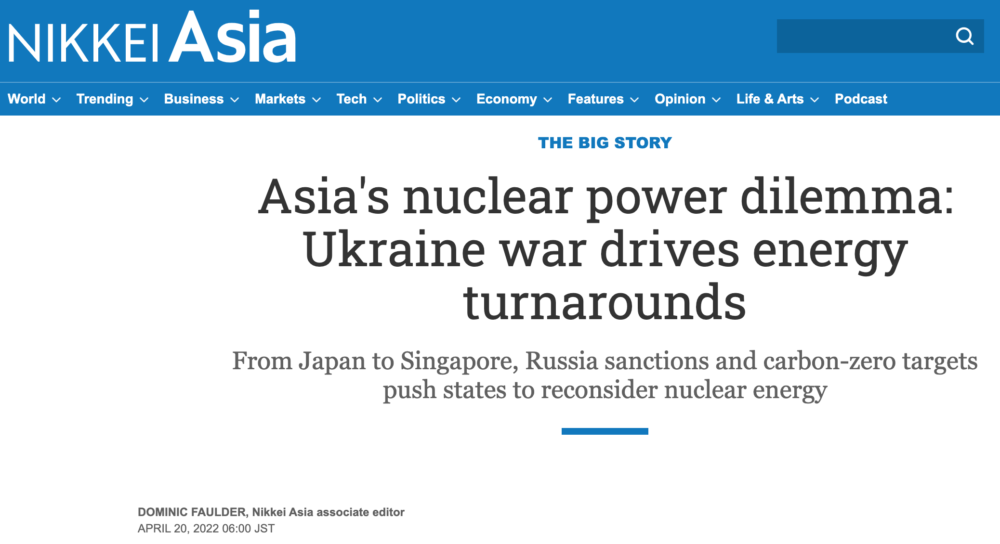](posts/2022-04-nikkei-nuclear-delemma/index.llms.md)

### [The scale of China’s future nuclear will depend on how renewables evolve](posts/2022-04-nikkei-nuclear-delemma/index.llms.md)

*Nikkei Asia* quotes Gang’s comments on nuclear.

Apr 20, 2022

*Nikkei Asia*

[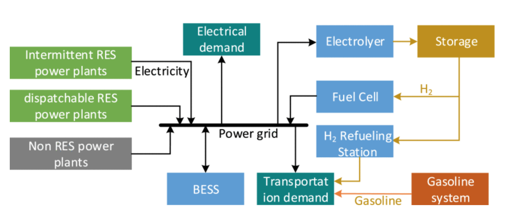](posts/2022-04-ieeetia-hydrogen-integrated-power-and-transport/index.llms.md)

### [Modeling Integrated Power and Transportation Systems: Impacts of Power-to-Gas on the Deep Decarbonization](posts/2022-04-ieeetia-hydrogen-integrated-power-and-transport/index.llms.md)

[*IEEE Transactions on Industry Applications*](posts/2022-04-ieeetia-hydrogen-integrated-power-and-transport/index.llms.md)

Hydrogen could link power and transport systems and reduce costs of deep decarbonization for both sectors.

Apr 15, 2022

Bo Li, Minyou Chen, Ziming Ma, Gang He, Wei Dai, Dongran Liu, Chi Zhang, Haiwang Zhong

[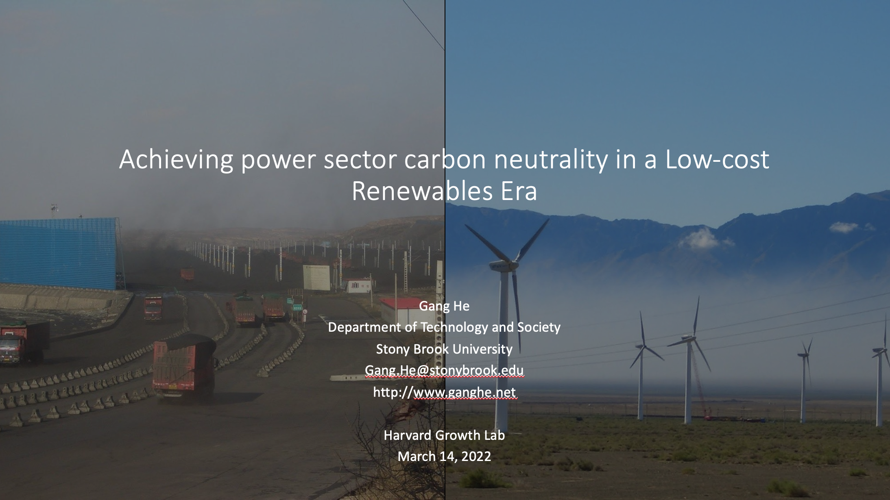](posts/2022-03-harvard-growth-lab-talk/index.llms.md)

### [Achieving power sector carbon neutrality in a low-cost renewable era](posts/2022-03-harvard-growth-lab-talk/index.llms.md)

Gang shares research at Harvard Growth Lab Research Seminar.

Mar 14, 2022

Growth Lab

[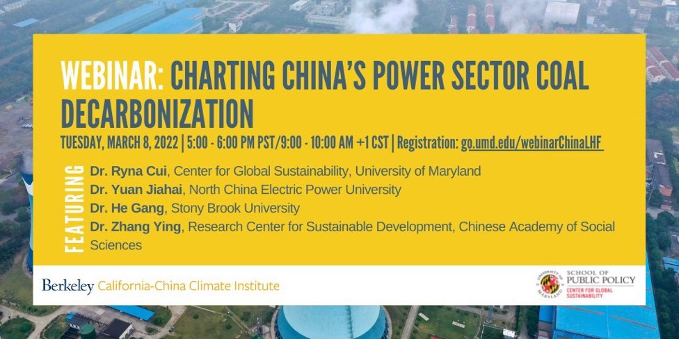](posts/2022-03-ccci-power-sector-coal-decarbonization/index.llms.md)

### [Webinar: Charting China’s Power Sector Coal Decarbonization](posts/2022-03-ccci-power-sector-coal-decarbonization/index.llms.md)

Gang joins experts to discuss coal transition and decarbonization.

Mar 8, 2022

CCCI

[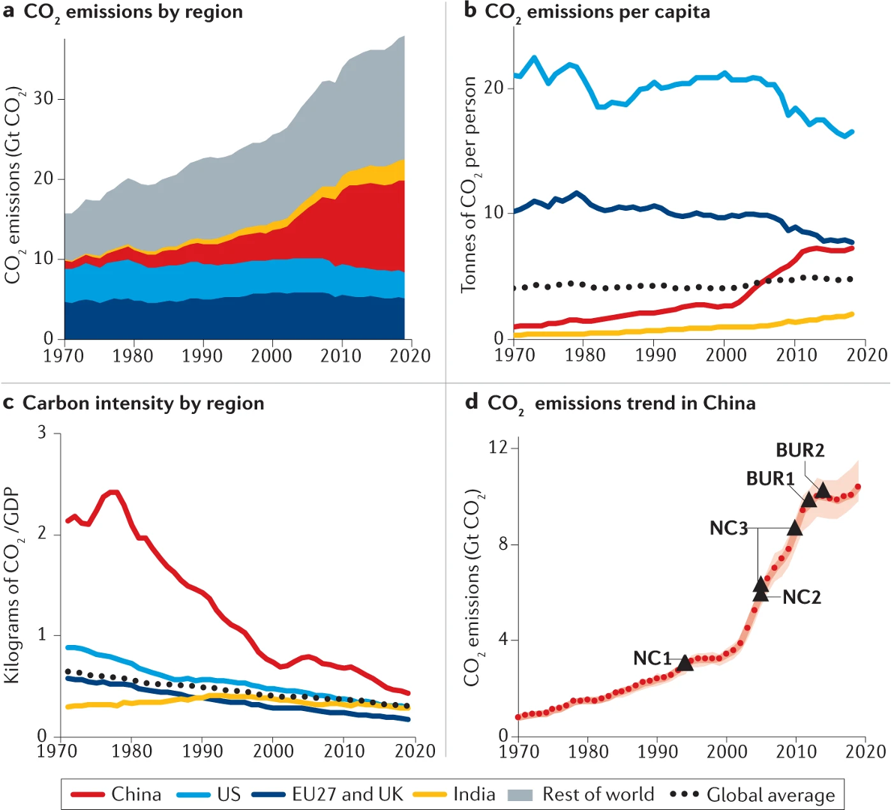](posts/2022-03-nree-china-carbon-neutrality/index.llms.md)

### [Challenges and opportunities for carbon neutrality in China](posts/2022-03-nree-china-carbon-neutrality/index.llms.md)

[*Nature Reviews Earth & Environment*](posts/2022-03-nree-china-carbon-neutrality/index.llms.md)

In this Perspective, we summarize the key features of China’s CO2 emissions, its reduction processes and successes in meeting climate targets.

Mar 1, 2022

Zhu Liu, Zhu Deng, Gang He, Hailin Wang, Xian Zhang, Jiang Lin, Ye Qi, Xi Liang

[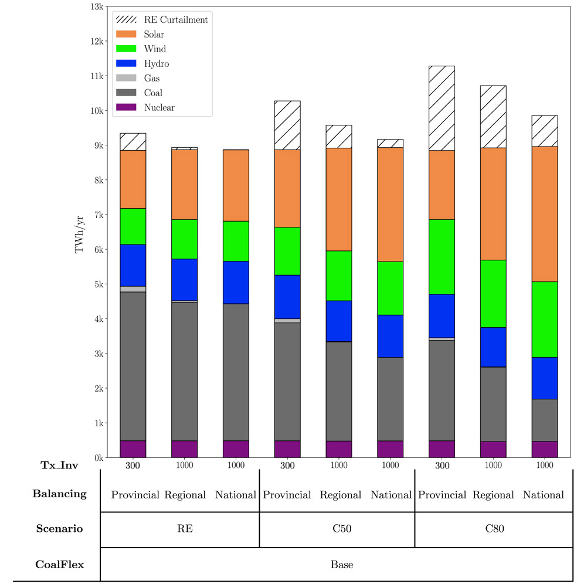](posts/2022-01-iscience-renewable-flexibility/index.llms.md)

### [Large balancing areas and dispersed renewable investment enhance grid flexibility in a renewable-dominant power system in China](posts/2022-01-iscience-renewable-flexibility/index.llms.md)

[*iScience*](posts/2022-01-iscience-renewable-flexibility/index.llms.md)

Larger balancing area offers direct flexibility benefits.

Jan 7, 2022

Jiang Lin, Nikit Abhyankar, Gang He, Xu Liu, Shengfei Yin

[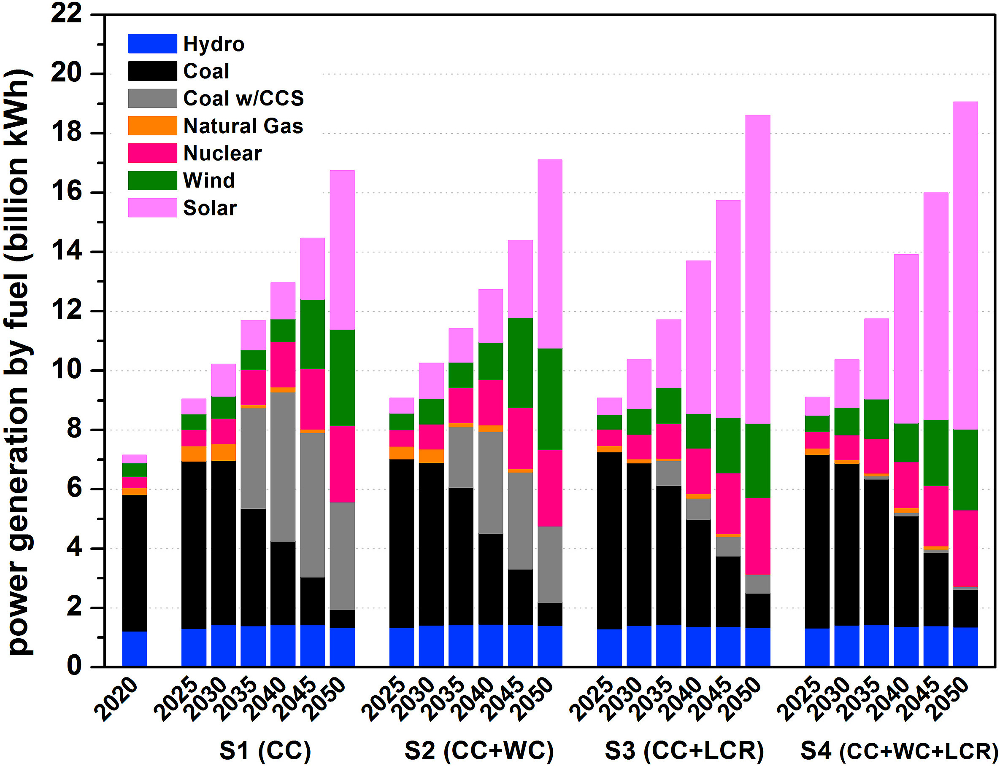](posts/2021-12-jcp-power-water-carbon/index.llms.md)

### [Long-term transition of China’s power sector under carbon neutrality target and water withdrawal constraint](posts/2021-12-jcp-power-water-carbon/index.llms.md)

[*Journal of Cleaner Production*](posts/2021-12-jcp-power-water-carbon/index.llms.md)

Low-cost renewables reduced the need for CCS by 80%, and water constraints nearly squeeze CCS out.

Dec 20, 2021

Chao Zhang, Gang He, Josiah Johnston, Lijin Zhong

[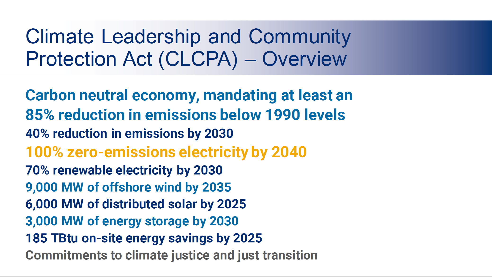](posts/2021-12-nysclcpa-scoping-plan-draft/index.llms.md)

### [Advising the NYS Climate Action Council Draft Scoping Plan](posts/2021-12-nysclcpa-scoping-plan-draft/index.llms.md)

Dr. Gang He served as a member of the technical advisory group for the scoping plan.

Dec 20, 2021

NYSERDA

[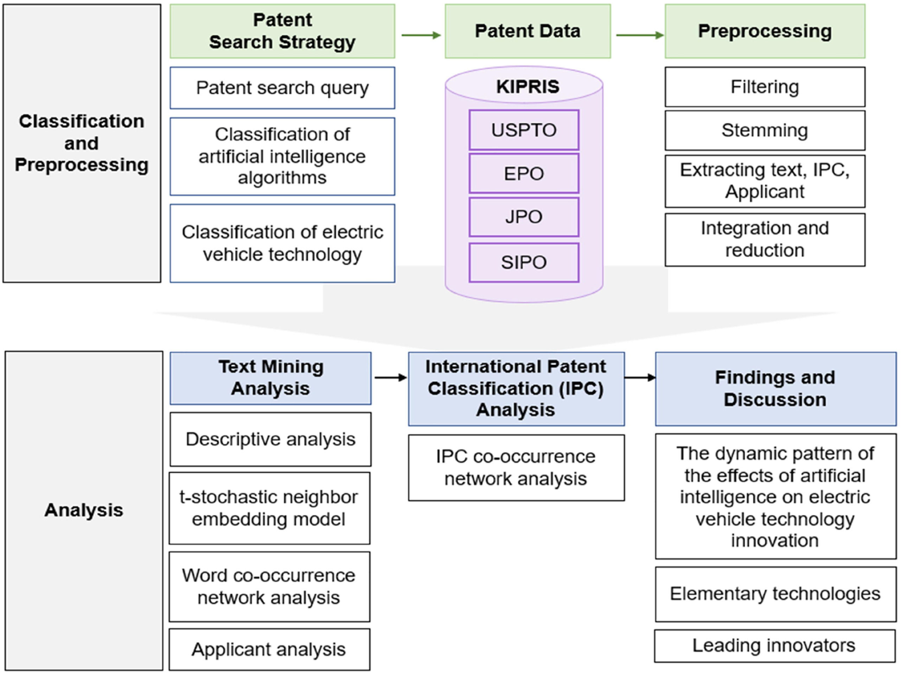](posts/2021-05-jcp-ai-energy/index.llms.md)

### [An empirical analysis of applications of artificial intelligence algorithms in wind power technology innovation during 1980–2017](posts/2021-05-jcp-ai-energy/index.llms.md)

[*Journal of Cleaner Production*](posts/2021-05-jcp-ai-energy/index.llms.md)

AI algorithms in wind power technology innovation.

May 15, 2021

Mekyung Lee, Gang He

[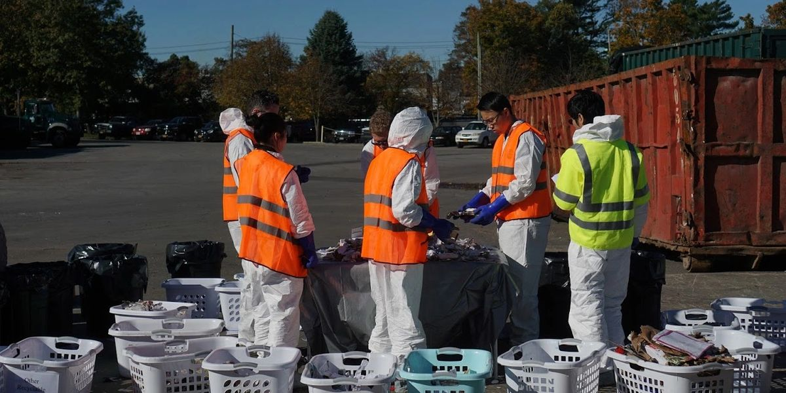](posts/2021-01-nys-waste/index.llms.md)

### [Stony Brook Receives \$4.25M Grant from State to Help NY Improve Recycling](posts/2021-01-nys-waste/index.llms.md)

Sorting garbage is messy, but important.

Jan 28, 2021

SBU News

[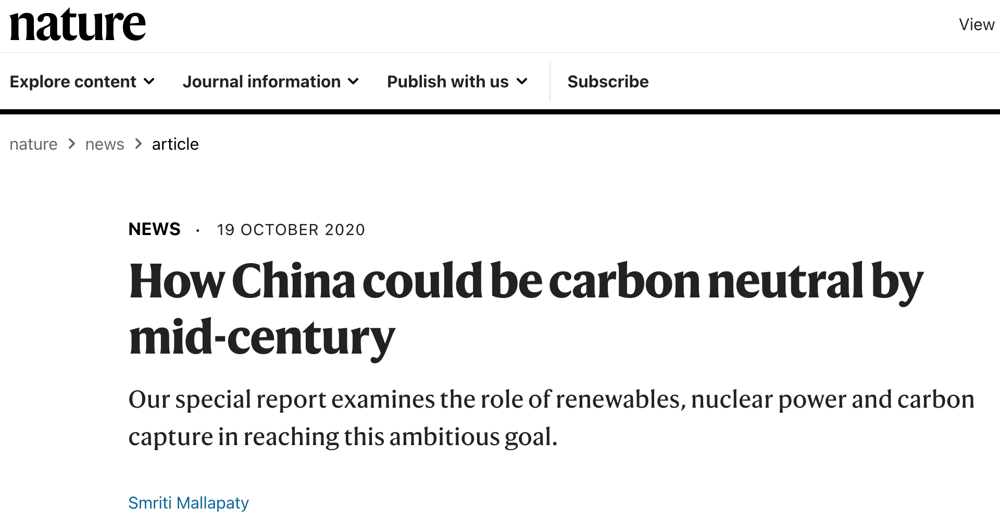](posts/2020-10-nature-news-carbon-neutrality/index.llms.md)

### [Nature News featured our studies on China’s clean energy transition](posts/2020-10-nature-news-carbon-neutrality/index.llms.md)

Our work is reported by *Nature*.

Oct 19, 2020

Smriti Mallapaty

[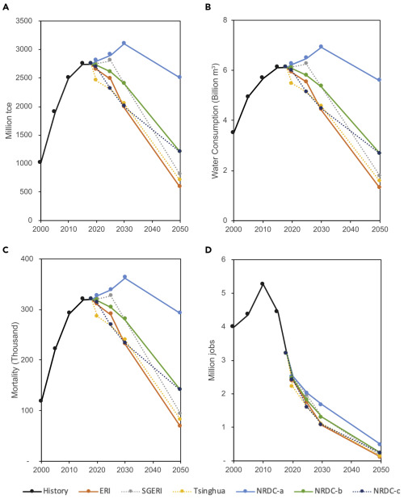](posts/2020-08-oneearth-coal-just-transition/index.llms.md)

### [Enabling a Rapid and Just Transition away from Coal in China](posts/2020-08-oneearth-coal-just-transition/index.llms.md)

[*One Earth*](posts/2020-08-oneearth-coal-just-transition/index.llms.md)

An aggressive coal-transition pathway is needed to achieve the carbon neutrality goal while achieving water savings and avoiding premature deaths.

Aug 21, 2020

Gang He, Jiang Lin, Ying Zhang, Wenhua Zhang, Guilherme Larangeira, Chao Zhang, Wei Peng, Manzhi Liu, Fuqiang Yang

[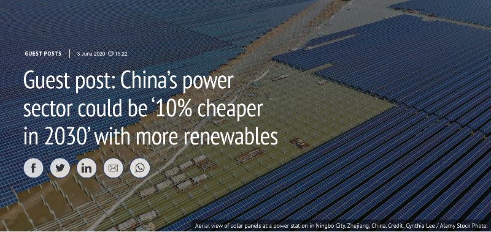](posts/2020-06-ncomms-paper-summary/index.llms.md)

### [China’s power sector could be ‘10% cheaper in 2030’ with more renewables](posts/2020-06-ncomms-paper-summary/index.llms.md)

A post explaining our 2020 *Nature Communications* paper.

Jun 3, 2020

Jiang Lin, Gang He

[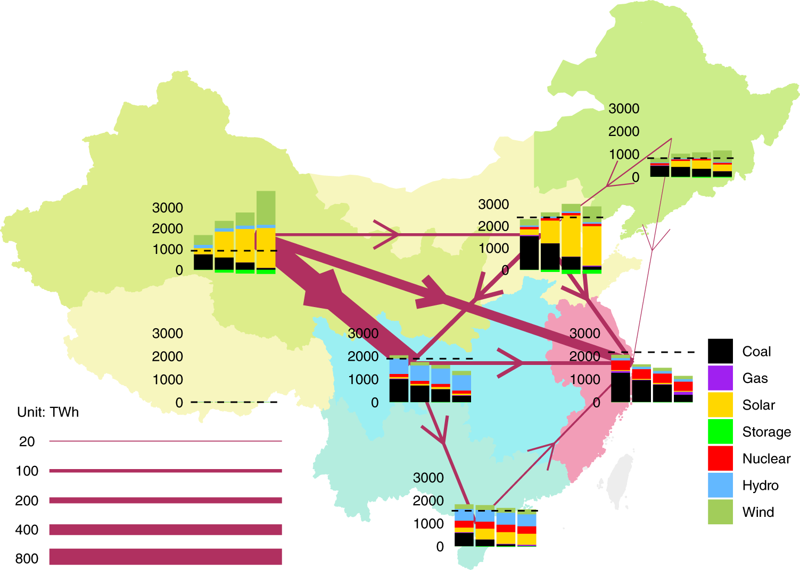](posts/2020-05-ncomms-rapid-re-cost/index.llms.md)

### [Rapid Cost Decrease of Renewables and Storage Accelerates the Decarbonization of China’s Power System](posts/2020-05-ncomms-rapid-re-cost/index.llms.md)

[*Nature Communications*](posts/2020-05-ncomms-rapid-re-cost/index.llms.md)

A renewable-dominant pathway is not just technologically sound, but also cost-effective.

May 15, 2020

Gang He, Jiang Lin, Froylan Sifuentes, Xu Liu, Nikit Abhyankar, Amol Phadke

[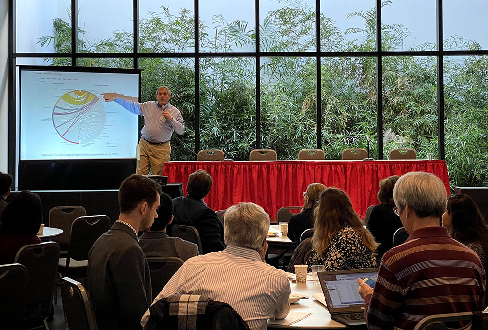](posts/2020-01-nsf-workshop/index.llms.md)

### [Stony Brook University Hosts NSF Funded Data Science Workshop](posts/2020-01-nsf-workshop/index.llms.md)

On January 9-10, 2020, the Department of Technology and Society, Stony Brook University, hosted an NSF funded workshop.

Jan 17, 2020

SBU News

[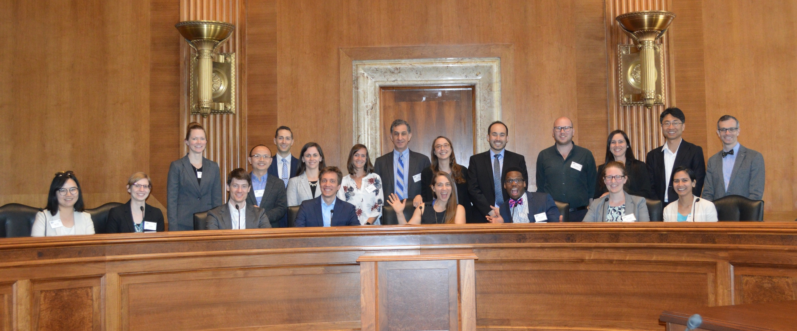](https://itif.org/events/2019/05/19/2019-itif-energy-innovation-boot-camp-for-early-career-scholars/)

### [2019 Energy Innovation Policy and Management Scholars](https://itif.org/events/2019/05/19/2019-itif-energy-innovation-boot-camp-for-early-career-scholars/)

Grateful to join a group of energy innovation scholars in the ITIF/Sloan Energy Innovation Policy and Management Scholars program

May 20, 2019

ITIF

[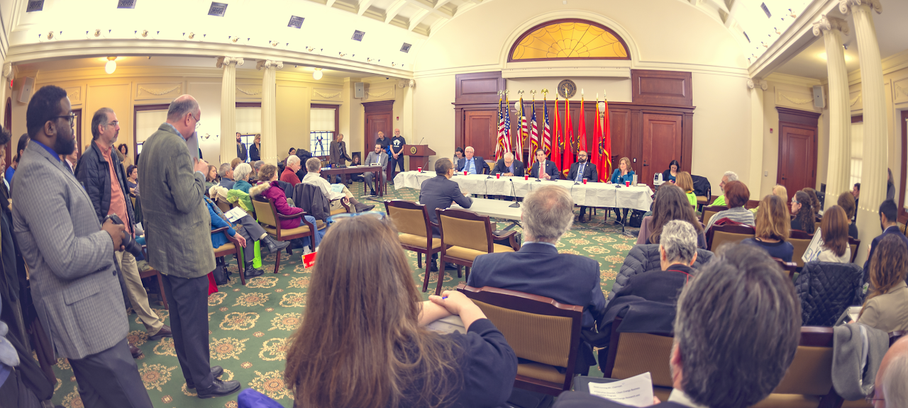](posts/2019-nyclcpa-testimony/index.llms.md)

### [Testimony on the New York State Climate Leadership and Community Protection Act](posts/2019-nyclcpa-testimony/index.llms.md)

Dr. Gang He joined a Stony Brook University expert team to testify for NYCLCPA.

Feb 15, 2019

Gang He

[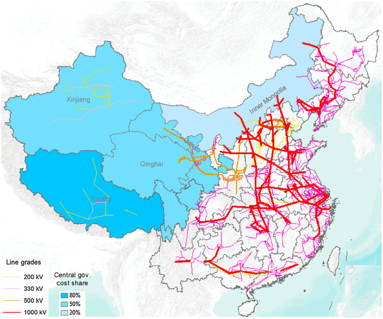](posts/2017-china-electricity-for-all/index.llms.md)

### [Experiences and lessons from China’s success in providing electricity for all](posts/2017-china-electricity-for-all/index.llms.md)

[*Resources, Conservation and Recycling*](posts/2017-china-electricity-for-all/index.llms.md)

Funding, coordination, and technology are key to deliver full electrification.

Jul 15, 2017

Gang He, David Victor

[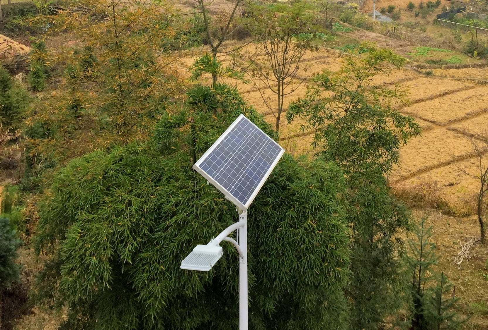](posts/2017-china-electricity-for-all-summary/index.llms.md)

### [Three lessons from China’s effort to bring electricity to 1.4 billion people](posts/2017-china-electricity-for-all-summary/index.llms.md)

The ‘Electricity for All’ programme was hugely successful, reaching even the remotest populations.

Jun 24, 2017

Gang He

### [SWITCH-China: A Systems Approach to Decarbonizing China’s Power System](posts/2016-est-switch-china/index.llms.md)

[*Environmental Science & Technology*](posts/2016-est-switch-china/index.llms.md)

SWITCH-China, an integrated model for power sector decarbonization.

May 8, 2016

Gang He, Anne-Perrine Avrin, James H. Nelson, Josiah Johnston, Ana Mileva, Jianwei Tian, Daniel M. Kammen

[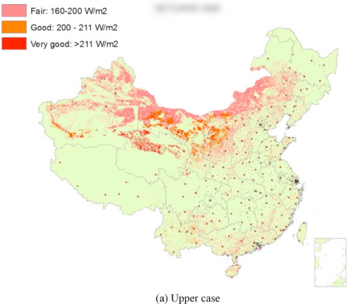](posts/2016-re-china-provincial-solar-resource-assessment/index.llms.md)

### [Where, when and how much solar is available? A provincial-scale solar resource assessment for China](posts/2016-re-china-provincial-solar-resource-assessment/index.llms.md)

[*Renewable Energy*](posts/2016-re-china-provincial-solar-resource-assessment/index.llms.md)

We utilized 10-year hourly solar irradiation data from 2001 to 2010 from 200 representative locations to develop provincial solar availability profiles.

Jan 15, 2016

Gang He, Daniel M. Kammen

[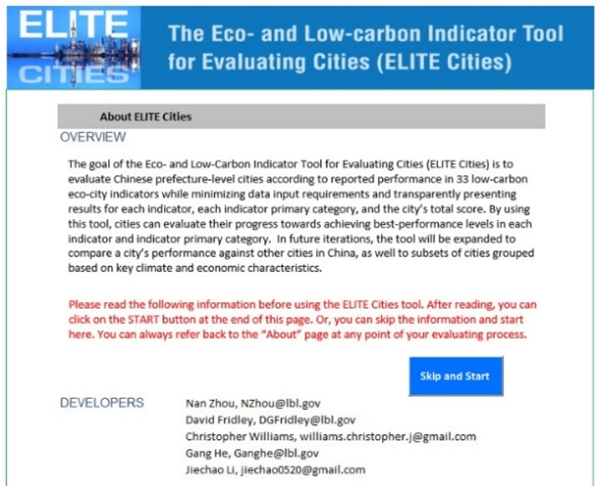](posts/2015-ei-elite-cities-low-carbon-eco-city-evaluation-tool/index.llms.md)

### [ELITE cities: A low-carbon eco-city evaluation tool for China](posts/2015-ei-elite-cities-low-carbon-eco-city-evaluation-tool/index.llms.md)

[*Ecological Indicators*](posts/2015-ei-elite-cities-low-carbon-eco-city-evaluation-tool/index.llms.md)

ELITE Cities is an Excel-based tool that measures city low-carbon development progress on 33 key indicators.

Jan 15, 2015

Nan Zhou, Gang He, Christopher Williams, David Fridley

[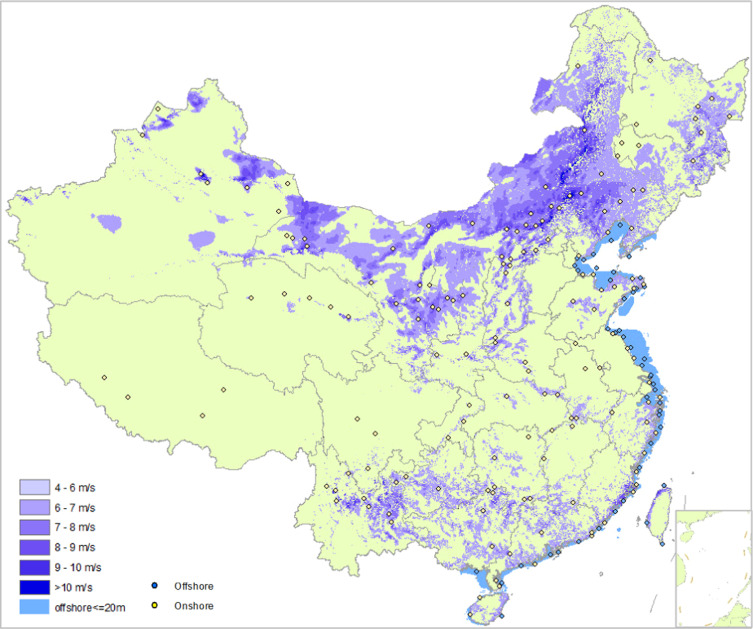](posts/2014-ep-china-provincial-wind-resource-assessment/index.llms.md)

### [Where, when and how much wind is available? A provincial-scale wind resource assessment for China](posts/2014-ep-china-provincial-wind-resource-assessment/index.llms.md)

[*Energy Policy*](posts/2014-ep-china-provincial-wind-resource-assessment/index.llms.md)

We utilized 200 representative locations for which 10 years of hourly wind speed data exist to develop provincial capacity factors from 2001 to 2010, and to build analytic wind speed profiles.

Nov 15, 2014

Gang He, Daniel M. Kammen

[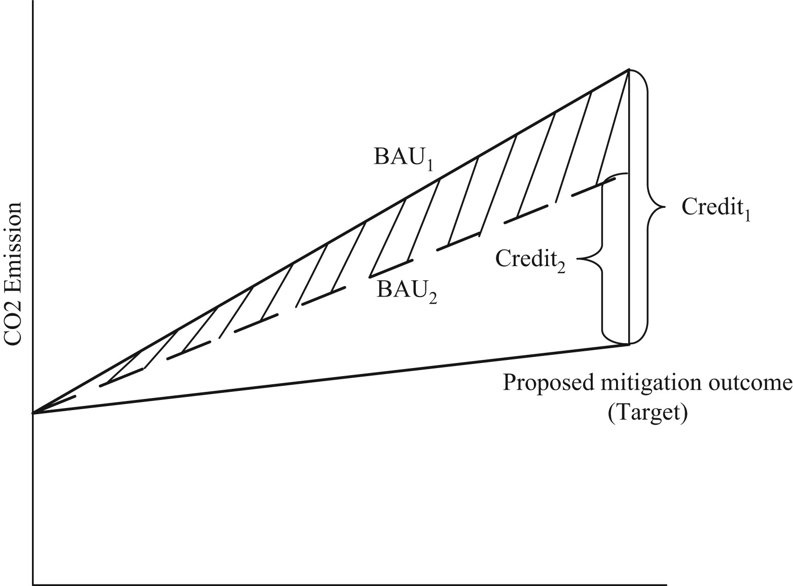](posts/2013-ep-carbon-offsetters-paradox/index.llms.md)

### [Addressing carbon Offsetters’ Paradox: Lessons from Chinese wind CDM](posts/2013-ep-carbon-offsetters-paradox/index.llms.md)

[*Energy Policy*](posts/2013-ep-carbon-offsetters-paradox/index.llms.md)

The paper examines the application of additionality in the Chinese wind power market and draws implications for the design of effective global carbon offset policy.

Dec 15, 2013

Gang He, Richard Morse
