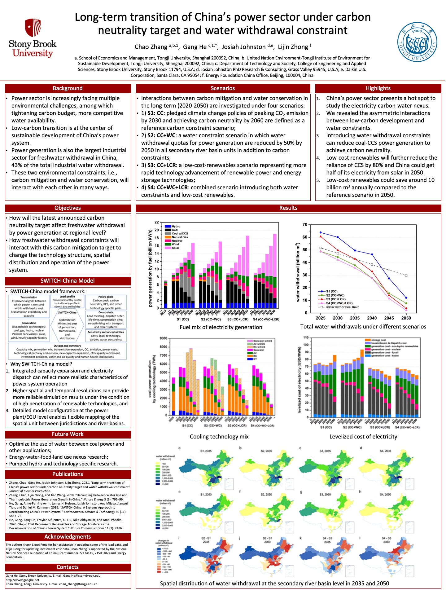

# Long-term transition of China’s power sector under carbon neutrality target and water withdrawal constraint

*Journal of Cleaner Production*

paper

poster

Low-cost renewables reduced the need for CCS by 80%, and water constraints nearly squeeze CCS out.

Authors

Chao Zhang

Gang He

Josiah Johnston

Lijin Zhong

Published

December 20, 2021

> **NOTE:**
>
> Long-term transition of China’s power sector under carbon neutrality target and water withdrawal constraint  
> Chao Zhang, **Gang He**\*, Josiah Johnston, and Lijin Zhong  
> *Journal of Cleaner Production* (2021)  
> DOI: [10.1016/j.jclepro.2021.129765](https://doi.org/10.1016/j.jclepro.2021.129765)

## Abstract

Deep carbon mitigation and water resources conservation are two interacted environmental challenges that China’s power sector is facing. We investigate long-term transition pathways (2020–2050) of China’s power sector under carbon neutrality target and water withdrawal constraint using an integrated capacity expansion and dispatch model: SWITCH-China. We find that achieving carbon neutrality before 2060 under moderate cost decline of renewables by 10–20% depends heavily on large scale deployment of coal-fired power generation with carbon capture and storage (CCS) since 2035 in China’s water-deficient northwestern regions, which may incur significant water penalties in arid catchments. Introducing water withdrawal constraints at the secondary river basin level can reduce the reliance on coal-CCS power generation to achieve carbon neutrality, promote the application of air-cooling technology, and reallocate newly built coal power capacities from northwestern regions to northeastern and southern regions. If levelized cost of renewables can decline rapidly by about 70%, demand for coal power generation with CCS will be significantly reduced by more than 80% and solar photovoltaic (PV) and wind could account for about 70% of the national total power generation by 2050. The transition pathway under low-cost renewables also creates water conservation co-benefits of around 10 billion m3 annually compared to the reference scenario.

## Links

Published [paper](https://www.sciencedirect.com/science/article/pii/S095965262103941X)

Self-archiving [pdf](../../files/papers/2021-JCP-ChinaPowerCarbonWaterNexus.pdf)

[Supplementary Data](https://ars.els-cdn.com/content/image/1-s2.0-S095965262103941X-mmc1.docx)

## Poster



## Twitter Thread

> New paper on energy-water nexus: Long-term transition of China’s power sector under carbon neutrality target and water withdrawal constraint.  
>   
> With lead author Chao Zhang and coauthors Josiah Johnston, and Lijin Zhong.  
>   
> Paper link: <https://t.co/Ujwtk42Zmx>  
>   
> DM for a pdf. [pic.twitter.com/6QYrLLnWtv](https://t.co/6QYrLLnWtv)
>
> — Gang He (@DrGangHe) [November 21, 2021](https://twitter.com/DrGangHe/status/1462407719231569920?ref_src=twsrc%5Etfw)

## Citation

BibTeX citation:

``` quarto-appendix-bibtex
@article{zhang2021,
  author = {Zhang, Chao and He, Gang and Johnston, Josiah and Zhong,
    Lijin},
  title = {Long-Term Transition of {China’s} Power Sector Under Carbon
    Neutrality Target and Water Withdrawal Constraint},
  journal = {Journal of Cleaner Production},
  volume = {329},
  pages = {129765},
  date = {2021-12-20},
  url = {https://www.sciencedirect.com/science/article/pii/S095965262103941X},
  doi = {10.1016/j.jclepro.2021.129765},
  langid = {en}
}
```

For attribution, please cite this work as:

Zhang, Chao, Gang He, Josiah Johnston, and Lijin Zhong. 2021. “Long-Term Transition of China’s Power Sector Under Carbon Neutrality Target and Water Withdrawal Constraint.” *Journal of Cleaner Production* 329 (December): 129765. <https://doi.org/10.1016/j.jclepro.2021.129765>.
