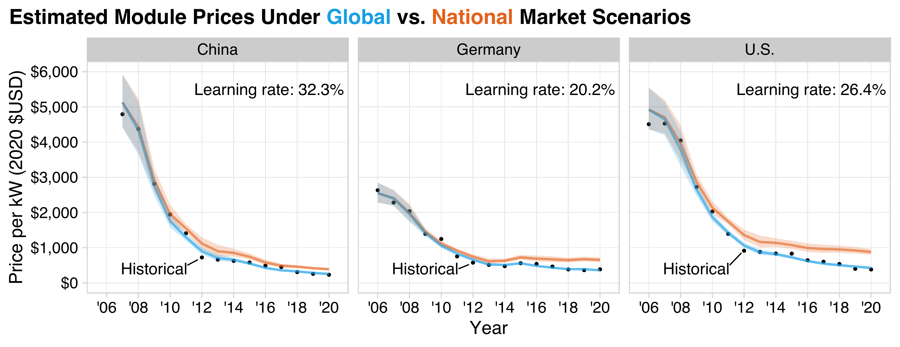
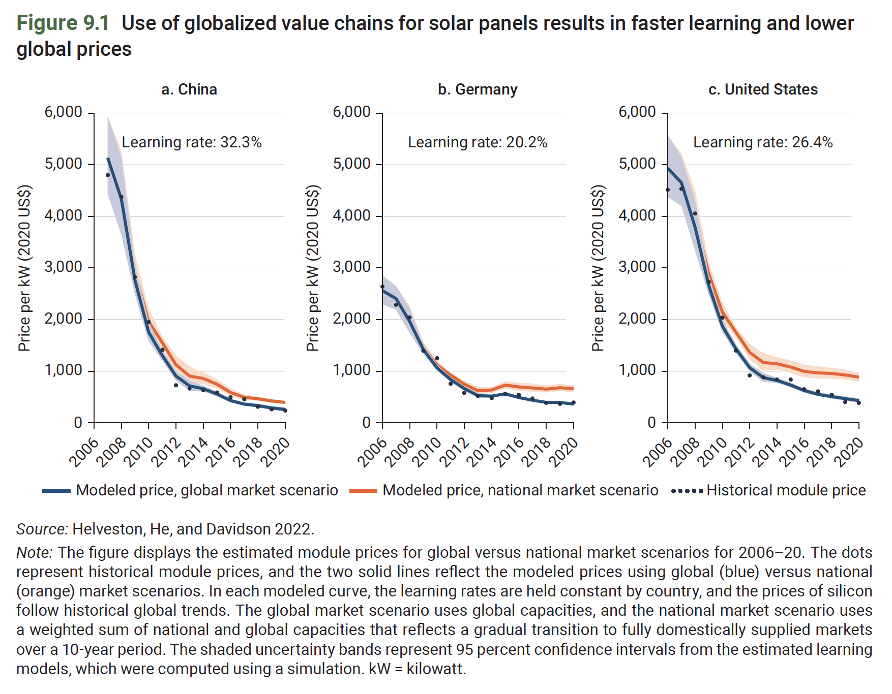

# Quantifying the cost savings of global solar photovoltaic supply chains

*Nature*

paper

poster

slides

Globalized supply chains have saved solar installers in the U.S., Germany, and China \$67B from 2008–2020, and solar prices will be 20–30% higher in 2030 if countries move to produce domestically.

Authors

John Paul Helveston

Gang He

Michael R. Davidson

Published

October 26, 2022

[](https://www.nature.com/nature/volumes/612/issues/7938)

*Nature* December 1, 2022 Issue Cover highlighted our paper in the same issue

> **NOTE:**
>
> Quantifying the cost savings of global solar photovoltaic supply chains  
> John Paul Helveston, **Gang He**\*, and Michael R. Davidson  
> *Nature* (2022)  
> DOI: [10.1038/s41586-022-05316-6](https://doi.org/10.1038/s41586-022-05316-6)  

## Abstract

Achieving carbon neutrality requires deploying renewable energy at unprecedented speed and scale, yet countries sometimes implement policies that increase costs by restricting the free flow of capital, talent and innovation in favour of localizing benefits such as economic growth, employment and trade surpluses. Here we assess the cost savings from a globalized solar photovoltaic (PV) module supply chain. We develop a two-factor learning model using historical capacity, component and input material price data of solar PV deployment in the United States, Germany and China. We estimate that the globalized PV module market has saved PV installers US\$24 (19–31) billion in the United States, US\$7 (5–9) billion in Germany and US\$36 (26–45) billion in China from 2008 to 2020 compared with a counterfactual scenario where domestic manufacturers supply an increasing proportion of installed capacities over a ten-year period. Projecting the same scenario forwards from 2020 results in estimated solar module prices that are approximately 20–30 per cent higher in 2030 compared with a future with globalized supply chains. International climate policy benefits from a globalized low-carbon value chain, and these results point to the need for complementary policies to mitigate welfare distribution effects and potential impacts on technological crowding out.

[](https://www.nature.com/articles/s41586-022-05316-6/figures/2)

Comparison of estimated solar PV module prices under global versus national market scenarios in China (2007–2020), and Germany and the United States (2006–2020).

## Links

Published [paper](https://www.nature.com/articles/s41586-022-05316-6)

Paper summary: [The Cost of Going Solo in Solar](../../posts/2022-11-nature-solar-paper-summary/index.llms.md)

View-only SharedIt [full-text](https://rdcu.be/enuBz)

Preprint [pdf](../../files/papers/2022-nature-solar-supply-chains-preprint.pdf)

Author Correction [pdf](https://www.nature.com/articles/s41586-023-06262-7), [SI](https://static-content.springer.com/esm/art%3A10.1038%2Fs41586-023-06262-7/MediaObjects/41586_2023_6262_MOESM1_ESM.pdf)

Github: [solar-learning-2021](https://github.com/jhelvy/solar-learning-2021)

Zenodo: [Code and Data](https://doi.org/10.5281/zenodo.6989075)

Shinyapps: [Sensitivity visualization](https://jhelvy.shinyapps.io/solar-learning-2021/)

## Impact

Award: Integrated Assessment Modeling Consortium 2022 [Best Poster Award](../../posts/2022-12-iamc-2022-best-poster-award/index.llms.md)

*Nature* Highlights: [Climate policy: Solar energy expected to be cheaper through globalization](https://web.archive.org/web/20230603073317/https://www.natureasia.com/en/research/highlight/14262)

*Joule* Preview: [The cost of risk mitigation—Diversifying the global solar PV supply chain](https://doi.org/10.1016/j.joule.2022.12.003) by Nathan L.Chang, Mohammad Dehghanimadvar, and Renate Egan

Press release: [SBU News](https://news.stonybrook.edu/newsroom/global-collaboration-is-key-to-saving-billions-for-solar-module-production/), [GWU News](https://mediarelations.gwu.edu/global-collaboration-saved-countries-67-billion-solar-panel-production-costs), [UCSD News](https://today.ucsd.edu/story/open-trade-saves-countries-billions-in-solar-panel-production)

Coverage: [E&E News](https://www.eenews.net/articles/how-bidens-made-in-america-solar-strategy-may-backfire/), [*Foreign Policy*](https://foreignpolicy.com/2023/09/21/us-china-climate-cooperation-trade-ira-green-technology/), [GRID News](https://web.archive.org/web/20240106093827/https://themessenger.com/grid/the-us-is-reducing-its-reliance-on-china-for-green-technology-could-that-slow-progress-on-climate-change), [PV Magazine](https://pv-magazine-usa.com/2022/10/26/a-globalized-supply-chain-is-key-to-cutting-costs-in-solar-module-manufacturing/), [dot.LA](https://dot.la/deglobalization-2658510850.html), [pvbuzz](https://pvbuzz.com/new-study-quantifies-cost-savings-solar-industry-globalized-supply-chains/), [InnovateLongIsland](https://www.innovateli.com/no-736-on-immigrants-solar-energy-supplies-and-other-american-strengths-with-lots-of-candy-to-share/), [Mercom India](https://mercomindia.com/imposing-import-tariffs-hamper-of-solar-energy-study/), [China News](https://www.chinanews.com.cn/cj/2022/10-27/9881042.shtml), [Science and Technology Daily](http://www.stdaily.com/index/kejixinwen/202210/e38ea5c3a3054d87a43996d39a2924ab.shtml)

[Nature Portfolio Chinese summary](https://mp.weixin.qq.com/s/CuyHGblyLcMfMo13VBXaFA)

Notable policy citations:

- DIW Berlin. 2025. [Non-Price Criteria in Renewable Energy Auctions and Consequences for the European Solar PV Industry](https://www.diw.de/de/diw_01.c.997094.de/publikationen/diskussionspapiere/2026_2153/non-price_criteria_in_renewable_energy_auctions_and_consequences_for_the_european_solar_pv_industry.html).

- Harvard Belfer Center. 2025. [Sustaining the Global Energy Transition](https://www.belfercenter.org/research-analysis/sustaining-global-energy-transition).

- UNFCCC. 2025. [The Global Stocktake (GST) NDC Dialogue 2025 - Roundtable 2](https://unfccc.int/event/annual-gst-ndc-dialogue-mandated-event-0).

- Centre for Economic Policy Research. 2025. [The Economic Consequences of The Second Trump Administration: A Preliminary Assessment](https://cepr.org/publications/books-and-reports/economic-consequences-second-trump-administration-preliminary).

- MIT Center for Energy and Environmental Policy Research. 2025. [Good Spillover, Bad Spillover: Industrial Policy, Trade, and the Political Economy of Decarbonization](https://ceepr.mit.edu/good-spillover-bad-spillover-industrial-policy-trade-and-the-political-economy-of-decarbonization/).

- UN, OECD, The World Bank, WTO and IMF. 2024. [Working Together for Better Climate Action: Carbon pricing, policy spillovers, and global climate goals](https://unctad.org/publication/working-together-better-climate-action).

- UK Parliament Select Committee Publications. 2024. [Written evidence submitted by UK Trade for Net Zero](https://committees.parliament.uk/writtenevidence/129843/pdf/).

- World Bank. 2024. [World Development Report 2024: The Middle-Income Trap](https://hdl.handle.net/10986/41919).

- International Renewable Energy Agency. 2024. [Renewable energy and jobs: Annual review 2024](https://www.irena.org/Publications/2024/Oct/Renewable-energy-and-jobs-Annual-review-2024).

- World Trade Organization. 2023. [Trade Policy Tools for Climate Action](https://www.wto.org/english/res_e/publications_e/tptforclimataction_e.htm).

- World Trade Organization. 2023. [Global Value Chain Development Report 2023](https://www.wto.org/english/res_e/publications_e/gvc_dev_rep23_e.htm).

Source: [Altmetric](https://nature.altmetric.com/details/137703061/policy-documents) and [PlumX](https://plu.mx/plum/a/policy_citation?doi=10.1038/s41586-022-05316-6)

## The World Bank reproduced our chart

[](http://hdl.handle.net/10986/41919)

Source: World Bank. 2024. World Development Report 2024: The Middle-Income Trap. p.223

## Twitter Thread

> Excited to share new paper in [@nature](https://twitter.com/Nature?ref_src=twsrc%5Etfw) with [@JohnHelveston](https://twitter.com/JohnHelveston?ref_src=twsrc%5Etfw) and [@east_winds](https://twitter.com/east_winds?ref_src=twsrc%5Etfw) on “Quantifying the cost savings of global solar photovoltaic supply chains”.  
>   
> Paper: <https://t.co/2DpBh4huDj>  
>   
> pdf: <https://t.co/F7oPjA67LR>  
>   
> Vis: <https://t.co/a8Q306vnbq>  
>   
> More: <https://t.co/OVmdOUHIfZ> [pic.twitter.com/oFg4hGf9YK](https://t.co/oFg4hGf9YK)
>
> — Gang He (@DrGangHe) [October 26, 2022](https://twitter.com/DrGangHe/status/1585303259975061504?ref_src=twsrc%5Etfw)

## Poster

Here is the poster for [IAMC2022](https://www.iamconsortium.org/event/fifteenth-iamc-annual-meeting-2022/) which won the [Best Poster Award](../../posts/2022-12-iamc-2022-best-poster-award/index.llms.md). The [pdf](../../files/posters/nature-solar-supply-chains-poster.pdf) is also available.


## Slides

Above are the general slides for our paper; I presented them at [Tsinghua University](https://mp.weixin.qq.com/s/c_Z0RHwzkjziq-QvdUzs-g). Check the [slides](../../files/slides/solar-supply-chains-slides.llms.md) in a new tab.

## Citation

BibTeX citation:

``` quarto-appendix-bibtex
@article{paul_helveston2022,
  author = {Paul Helveston, John and He, Gang and R. Davidson, Michael},
  title = {Quantifying the Cost Savings of Global Solar Photovoltaic
    Supply Chains},
  journal = {Nature},
  volume = {612},
  number = {7938},
  pages = {83-87},
  date = {2022-12-01},
  url = {https://www.nature.com/articles/s41586-022-05316-6},
  doi = {10.1038/s41586-022-05316-6},
  langid = {en}
}
```

For attribution, please cite this work as:

Paul Helveston, John, Gang He, and Michael R. Davidson. 2022. “Quantifying the Cost Savings of Global Solar Photovoltaic Supply Chains.” *Nature* 612 (7938): 83–87. <https://doi.org/10.1038/s41586-022-05316-6>.
