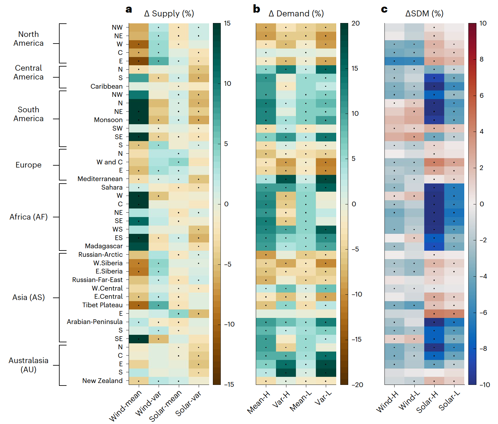

# Climate change impacts on planned supply–demand match in global wind and solar energy systems

*Nature Energy*

paper

slides

Up to 32% or 44% of non-Antarctic land areas for wind or solar, respectively, are projected to experience supply–demand match reductions by the end of this century under an intermediate emission scenario.

Authors

Laibao Liu

Gang He

Mengxi Wu

Gang Liu

Haoran Zhang

Ying Chen

Jiashu Shen

Shuangcheng Li

Published

July 24, 2023



Climate change impacts on supply, demand, and supply-demand match

> **NOTE:**
>
> Climate change impacts on planned supply–demand match in global wind and solar energy systems  
> Laibao Liu\*, **Gang He**, Mengxi Wu\*, Gang Liu, Haoran Zhang, Ying Chen, Jiashu Shen, Shuangcheng Li  
> *Nature Energy* (2023)  
> DOI: [10.1038/s41560-023-01304-w](https://doi.org/10.1038/s41560-023-01304-w)

## Abstract

Climate change modulates both energy demand and wind/solar energy supply, but a globally synthetic analysis of supply-demand match (SDM) is lacking. Here we use 12 state-of-the-art climate models to assess climate change impacts on SDM, quantified by the fraction of demand met by local wind or solar supply. For energy systems with varying dependence on wind or solar supply, up to 32% or 44% of non-Antarctic land areas, respectively, are projected to experience robust SDM reductions by the end of this century under an intermediate emission scenario. Smaller and more variable supply reduces SDM at northern middle-to-high latitudes, whereas reduced heating demand alleviates or reverses SDM reductions remarkably. By contrast, despite supply increases somewhere at low latitudes, raised cooling demand reduces SDM substantially. Changes in climate extremes and climate mean make size-comparable contributions. Our results provide early warnings for energy sectors in climate change adaptation.

## Links

Published [paper](https://www.nature.com/articles/s41560-023-01304-w)

Open access [pdf](https://www.nature.com/articles/s41560-023-01304-w.pdf)

Zenodo: [Code and Data](https://zenodo.org/record/6884124)

Notable policy citations:

- UNEP. 2024. [Emissions gap report 2024: no more hot air please: with a massive gap between rhetoric and reality, countries draft new climate commitments](https://wedocs.unep.org/handle/20.500.11822/46404).

Source: [PlumX](https://plu.mx/plum/a/policy_citation?doi=10.1038/s41560-023-01304-w)

## Twitter Thread

> Climate change impacts energy supply, it impacts demand too, what about supply and demand balance?  
>   
> Our new [@NatureEnergyJnl](https://twitter.com/NatureEnergyJnl?ref_src=twsrc%5Etfw) paper mapped out how climate change impacts wind solar supply demand match globally.  
>   
> Paper: <https://t.co/TgyvQW2GOc>  
> Code: <https://t.co/EsM3wauMKZ> [pic.twitter.com/RTT40YoZNJ](https://t.co/RTT40YoZNJ)
>
> — Gang He (@DrGangHe) [July 24, 2023](https://twitter.com/DrGangHe/status/1683500554809475072?ref_src=twsrc%5Etfw)

## Slides

Above are the general slides for our paper; I presented it at [APPAM](../../posts/2024-11-appam-climate-change-impacts-and-responses-assessment-politics-and-policy/index.llms.md). Check the [slides](../../files/slides/climate-power-sdm.llms.md) in a new tab.

## Citation

BibTeX citation:

``` quarto-appendix-bibtex
@article{liu2023,
  author = {Liu, Laibao and He, Gang and Wu, Mengxi and Liu, Gang and
    Zhang, Haoran and Chen, Ying and Shen, Jiashu and Li, Shuangcheng},
  title = {Climate Change Impacts on Planned Supply–Demand Match in
    Global Wind and Solar Energy Systems},
  journal = {Nature Energy},
  volume = {8},
  number = {8},
  pages = {870-880},
  date = {2023-08-22},
  url = {https://www.nature.com/articles/s41560-023-01304-w},
  doi = {10.1038/s41560-023-01304-w},
  langid = {en}
}
```

For attribution, please cite this work as:

Liu, Laibao, Gang He, Mengxi Wu, et al. 2023. “Climate Change Impacts on Planned Supply–Demand Match in Global Wind and Solar Energy Systems.” *Nature Energy* 8 (8): 870–80. <https://doi.org/10.1038/s41560-023-01304-w>.
