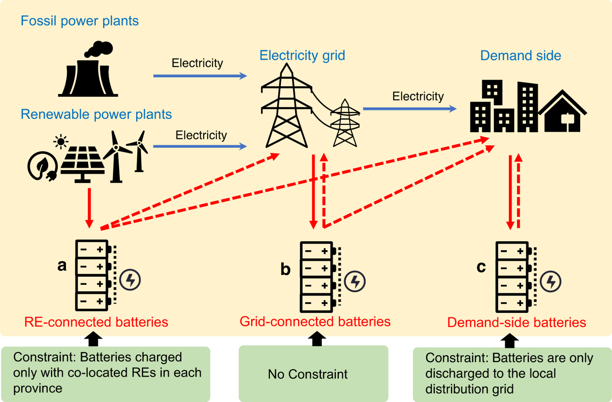

# Heterogeneous effects of battery storage deployment strategies on decarbonization of provincial power systems in China

*Nature Communications*

paper

We find heterogeneous strategies provide the lowest system costs; however, carbon emissions depend on carbon prices.

Authors

Liqun Peng

Denise L. Mauzerall

Yaofeng D. Zhong

Gang He

Published

August 11, 2023



Three battery storage deployment strategies

> **NOTE:**
>
> Heterogeneous effects of battery storage deployment strategies on decarbonization of provincial power systems in China  
> Liqun Peng, Denise L. Mauzerall\*, Yaofeng D. Zhong, **Gang He**\*  
> *Nature Communications* (2023)  
> DOI: [10.1038/s41467-023-40337-3](https://doi.org/10.1038/s41467-023-40337-3)

## Abstract

Battery storage is critical for integrating variable renewable generation, yet how the location, scale, and timing of storage deployment affect system costs and carbon dioxide (CO2) emissions is uncertain. We improve a power system model, SWITCH-China, to examine three nationally uniform battery deployment strategies (Renewable-connected, Grid-connected, and Demand-side) and a heterogeneous battery deployment strategy where each province is allowed to utilize any of the three battery strategies. Here, we find that the heterogeneous strategy always provides the lowest system costs among all four strategies, where provinces with abundant renewable resources dominantly adopt Renewable-connected batteries while those with limited renewables dominantly adopt Demand-side batteries. However, which strategy achieves the lowest CO2 emissions depends on carbon prices. The Renewable-connected strategy achieves the lowest CO2 emissions when carbon prices are relatively low, and the heterogeneous strategy results in the lowest CO2 emissions only at extremely high carbon prices.

## Links

Published [paper](https://www.nature.com/articles/s41467-023-40337-3)

Open-access [pdf](https://www.nature.com/articles/s41467-023-40337-3.pdf)

## Citation

BibTeX citation:

``` quarto-appendix-bibtex
@article{peng2023,
  author = {Peng, Liqun and L. Mauzerall, Denise and D. Zhong, Yaofeng
    and He, Gang},
  title = {Heterogeneous Effects of Battery Storage Deployment
    Strategies on Decarbonization of Provincial Power Systems in
    {China}},
  journal = {Nature Communications},
  volume = {14},
  pages = {4858},
  date = {2023-08-11},
  url = {https://www.nature.com/articles/s41467-023-40337-3},
  doi = {10.1038/s41467-023-40337-3},
  langid = {en}
}
```

For attribution, please cite this work as:

Peng, Liqun, Denise L. Mauzerall, Yaofeng D. Zhong, and Gang He. 2023. “Heterogeneous Effects of Battery Storage Deployment Strategies on Decarbonization of Provincial Power Systems in China.” *Nature Communications* 14 (August): 4858. <https://doi.org/10.1038/s41467-023-40337-3>.
