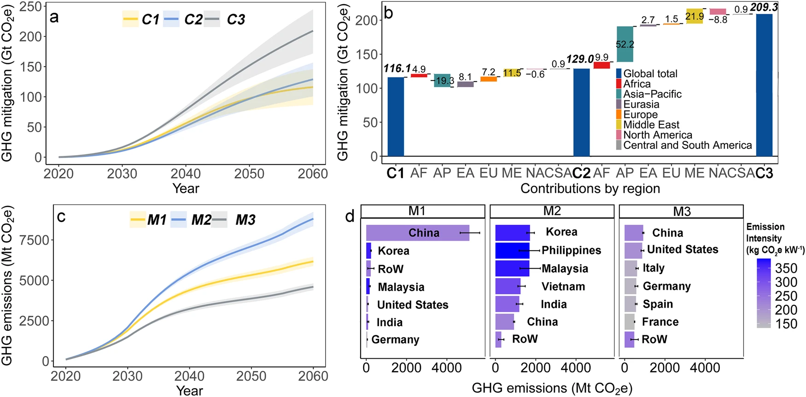

# Deploying solar photovoltaic energy first in carbon-intensive regions brings gigatons more carbon mitigations to 2060

*Communications Earth & Environment*

paper

The results call for strategic international coordination of PV industrial chain to increase GHG net mitigation.

Authors

Shi Chen

Xi Lu

Chris P. Nielsen

Michael B. McElroy

Gang He

Shaohui Zhang

Kebin He

Xiu Yang

Fang Zhang

Jimin Hao

Published

October 11, 2023



Future GHG mitigation and emissions of PV industry by scenario from 2020 to 2060

> **NOTE:**
>
> Deploying solar photovoltaic energy first in carbon-intensive regions brings gigatons more carbon mitigations to 2060  
> Shi Chen, Xi Lu\*, Chris P. Nielsen, Michael B. McElroy\*, Gang He, Shaohui Zhang, Kebin He, Xiu Yang, Fang Zhang & Jimin Hao  
> *Communications Earth & Environment* (2023)  
> DOI: [10.1038/s43247-023-01006-x](https://doi.org/10.1038/s43247-023-01006-x)

## Abstract

The global surge in solar photovoltaic (PV) power has featured spatial specialization from manufacturing to installation along its industrial chain. Yet how to improve PV climate benefits are under-investigated. Here we explore the evolution of net greenhouse gas (GHG) mitigation of PV industry from 2009–2060 with a spatialized-dynamic life-cycle-analysis. Results suggest a net GHG mitigation of 1.29 Gt CO2-equivalent from 2009–2019, achieved by 1.97 Gt of mitigation from installation minus 0.68 Gt of emissions from manufacturing. The highest net GHG mitigation among future manufacturing-installation-scenarios to meet 40% global power demand in 2060 is as high as 204.7 Gt from 2020–2060, featuring manufacturing concentrated in Europe and North America and prioritized PV installations in carbon-intensive nations. This represents 97.5 Gt more net mitigation than the worst-case scenario, equivalent to 1.9 times 2020 global GHG emissions. The results call for strategic international coordination of PV industrial chain to increase GHG net mitigation.

## Links

Published [paper](https://www.nature.com/articles/s43247-023-01006-x)

Open-access [pdf](https://www.nature.com/articles/s43247-023-01006-x.pdf)

## Citation

BibTeX citation:

``` quarto-appendix-bibtex
@article{chen2023,
  author = {Chen, Shi and Lu, Xi and P. Nielsen, Chris and B. McElroy,
    Michael and He, Gang and Zhang, Shaohui and He, Kebin and Yang, Xiu
    and Zhang, Fang and Hao, Jimin},
  title = {Deploying Solar Photovoltaic Energy First in Carbon-Intensive
    Regions Brings Gigatons More Carbon Mitigations to 2060},
  journal = {Communications Earth \& Environment},
  volume = {4},
  pages = {369},
  date = {2023-10-11},
  url = {https://www.nature.com/articles/s43247-023-01006-x},
  doi = {10.1038/s43247-023-01006-x},
  langid = {en}
}
```

For attribution, please cite this work as:

Chen, Shi, Xi Lu, Chris P. Nielsen, et al. 2023. “Deploying Solar Photovoltaic Energy First in Carbon-Intensive Regions Brings Gigatons More Carbon Mitigations to 2060.” *Communications Earth & Environment* 4 (October): 369. <https://doi.org/10.1038/s43247-023-01006-x>.
