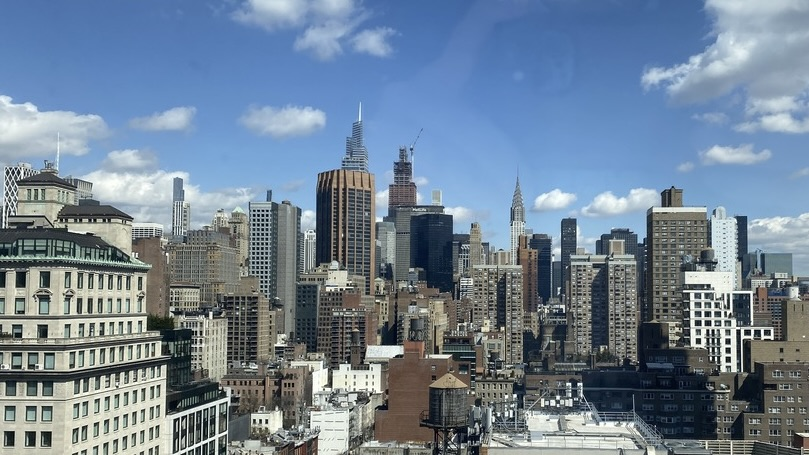

# Teaching Program Evaluation

news

Lectures, stories, and case studies on Program Evaluation.

Author

Gang He

Published

May 18, 2024

NYC is our classroom

I had the pleasure of teaching the EMPA class Program Evaluation with Professor Samantha MacBride in Spring 2024. The goal of the class is to enable students to conduct “sensible evaluation at reasonable costs.” Below are the teaching materials for the class.

## Course Link

[https://drganghe.github.io/program-evaluation/](https://drganghe.github.io/program-evaluation/)

## Lectures

- [Introduction and Overview](https://drganghe.github.io/program-evaluation/2024/lecture1.html)
- [Goals and Types of Evaluation](https://drganghe.github.io/program-evaluation/2024/lecture2.html)
- [Logic and Causal Models](https://drganghe.github.io/program-evaluation/2024/lecture3.html)
- [Stakeholder Engagement](https://drganghe.github.io/program-evaluation/2024/lecture4.html)
- [Evaluation Designs](https://drganghe.github.io/program-evaluation/2024/lecture5.html)
- [Data Collection](https://drganghe.github.io/program-evaluation/2024/lecture6.html)
- [Data Analysis](https://drganghe.github.io/program-evaluation/2024/lecture7.html)
- [Economic Evaluation and Performance Measurement](https://drganghe.github.io/program-evaluation/2024/lecture8.html)  
- [Ethics, Principles, and Standards](https://drganghe.github.io/program-evaluation/2024/lecture9.html)

## Stories

- [John Snow](https://drganghe.github.io/program-evaluation/2024/john-snow-and-evidence-based-analysis.html)
- [High Line Park](https://drganghe.github.io/program-evaluation/2024/high-line-park.html)  
- [Bombing, Heating, and Causal Models](https://drganghe.github.io/program-evaluation/2024/bombing-heating-and-causal-models.html)  
- [John Muir and National Park System](https://drganghe.github.io/program-evaluation/2024/john-muir-and-national-park.html)  
- [Esther Duflo and RCTs](https://drganghe.github.io/program-evaluation/2024/esther-duflo-and-rcts.html)
- [Fei-Fei Li and ImageNet](https://drganghe.github.io/program-evaluation/2024/feifei-li-imagenet-and-ai-revolution.html)
- [Hans Rosling and Storytelling](https://drganghe.github.io/program-evaluation/2024/hans-rosling-data-visualization-and-storystelling.html)
- [Robert Bullard and Environmental Justice](https://drganghe.github.io/program-evaluation/2024/robert-bullard-and-environmental-justice.html)
- [The Moral Machine](https://drganghe.github.io/program-evaluation/2024/the-moral-machine-and-ethics.html)

## Case studies

- Case 1: Northwest Housing Alternatives
- Case 2: Jobs Plus in NYC
- Case 3: ARPA-E
- Case 4: NYC Gifted & Talented Program
- Case 5: CBA of EPA Clean Air Act

## Program evaluation mindmap

Open the mindmap in a new [tab](https://drganghe.github.io/program-evaluation/images/program-evaluation-markmap.html), or [download](program-evaluation-mindmap.png) the mindmap.
