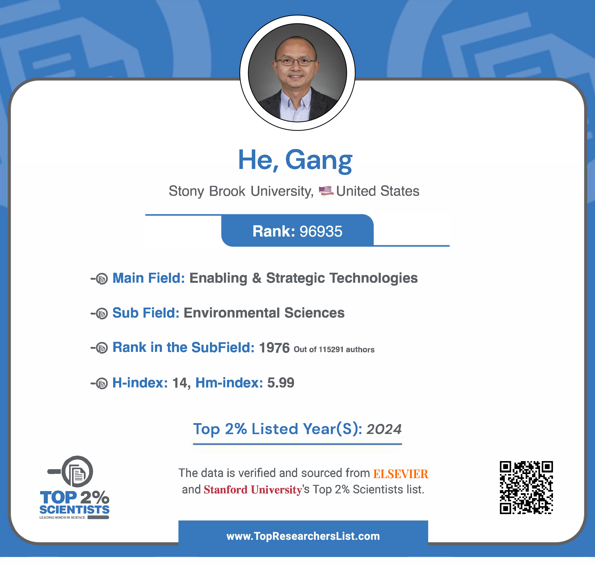

# Included in World’s Top 2% Scientists List 2024

news

recognition

video

Thank you for supporting our work!

Author

Stanford/Elsevier

Published

September 17, 2024

The database mistakenly references my former employer where I’m still an Affiliated Faculty. I have since joined CUNY-Baruch College.

## Acknowledgment

Grateful to be included in the **[Stanford/Elsevier Top 2% Scientists List 2024](https://topresearcherslist.com/Home/Profile/858833)** in three subfields:

- Environmental Sciences
- Energy
- Enabling & Strategic Technologies

I want to take a moment to thank my family, current and former students, visiting scholars, mentors, collaborators, funders, editors, reviewers, and colleagues for their invaluable support.

## Links

Baruch News, [Baruch College Faculty Included in World’s Top Scientist List](https://newscenter.baruch.cuny.edu/news/baruch-college-faculty-included-in-worlds-top-scientist-list/)

> 🎉 Congratulations to [\#MarxeFaculty](https://twitter.com/hashtag/MarxeFaculty?src=hash&ref_src=twsrc%5Etfw) Deborah Balk [@CIDR_NYC](https://twitter.com/CIDR_NYC?ref_src=twsrc%5Etfw), [@j_jgreene](https://twitter.com/j_jgreene?ref_src=twsrc%5Etfw), and [@DrGangHe](https://twitter.com/DrGangHe?ref_src=twsrc%5Etfw), along with six other [\#BaruchFaculty](https://twitter.com/hashtag/BaruchFaculty?src=hash&ref_src=twsrc%5Etfw) members, for being named to [@Stanford](https://twitter.com/Stanford?ref_src=twsrc%5Etfw) University and Elsevier’s “World’s Top 2% Scientists” list for 2024! 🌍✨  
>   
> 👉🔗 <https://t.co/fdUPQIZoRR> [pic.twitter.com/7UVra18g7S](https://t.co/7UVra18g7S)
>
> — Marxe School (@BaruchMarxe) [October 28, 2024](https://twitter.com/BaruchMarxe/status/1850920524072833515?ref_src=twsrc%5Etfw)

Source: Marxe School

## About World’s Top 2% Scientists

> Stanford University’s list of “World’s Top 2%” scientists is based on a 2% or above percentile rank, or the top 100,000 by c-score (with and without self-citations). This prestigious list identifies the world’s leading researchers, representing approximately 2% of all scientists worldwide. It encompasses standardised data on citations, h-index, and a wide range of bibliometric indicators. Researchers are classified into 22 scientific fields and 174 sub-fields, drawing from Scopus data provided by Elsevier through ICSR Lab.

Learn more [here](https://topresearcherslist.com/Home/AboutUs).
