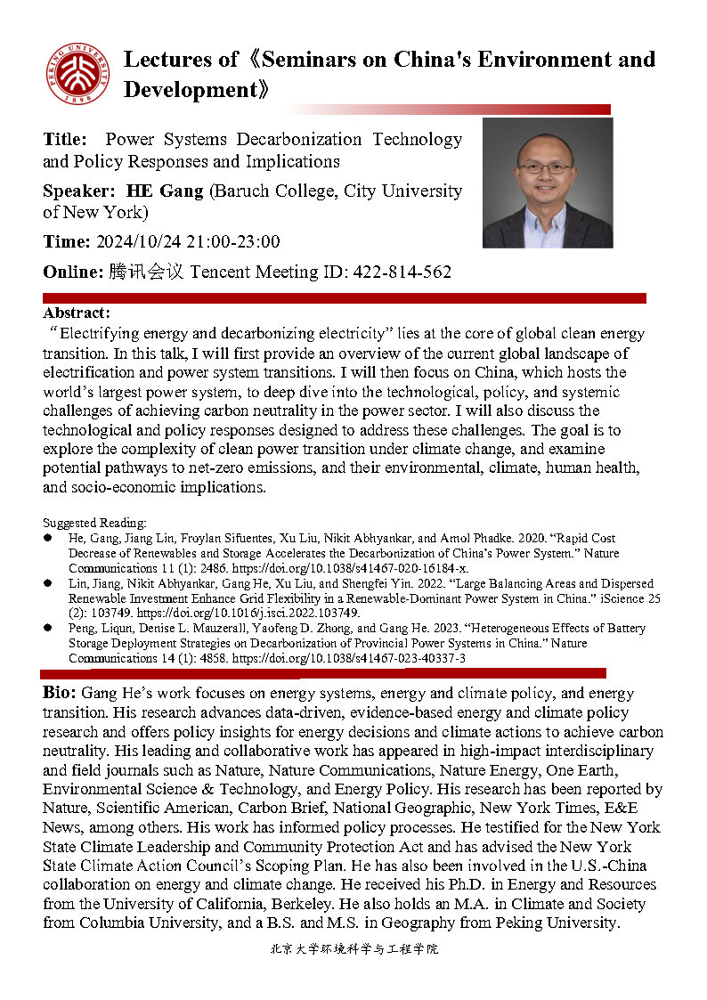

# Power Systems Decarbonization: Technology, Policy Responses, and Implications

event

presentation

Gang is invited to give an online guest lecture at Peking University

Author

CESE

Published

October 24, 2024

## Title

Power Systems Decarbonization: Technology, Policy Responses, and Implications

## Speaker

HE Gang, Baruch College, City University of New York

## Abstract

“Electrifying energy and decarbonizing electricity” lies at the core of the global clean energy transition. In this talk, I will first provide an overview of the current global landscape of electrification and power system transitions. I will then focus on China, which hosts the world’s largest power system, to take a deep dive into the technological, policy, and systemic challenges of achieving carbon neutrality in the power sector. I will also discuss the technological and policy responses designed to address these challenges. The goal is to explore the complexity of the clean power transition under climate change and examine potential pathways to net-zero emissions and their environmental, climate, human health, and socio-economic implications.

## Bio

Gang He’s work focuses on energy systems, energy and climate policy, and energy transition. His research advances data-driven, evidence-based energy and climate policy research and offers policy insights for energy decisions and climate actions to achieve carbon neutrality. His leading and collaborative work has appeared in high-impact interdisciplinary and field journals such as Nature, Nature Communications, Nature Energy, One Earth, Environmental Science & Technology, and Energy Policy. His research has been reported by Nature, Scientific American, Carbon Brief, National Geographic, The New York Times, E&E News, among others. His work has informed policy processes. He testified for the New York State Climate Leadership and Community Protection Act and has advised the New York State Climate Action Council’s Scoping Plan. He has also been involved in the U.S.-China collaboration on energy and climate change. He received his Ph.D. in Energy and Resources from the University of California, Berkeley. He also holds an M.A. in Climate and Society from Columbia University, and a B.S. and M.S. in Geography from Peking University.

## Flyer

## Relevant posts

##### SWITCH-China: Open Source Model for the World’s Largest Power System

Open model to study China’s clean power transition

SWITCH China

Nov 13, 2023

##### Long-term transition of China’s power sector under carbon neutrality target and water withdrawal constraint

Low-cost renewables reduced the need for CCS by 80%, and water…

Chao Zhang, Gang He, Josiah Johnston, Lijin Zhong

Dec 20, 2021

##### Rapid Cost Decrease of Renewables and Storage Accelerates the Decarbonization of China’s Power System

A renewable-dominant pathway is not just technologically sound, but also…

Gang He, Jiang Lin, Froylan Sifuentes, Xu Liu, Nikit Abhyankar, Amol Phadke

May 15, 2020

##### SWITCH-China: A Systems Approach to Decarbonizing China’s Power System

SWITCH-China, an integrated model for power sector decarbonization.

Gang He, Anne-Perrine Avrin, James H. Nelson, Josiah Johnston, Ana Mileva, Jianwei Tian, Daniel M. Kammen

May 8, 2016

## References

- Gang He et al. “Rapid Cost Decrease of Renewables and Storage Accelerates the Decarbonization of China’s Power System,” *Nature Communications* 11, no. 1 (May 19, 2020): 2486, <https://doi.org/10.1038/s41467-020-16184-x>.
- Gang He et al. “SWITCH-China: A Systems Approach to Decarbonizing China’s Power System,” *Environmental Science & Technology* 50, no. 11 (June 2016): 5467–73, <https://doi.org/10.1021/acs.est.6b01345>.
- Chao Zhang et al. “Long-Term Transition of China’s Power Sector Under Carbon Neutrality Target and Water Withdrawal Constraint,” *Journal of Cleaner Production* 329 (December 2021): 129765, <https://doi.org/10.1016/j.jclepro.2021.129765>.
- Jiang Lin et al. “Large Balancing Areas and Dispersed Renewable Investment Enhance Grid Flexibility in a Renewable-Dominant Power System in China,” *iScience* 25, no. 2 (February 2022): 103749, <https://doi.org/10.1016/j.isci.2022.103749>.
- Liqun Peng et al. “Heterogeneous Effects of Battery Storage Deployment Strategies on Decarbonization of Provincial Power Systems in China,” *Nature Communications* 14, no. 1 (August 2023): 4858, <https://doi.org/10.1038/s41467-023-40337-3>.
- Qian Luo et al. “Accelerating China’s Power Sector Decarbonization Can Save Lives: Integrating Public Health Goals into Power Sector Planning Decisions,” *Environmental Research Letters* 18, no. 10 (September 2023): 104023, <https://doi.org/10.1088/1748-9326/acf84b>.
- Haozhe Yang et al. “Regional Disparities in Health and Employment Outcomes of China’s Transition to a Low-Carbon Electricity System,” *Environmental Research: Energy* 1, no. 2 (April 2024): 025001, <https://doi.org/10.1088/2753-3751/ad3bb8>.
