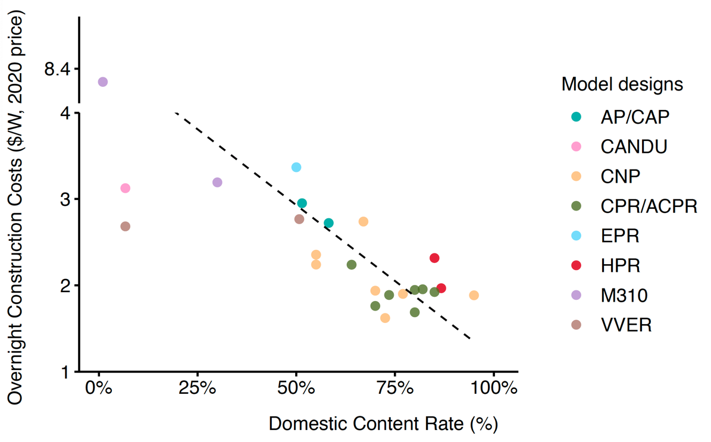
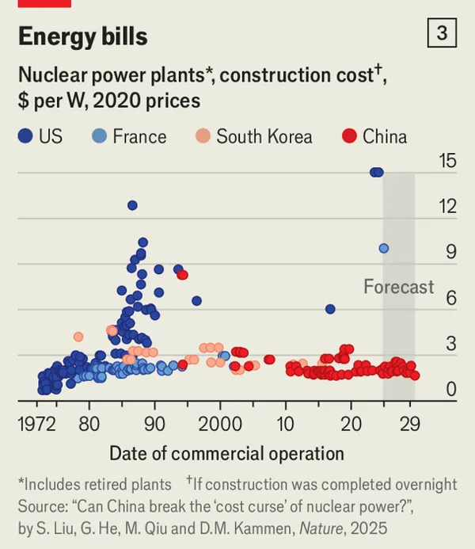
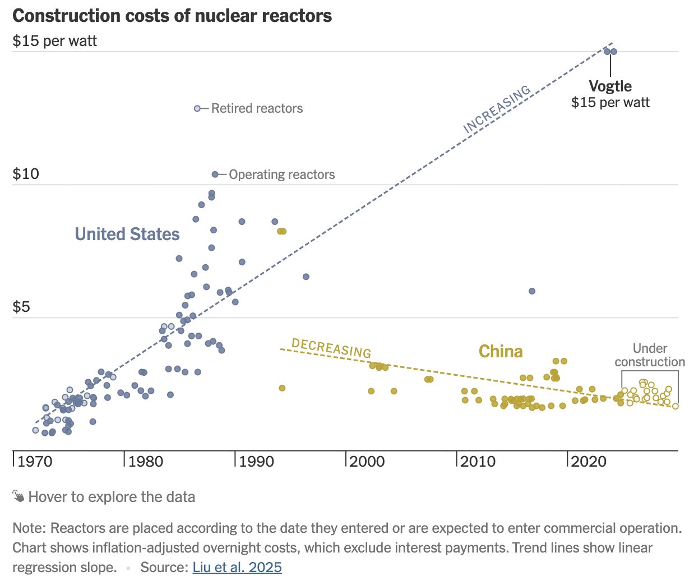

# Can China break the ‘cost curse’ of nuclear power?

*Nature*

paper

Escalating construction expenses threaten to derail global progress on atomic energy. China offers lessons on how to rein in costs.

Authors

Shangwei Liu

Gang He

Minghao Qiu

Daniel M. Kammen

Published

July 28, 2025

> **WARNING:**
>
> Title: **China reins in the spiralling construction costs of nuclear power — what can other countries learn?**
>
> Strengthening regulations and domestic supply chains could be key to making nuclear power more economically viable.

[](https://www.nature.com/articles/d41586-025-02341-z)

Cover page of the paper

> **NOTE:**
>
> Can China break the ‘cost curse’ of nuclear power?  
> Shangwei Liu\*, **Gang He**\*, Minghao Qiu, and Daniel M. Kammen  
> *Nature* (2025)  
> DOI: [10.1038/d41586-025-02341-z](https://doi.org/10.1038/d41586-025-02341-z)

## Summary

Escalating construction expenses threaten to derail global progress on atomic energy. China offers lessons on how to rein in costs. Over the past two decades, China has been the main country to substantially and consistently expand its nuclear fleet. Here we compiled and analyzed a dataset on the construction costs of nuclear power plants in China. We find that the construction costs of Chinese nuclear power plants have been declining since 2000, and the cost of building a nuclear power plant has been halved. China’s deliberate, staged effort to build domestic supply chains and standardized reactor designs has been key to this success. Coordinated regulatory structures and long-term policy commitments have also been important. As countries rush to expand nuclear capacities, they must combine affordability with safety, scalability, investor confidence and public trust. Without this, nuclear power will remain an expensive bet the world can ill afford.


Figure 1: Overnight construction costs of commercial nuclear power units in the US, France, and China. Overnight construction cost refers to the capital cost of building a nuclear power plant, excluding financing charges incurred during the construction period.[^1]



Figure 2: The effect of indigenization (domestic content rate) on unit overnight construction costs of Chinese operating nuclear power plants. Each dot represents a nuclear power plant (including multiple units), as costs and domestic content rates are typically reported at this level. The dashed line represents the fitted linear regression of domestic content rate against unit overnight construction costs.

## Links

Published [paper](https://www.nature.com/articles/d41586-025-02341-z)

SharedIt [full-text](https://rdcu.be/eyaXW)

Preprint [pdf](../../files/papers/2025-nature-nuclear-costs.pdf)

Press [release](https://deeppolicylab.github.io/news/2025-07-28-nature-comment-nuclear-costs.html)

Supplementary information [pdf](https://media.nature.com/original/magazine-assets/d41586-025-02341-z/51274736)

Source [data](https://www.nature.com/magazine-assets/d41586-025-02341-z/51274734)

- Power plant level investment costs (overnight construction costs)
- Power plant indigenization rate (domestic content rate)
- Harmonized nuclear power plant costs across countries (U.S., France, China)

Nature Portfolio [summary](https://mp.weixin.qq.com/s/NZ6mnx_a46Fj0xepdMsluA) in Chinese

## *Nature* press release

> **Comment: China Offers Clues to Break Nuclear Power’s ‘Cost Curse’**
>
> While historically the nuclear industry has faced a ‘cost escalation curse’, as witnessed in the U.S. and France, China has halved and stabilized these expenses over the past two decades, according to a Comment piece published in Nature this week.
>
> Shangwei Liu, Gang He, Minghao Qiu, and Daniel Kammen compiled and analysed a data set on the construction costs of nuclear power plants in China drawn from a wide range of publicly available sources. They attribute this success to a strategic blend of stable regulations, domestic supply chain development, and standardized reactor designs. China’s centralized nuclear regulatory structure, long-term policy commitments, and rapid project execution have enabled it to build reactors in nearly half the time of recent Western counterparts. These findings have important implications for policymakers seeking a nuclear energy resurgence, “As countries rush to expand nuclear capacities, they must combine affordability with safety, scalability, investor confidence and public trust. Without this, nuclear power will remain an expensive bet the world can ill afford”, they conclude.

## *The Economist* and *The New York Times* reproduced our chart

[](https://www.economist.com/business/2025/09/04/why-nuclear-is-now-a-booming-industry)

Source: The Economist, September 4, 2025, Why nuclear is now a booming industry.

[](https://www.nytimes.com/interactive/2025/10/22/climate/china-us-nuclear-energy-race.html)

Source: The New York Times, October 23, 2025, How China Raced Ahead of the U.S. on Nuclear Power.

## LinkedIn

[Gang He](https://www.linkedin.com/in/hegang?trk=public_post_embed_feed-actor-name)

Energy and Climate Scholar, Researcher, and Teacher; Associate Professor, CUNY Baruch College / Graduate Center; Director, Deep Energy and Climate Policy Lab

8mo Edited

[LinkedIn](https://www.linkedin.com/feed/?trk=public_post_embed_linkedin-logo-image)

📢 New Nature Comment out today! 🔬 Can China break the 'cost curse' of nuclear power? 👥 Co-authored with [Shangwei Liu](https://www.linkedin.com/in/shangwei-liu-nus?trk=public_post_embed-text), [Minghao Qiu](https://www.linkedin.com/in/minghaoqiu?trk=public_post_embed-text), and [Daniel Kammen](https://www.linkedin.com/in/daniel-kammen-4217346?trk=public_post_embed-text). While nuclear energy has long struggled with rising construction costs—especially in the U.S. and France—China tells a different story. We compiled and analyzed a unique plant-level dataset on Chinese nuclear construction costs and found that standardization, indigenization, and coordinated industrial policy have driven costs down and stabilized them over the past two decades. Our Nature Comment explores how China has achieved this and what it means for the global clean energy transition. 📄 Read the article: [https://lnkd.in/eWDig4ch](https://www.linkedin.com/redir/redirect?url=https%3A%2F%2Flnkd%2Ein%2FeWDig4ch&urlhash=RCd7&trk=public_post_embed-text) 📖 Open-access full text (SharedIt): [https://rdcu.be/eyaXW](https://www.linkedin.com/redir/redirect?url=https%3A%2F%2Frdcu%2Ebe%2FeyaXW&urlhash=xRaH&trk=public_post_embed-text) 📢 Release summary: [https://lnkd.in/eGgueC_8](https://www.linkedin.com/redir/redirect?url=https%3A%2F%2Flnkd%2Ein%2FeGgueC_8&urlhash=r6An&trk=public_post_embed-text) 📎 Supplementary Information (methods + data sources): [https://lnkd.in/eVWd8Xfy](https://www.linkedin.com/redir/redirect?url=https%3A%2F%2Flnkd%2Ein%2FeVWd8Xfy&urlhash=ICe9&trk=public_post_embed-text) 📊 Source data (plant level costs and domestic content rates in China): [https://lnkd.in/ec9cEv2n](https://www.linkedin.com/redir/redirect?url=https%3A%2F%2Flnkd%2Ein%2Fec9cEv2n&urlhash=LcEB&trk=public_post_embed-text) Key insights: ✅ China has halved nuclear construction costs during the early 2000s ✅ Domestic content rates (indigenization) are strongly correlated with lower costs ✅ Standardized designs and regulatory stability accelerated project delivery ✅ Chinese reactors are built in nearly half the time of recent Western projects 💬 “As countries rush to expand nuclear capacity, they must combine affordability with safety, scalability, investor confidence, and public trust. Without this, nuclear power will remain an expensive bet the world can ill afford.” [\#NuclearEnergy](https://www.linkedin.com/signup/cold-join?session_redirect=https%3A%2F%2Fwww.linkedin.com%2Ffeed%2Fhashtag%2Fnuclearenergy&trk=public_post_embed-text) [\#CleanEnergy](https://www.linkedin.com/signup/cold-join?session_redirect=https%3A%2F%2Fwww.linkedin.com%2Ffeed%2Fhashtag%2Fcleanenergy&trk=public_post_embed-text) [\#ClimatePolicy](https://www.linkedin.com/signup/cold-join?session_redirect=https%3A%2F%2Fwww.linkedin.com%2Ffeed%2Fhashtag%2Fclimatepolicy&trk=public_post_embed-text) [\#EnergyTransition](https://www.linkedin.com/signup/cold-join?session_redirect=https%3A%2F%2Fwww.linkedin.com%2Ffeed%2Fhashtag%2Fenergytransition&trk=public_post_embed-text) [\#ChinaEnergy](https://www.linkedin.com/signup/cold-join?session_redirect=https%3A%2F%2Fwww.linkedin.com%2Ffeed%2Fhashtag%2Fchinaenergy&trk=public_post_embed-text) [\#NatureComment](https://www.linkedin.com/signup/cold-join?session_redirect=https%3A%2F%2Fwww.linkedin.com%2Ffeed%2Fhashtag%2Fnaturecomment&trk=public_post_embed-text) [\#Decarbonization](https://www.linkedin.com/signup/cold-join?session_redirect=https%3A%2F%2Fwww.linkedin.com%2Ffeed%2Fhashtag%2Fdecarbonization&trk=public_post_embed-text)

- 
- 
- 

131 [14 Comments](https://www.linkedin.com/feed/update/urn:li:activity:7355643824590782465?trk=public_post_embed_social-actions-comments)

[ Like ](https://www.linkedin.com/signup/cold-join?session_redirect=https%3A%2F%2Fwww%2Elinkedin%2Ecom%2Ffeed%2Fupdate%2Furn%3Ali%3Aactivity%3A7355643824590782465&trk=public_post_embed_like-cta) [ Comment ](https://www.linkedin.com/signup/cold-join?session_redirect=https%3A%2F%2Fwww%2Elinkedin%2Ecom%2Ffeed%2Fupdate%2Furn%3Ali%3Aactivity%3A7355643824590782465&trk=public_post_embed_comment-cta)

Share

## Share this post

- 
- 
- 

## References

Rothwell, Geoffrey. 2022. “Projected Electricity Costs in International Nuclear Power Markets.” *Energy Policy* 164 (May): 112905. <https://doi.org/10.1016/j.enpol.2022.112905>.

## Footnotes

## Citation

BibTeX citation:

``` quarto-appendix-bibtex
@article{liu2025,
  author = {Liu, Shangwei and He, Gang and Qiu, Minghao and M. Kammen,
    Daniel},
  title = {Can {China} Break the “Cost Curse” of Nuclear Power?},
  journal = {Nature},
  volume = {643},
  pages = {1186-1188},
  date = {2025-07-31},
  url = {https://www.nature.com/articles/d41586-025-02341-z},
  doi = {10.1038/d41586-025-02341-z},
  langid = {en}
}
```

For attribution, please cite this work as:

Liu, Shangwei, Gang He, Minghao Qiu, and Daniel M. Kammen. 2025. “Can China Break the ‘Cost Curse’ of Nuclear Power?” *Nature* 643 (July): 1186–88. <https://doi.org/10.1038/d41586-025-02341-z>.

[^1]: **Clarification regarding Flamanville 3 cost estimates**: At the time of our data collection, Flamanville 3 was still under construction, with published overnight cost estimates ranging from \$4.013/W to \$8.62/W (see [Rothwell 2022](#ref-rothwellProjectedElectricityCosts2022), Table 2). In our original figure (now included as [Supplementary Figure S1](https://media.nature.com/original/magazine-assets/d41586-025-02341-z/51274736)), we used the lower bound estimate of \$4/W and denoted it as “\> \$4/W” to reflect the uncertainty and acknowledge that this conservative value already illustrates the magnitude of cost escalation in France’s recent nuclear construction. Subsequently, the [2025 French Court of Auditors’ review](https://www.ccomptes.fr/fr/publications/la-filiere-epr-une-dynamique-nouvelle-des-risques-persistants) placed the overnight construction cost at over \$10/W. We note that the “\>” symbol was inadvertently omitted from the final published figure, and we apologize for this oversight.
