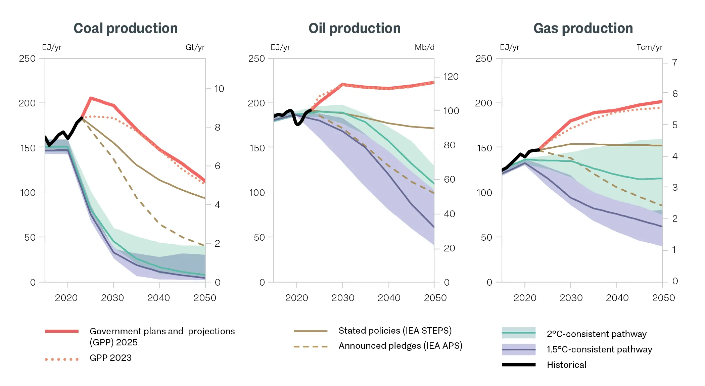
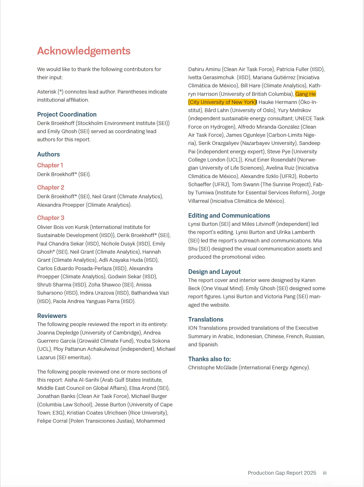

# Production Gap Report 2025

news

outreach

Gang serves as a reviewer for the Production Gap Report 2025

Author

SEI, Climate Analytics, IISD

Published

September 22, 2025

Production Gap Report 2025

## Summary

> This year’s report updates the analysis presented in the 2023 Production Gap Report, profiling the plans and projections of 20 major fossil fuel-producing countries, representing a mix of the world’s largest producers, large producers with readily available data, and producers with strongly stated climate ambitions.

## Links

Check the official [release](https://productiongap.org/2025-press/).

Production Gap Report 2025 full report [PDF](https://productiongap.org/wp-content/uploads/2025/09/PGR2025_full_web.pdf)

## Main findings

> - Since the 2023 analysis, governments now plan even higher levels of coal production to 2035 and gas production to 2050. Planned oil production continues to increase to 2050.
> - To meet Paris Agreement goals of holding warming to well below 2°C while pursuing efforts to limit warming to 1.5°C, the world must now undertake steeper and faster reductions in fossil fuel production to compensate for lack of progress so far. Meanwhile, governments expanding fossil fuel infrastructure waste public funds on development destined to become stranded assets.
> - Achieving these reductions will require deliberate, coordinated policies to ensure a just transition away from fossil fuels. While a few major fossil-fuel-producing countries have begun to align production plans with national and international climate goals, most still have not.

The increases in fossil fuel production estimated under the government plans and projections pathways would lead to global production levels in 2030 that are 500%, 31%, and 92% higher for coal, oil, and gas, respectively, than the median 1.5ºC-con­sistent pathway. These plans and projections also collectively exceed the fossil fuel production implied by countries’ own climate mitigation pledges by 35% in 2030 and 141% in 2050.

## Contributors

## Related Posts

### [UNEP releases the Production Gap Report 2023](../../posts/2023-11-unep-production-gap-report-2023/index.llms.md)

Gang joins a global expert team that contributed to the Production Gap Report 2023

Nov 8, 2023

SEI, Climate Analytics, E3G, IISD, UNEP
