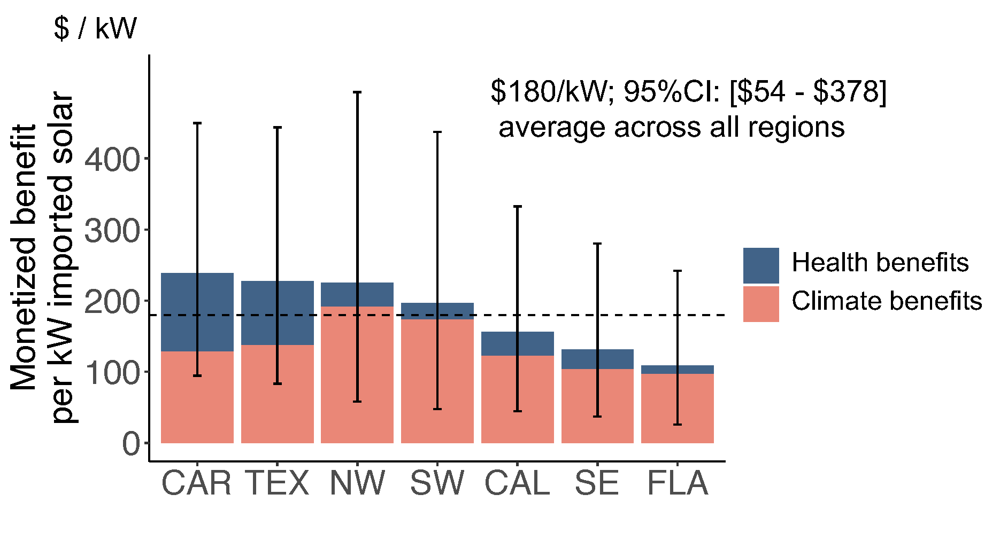
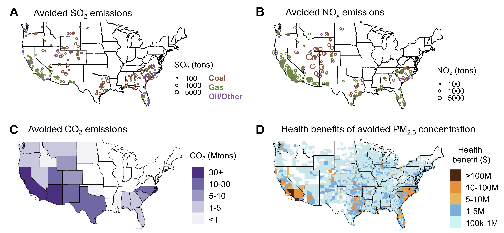
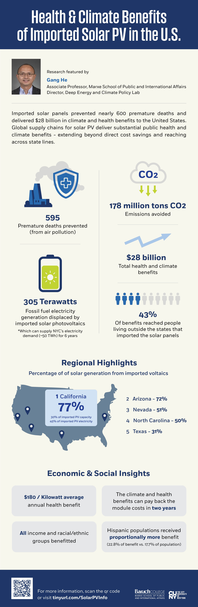

# Imported solar photovoltaics contributed to health and climate benefits in the United States

*One Earth*

paper

infographic

We estimate that imported solar panels in the U.S. displaced 305 TWh of fossil generation, avoided 178 million tons of CO₂, and prevented 595 premature deaths between 2014 and 2022.

Authors

Minghao Qiu

Gang He

Peter Marcotullio

Published

October 8, 2025

> **NOTE:**
>
> Imported solar photovoltaics contributed to health and climate benefits in the United States  
> Minghao Qiu, **Gang He**\*, Peter Marcotullio  
> *One Earth* (2025)  
> DOI: [10.1016/j.oneear.2025.101467](https://doi.org/10.1016/j.oneear.2025.101467)



Monetized climate and health benefits of importing 1 kW solar panels

## Abstract

Global supply chains have played a central role in driving down solar photovoltaic (PV) costs and accelerating deployment globally, but their broader societal benefits are underexplored. Here we quantify the climate, air quality, and health impacts of imported solar panels in the United States between 2014 and 2022. We find that 1 kW of imported solar capacity yields an average of \$180 in annualized climate and health benefits, offsetting nearly half the PV module cost in 2020. This imported capacity displaced fossil generation by 305 TWh, avoided 178 million tons of CO₂, and prevented an estimated 595 premature deaths between 2014 and 2022. While these advantages are unevenly distributed across regions and demographic groups, residents in non-importing states also benefited from them. These findings provide critical evidence for policy debates on clean energy trade, showing that imported solar capacity delivers substantial public health and climate gains beyond direct cost savings.



Avoided emissions and PM2.5-related health benefits associated with electricity generation from imported solar panels

## Links

Published [paper](https://www.cell.com/one-earth/abstract/S2590-3322(25)00293-3)

Preprint [pdf](../../files/papers/2025-one-earth-health-climate-benefits-of-imported-solar-pv-in-the-united-states.pdf)

Zenodo [data and resources](https://zenodo.org/records/16622349)

Release [summary](https://deeppolicylab.github.io/news/2025-10-08-one-earth-imported-solar-pv-health-and-climate-benefits-in-the-united-states.html)

## Infographic



Credit: Jason M. Epstein and Marxe Communications team

## Citation

BibTeX citation:

``` quarto-appendix-bibtex
@article{qiu2025,
  author = {Qiu, Minghao and He, Gang and Marcotullio, Peter},
  title = {Imported Solar Photovoltaics Contributed to Health and
    Climate Benefits in the {United} {States}},
  journal = {One Earth},
  volume = {8},
  number = {11},
  pages = {101467},
  date = {2025-10-08},
  url = {https://doi.org/10.1016/j.oneear.2025.101467},
  doi = {10.1016/j.oneear.2025.101467},
  langid = {en}
}
```

For attribution, please cite this work as:

Qiu, Minghao, Gang He, and Peter Marcotullio. 2025. “Imported Solar Photovoltaics Contributed to Health and Climate Benefits in the United States.” *One Earth* 8 (11): 101467. <https://doi.org/10.1016/j.oneear.2025.101467>.
