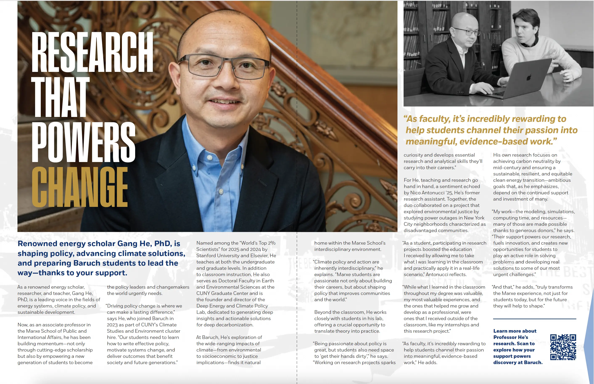

# 17 Lex Society Feature Story: Research That Powers Change

news

Renowned energy scholar Gang He, PhD, is shaping policy, advancing climate solutions, and preparing Baruch students to lead the way—thanks to your support.

Author

Meghan Goff

Published

December 16, 2025

## Feature Story

Note: Click the image to see the full view

## About 17 Lex Society

> Every Baruchian – past, present, and future – passes through the doors of “17 Lex” (17 Lexington Avenue). The campus building, on the corner of 23rd Street, is the site where the Free Academy, the first free public institution of higher education in the nation, once stood. Founded in 2007, [17 Lex Society](https://bcf.alumni.baruch.cuny.edu/supporters/17lex) members are leaders in creating the opportunities necessary to build on our, and your, tradition of changing lives for the better.
