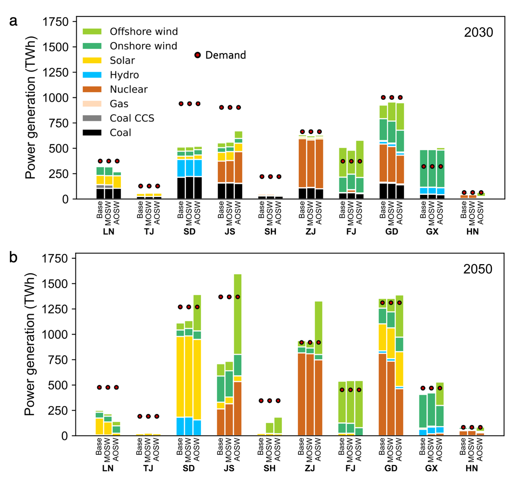

# Aligning offshore wind deployment with local priorities to accelerate power system decarbonization

*Communications Earth & Environment*

paper

Offshore wind can bolster the energy self-sufficiency of coastal provinces, shifting them from net electricity importers to exporters. It also reduces the need for energy storage in a grid with high renewable penetration and drives substantial local investment and job creation.

Authors

Liqun Peng

Gang He

Nikit Abhyankar

Haozhe Yang

Umed Paliwal

Jiang Lin

Published

April 21, 2026



Energy self-sufficiency of coastal provinces under the Base, MOSW, and AOSW scenarios

> **NOTE:**
>
> Aligning offshore wind deployment with local priorities to accelerate power system decarbonization  
> Peng, Liqun, **Gang He**, Nikit Abhyankar, Haozhe Yang, Umed Paliwal, and Jiang Lin\*  
> *Communications Earth & Environment* (2026)  
> DOI: [10.1038/s43247-026-03533-9](https://doi.org/10.1038/s43247-026-03533-9)

## Abstract

Accelerating offshore wind power deployment, a critical but underutilized resource for decarbonizing power systems, requires balancing national and local interests. Using China, the global leader in offshore wind, as a case study, here we evaluate how its deployment creates benefits, such as improved energy self-sufficiency, greater resource diversity, enhanced grid reliability, and increased local investment and employment. Our results show that offshore wind can bolster the energy self-sufficiency of coastal provinces, shifting them from net electricity importers to exporters. Furthermore, expanding offshore wind reduces the need for energy storage in a grid with high renewable penetration and drives substantial local investment and job creation. After quantifying uncertainties in policies, technology costs, and electricity demand, we find offshore wind could provide 3–18% of China’s electricity by 2050. Aligning local interests with offshore wind development can facilitate more ambitious targets and accelerate power system decarbonization with limited increases in system costs.

## Links

Published [paper](https://www.nature.com/articles/s43247-026-03533-9)

Open-access [pdf](https://www.nature.com/articles/s43247-026-03533-9.pdf)

## Citation

BibTeX citation:

``` quarto-appendix-bibtex
@article{peng2026,
  author = {Peng, Liqun and He, Gang and Abhyankar, Nikit and Yang,
    Haozhe and Paliwal, Umed and Lin, Jiang},
  title = {Aligning Offshore Wind Deployment with Local Priorities to
    Accelerate Power System Decarbonization},
  journal = {Communications Earth \& Environment},
  volume = {7},
  pages = {533},
  date = {2026-04-21},
  url = {https://www.nature.com/articles/s43247-026-03533-9},
  doi = {10.1038/s43247-026-03533-9},
  langid = {en}
}
```

For attribution, please cite this work as:

Peng, Liqun, Gang He, Nikit Abhyankar, Haozhe Yang, Umed Paliwal, and Jiang Lin. 2026. “Aligning Offshore Wind Deployment with Local Priorities to Accelerate Power System Decarbonization.” *Communications Earth & Environment* 7 (April): 533. <https://doi.org/10.1038/s43247-026-03533-9>.
