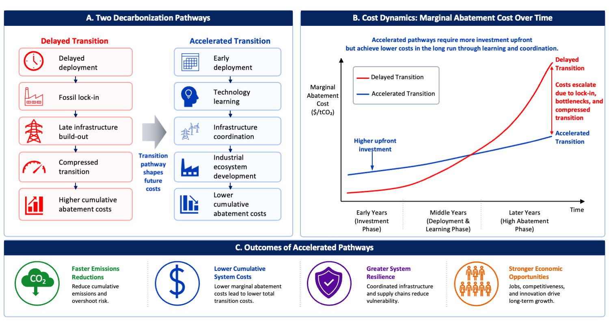

# How Hard Are Hard-to-Abate Sectors? Rethinking Industrial Decarbonization Pathways

*One Earth*

paper

Coordinated, system-wide transitions can accelerate learning, lower costs, strengthen competitiveness, and offer implications for global industrial decarbonization.

Authors

Gang He [](mailto:gang.he@baruch.cuny.edu) [![](data:image/png;base64,iVBORw0KGgoAAAANSUhEUgAAABAAAAAQCAYAAAAf8/9hAAAAGXRFWHRTb2Z0d2FyZQBBZG9iZSBJbWFnZVJlYWR5ccllPAAAA2ZpVFh0WE1MOmNvbS5hZG9iZS54bXAAAAAAADw/eHBhY2tldCBiZWdpbj0i77u/IiBpZD0iVzVNME1wQ2VoaUh6cmVTek5UY3prYzlkIj8+IDx4OnhtcG1ldGEgeG1sbnM6eD0iYWRvYmU6bnM6bWV0YS8iIHg6eG1wdGs9IkFkb2JlIFhNUCBDb3JlIDUuMC1jMDYwIDYxLjEzNDc3NywgMjAxMC8wMi8xMi0xNzozMjowMCAgICAgICAgIj4gPHJkZjpSREYgeG1sbnM6cmRmPSJodHRwOi8vd3d3LnczLm9yZy8xOTk5LzAyLzIyLXJkZi1zeW50YXgtbnMjIj4gPHJkZjpEZXNjcmlwdGlvbiByZGY6YWJvdXQ9IiIgeG1sbnM6eG1wTU09Imh0dHA6Ly9ucy5hZG9iZS5jb20veGFwLzEuMC9tbS8iIHhtbG5zOnN0UmVmPSJodHRwOi8vbnMuYWRvYmUuY29tL3hhcC8xLjAvc1R5cGUvUmVzb3VyY2VSZWYjIiB4bWxuczp4bXA9Imh0dHA6Ly9ucy5hZG9iZS5jb20veGFwLzEuMC8iIHhtcE1NOk9yaWdpbmFsRG9jdW1lbnRJRD0ieG1wLmRpZDo1N0NEMjA4MDI1MjA2ODExOTk0QzkzNTEzRjZEQTg1NyIgeG1wTU06RG9jdW1lbnRJRD0ieG1wLmRpZDozM0NDOEJGNEZGNTcxMUUxODdBOEVCODg2RjdCQ0QwOSIgeG1wTU06SW5zdGFuY2VJRD0ieG1wLmlpZDozM0NDOEJGM0ZGNTcxMUUxODdBOEVCODg2RjdCQ0QwOSIgeG1wOkNyZWF0b3JUb29sPSJBZG9iZSBQaG90b3Nob3AgQ1M1IE1hY2ludG9zaCI+IDx4bXBNTTpEZXJpdmVkRnJvbSBzdFJlZjppbnN0YW5jZUlEPSJ4bXAuaWlkOkZDN0YxMTc0MDcyMDY4MTE5NUZFRDc5MUM2MUUwNEREIiBzdFJlZjpkb2N1bWVudElEPSJ4bXAuZGlkOjU3Q0QyMDgwMjUyMDY4MTE5OTRDOTM1MTNGNkRBODU3Ii8+IDwvcmRmOkRlc2NyaXB0aW9uPiA8L3JkZjpSREY+IDwveDp4bXBtZXRhPiA8P3hwYWNrZXQgZW5kPSJyIj8+84NovQAAAR1JREFUeNpiZEADy85ZJgCpeCB2QJM6AMQLo4yOL0AWZETSqACk1gOxAQN+cAGIA4EGPQBxmJA0nwdpjjQ8xqArmczw5tMHXAaALDgP1QMxAGqzAAPxQACqh4ER6uf5MBlkm0X4EGayMfMw/Pr7Bd2gRBZogMFBrv01hisv5jLsv9nLAPIOMnjy8RDDyYctyAbFM2EJbRQw+aAWw/LzVgx7b+cwCHKqMhjJFCBLOzAR6+lXX84xnHjYyqAo5IUizkRCwIENQQckGSDGY4TVgAPEaraQr2a4/24bSuoExcJCfAEJihXkWDj3ZAKy9EJGaEo8T0QSxkjSwORsCAuDQCD+QILmD1A9kECEZgxDaEZhICIzGcIyEyOl2RkgwAAhkmC+eAm0TAAAAABJRU5ErkJggg==)](https://orcid.org/0000-0002-8416-1965)

Jiang Lin [](mailto:lin.jiang@berkeley.edu) [![](data:image/png;base64,iVBORw0KGgoAAAANSUhEUgAAABAAAAAQCAYAAAAf8/9hAAAAGXRFWHRTb2Z0d2FyZQBBZG9iZSBJbWFnZVJlYWR5ccllPAAAA2ZpVFh0WE1MOmNvbS5hZG9iZS54bXAAAAAAADw/eHBhY2tldCBiZWdpbj0i77u/IiBpZD0iVzVNME1wQ2VoaUh6cmVTek5UY3prYzlkIj8+IDx4OnhtcG1ldGEgeG1sbnM6eD0iYWRvYmU6bnM6bWV0YS8iIHg6eG1wdGs9IkFkb2JlIFhNUCBDb3JlIDUuMC1jMDYwIDYxLjEzNDc3NywgMjAxMC8wMi8xMi0xNzozMjowMCAgICAgICAgIj4gPHJkZjpSREYgeG1sbnM6cmRmPSJodHRwOi8vd3d3LnczLm9yZy8xOTk5LzAyLzIyLXJkZi1zeW50YXgtbnMjIj4gPHJkZjpEZXNjcmlwdGlvbiByZGY6YWJvdXQ9IiIgeG1sbnM6eG1wTU09Imh0dHA6Ly9ucy5hZG9iZS5jb20veGFwLzEuMC9tbS8iIHhtbG5zOnN0UmVmPSJodHRwOi8vbnMuYWRvYmUuY29tL3hhcC8xLjAvc1R5cGUvUmVzb3VyY2VSZWYjIiB4bWxuczp4bXA9Imh0dHA6Ly9ucy5hZG9iZS5jb20veGFwLzEuMC8iIHhtcE1NOk9yaWdpbmFsRG9jdW1lbnRJRD0ieG1wLmRpZDo1N0NEMjA4MDI1MjA2ODExOTk0QzkzNTEzRjZEQTg1NyIgeG1wTU06RG9jdW1lbnRJRD0ieG1wLmRpZDozM0NDOEJGNEZGNTcxMUUxODdBOEVCODg2RjdCQ0QwOSIgeG1wTU06SW5zdGFuY2VJRD0ieG1wLmlpZDozM0NDOEJGM0ZGNTcxMUUxODdBOEVCODg2RjdCQ0QwOSIgeG1wOkNyZWF0b3JUb29sPSJBZG9iZSBQaG90b3Nob3AgQ1M1IE1hY2ludG9zaCI+IDx4bXBNTTpEZXJpdmVkRnJvbSBzdFJlZjppbnN0YW5jZUlEPSJ4bXAuaWlkOkZDN0YxMTc0MDcyMDY4MTE5NUZFRDc5MUM2MUUwNEREIiBzdFJlZjpkb2N1bWVudElEPSJ4bXAuZGlkOjU3Q0QyMDgwMjUyMDY4MTE5OTRDOTM1MTNGNkRBODU3Ii8+IDwvcmRmOkRlc2NyaXB0aW9uPiA8L3JkZjpSREY+IDwveDp4bXBtZXRhPiA8P3hwYWNrZXQgZW5kPSJyIj8+84NovQAAAR1JREFUeNpiZEADy85ZJgCpeCB2QJM6AMQLo4yOL0AWZETSqACk1gOxAQN+cAGIA4EGPQBxmJA0nwdpjjQ8xqArmczw5tMHXAaALDgP1QMxAGqzAAPxQACqh4ER6uf5MBlkm0X4EGayMfMw/Pr7Bd2gRBZogMFBrv01hisv5jLsv9nLAPIOMnjy8RDDyYctyAbFM2EJbRQw+aAWw/LzVgx7b+cwCHKqMhjJFCBLOzAR6+lXX84xnHjYyqAo5IUizkRCwIENQQckGSDGY4TVgAPEaraQr2a4/24bSuoExcJCfAEJihXkWDj3ZAKy9EJGaEo8T0QSxkjSwORsCAuDQCD+QILmD1A9kECEZgxDaEZhICIzGcIyEyOl2RkgwAAhkmC+eAm0TAAAAABJRU5ErkJggg==)](https://orcid.org/0000-0001-7675-8334)

Published

August 21, 2026

> **NOTE:**
>
> How Hard Are Hard-to-Abate Sectors? Rethinking Industrial Decarbonization Pathways  
> **Gang He** and Jiang Lin  
> *One Earth* (2026)  
> DOI: [10.1016/j.oneear.2026.101784](https://doi.org/10.1016/j.oneear.2026.101784)

## Summary

Industrial decarbonization is widely regarded as one of the most difficult and costly challenges, or “hard-to-abate”, in achieving net-zero emissions. Recently in *Joule*, Dai and colleagues demonstrated accelerated decarbonization pathways at lower costs for China’s industrial sector. Here we argue that coordinated, system-wide transitions can accelerate learning, lower costs, strengthen competitiveness, and offer implications for global industrial decarbonization.

## Main Text

Industrial decarbonization is increasingly recognized as one of the persistent challenges of the global energy transition. While remarkable progress has been made in accelerating the deployment of renewable energy technologies and decarbonizing electricity systems, emissions from heavy industry, including steel, aluminum, cement, chemicals, and other energy-intensive sectors, remain stubbornly difficult to eliminate ([Bashmakov et al. 2022](#ref-IPCC_2022_WGIII_Ch_11)). These sectors account for roughly a quarter of global energy-related carbon dioxide emissions and are deeply embedded in modern economies through long-lived capital assets, complex supply chains, and process emissions that cannot be addressed through fuel switching alone ([Gailani et al. 2024](#ref-gailaniAssessingPotentialDecarbonization2024)).

As governments and industries pursue pathways toward net-zero emissions, industrial emissions are often portrayed as the “hard-to-abate” ([Meng et al. 2025](#ref-mengTechnologiesGapsDeep2025)) sectors of climate mitigation: technologically challenging, capital intensive, and inevitably expensive. Against this backdrop, a recent study by Dai and colleagues in *Joule* demonstrates that accelerated industrial decarbonization may save costs ([Liu et al. 2026](#ref-liuAcceleratedPathwaysChinas2026)). Through a system-wide assessment of China’s five major industrial sectors, which captures interactions across multiple industrial subsectors and energy carriers using IMED\|TEC (Integrated Model of Energy, Environment and Economy for Sustainable Development \| Technology Evaluation and Choice) model, the study assesses how technology choices, deployment timing, and infrastructure development jointly shape long-term outcomes.

The results show that faster transitions can reduce cumulative system costs from 2020 to 2060 by approximately 8% (saving USD 1.8 trillion) while preserving 10–20% of the remaining 1.5°C global carbon budget constraints. Their findings challenge the conventional view that deeper and faster decarbonization necessarily entails economic burdens. By avoiding delayed transitions that require more abrupt and expensive structural changes later, accelerated deployment of low-carbon technologies can lower cumulative system costs. Ultimately, the cost of decarbonization depends not only on where emissions ultimately end up, but also on how they get there ([Figure 1](#fig-1)).



Figure 1: Why Faster Can Be Cheaper: Cost Dynamics of Accelerated Industrial Decarbonization

**Note**: A) Comparisons between two transition pathways. Delayed transition can lead to fossil lock-in, infrastructure bottlenecks, and compressed deployment schedules that increase cumulative abatement costs. Accelerated deployment enables technology learning, infrastructure coordination, and industrial ecosystem development that lower mitigation costs over time. B) Conceptual evolution of marginal abatement costs under the two pathways. Although accelerated pathways may require greater upfront investment, they can reduce long-term costs through learning-by-doing, economies of scale, and coordinated infrastructure expansion. C) Broader system benefits, including faster emissions reductions, lower cumulative transition costs, greater resilience, and stronger economic opportunities.

Rather than viewing industrial decarbonization as a collection of isolated technology substitutions, the authors frame it as a coordinated system transformation involving energy, infrastructure, industry, and policy. This perspective has implications well beyond China and raises a fundamental question for policymakers and industrial stakeholders worldwide: Are hard-to-abate sectors inherently expensive to decarbonize, or have we been underestimating the value of coordinated action and early investment and deployment?

## Why Faster Could Be Cheaper

At first glance, the idea that accelerated decarbonization could reduce costs appears counterintuitive. Faster transitions typically require larger upfront investments, more rapid technology deployment, and significant infrastructure expansion. Yet several mechanisms help explain why earlier action can produce lower cumulative costs. Those mechanisms have been observed in the power sector ([He et al. 2020](#ref-he_rapid_2020)), and are now revealed in the industry sectors.

One primary mechanism is endogenous technological learning. Historical experience across clean energy technologies has consistently demonstrated that costs decline as production and deployment scales. Solar photovoltaics provide perhaps the most prominent example. Global solar costs have fallen by more than 90% over the past decade, driven largely by manufacturing scale, innovation, and globalized supply-chains ([Nemet 2026](#ref-nemetHowSolarEnergy2026)). Similar dynamics are emerging for electrolyzers, batteries, hydrogen-based direct reduced iron (H2-DRI), and other breakthrough technologies expected to play critical roles in industrial decarbonization. By accelerating deployment, countries can move technologies down learning curves more rapidly, significantly reducing capital costs for future investments. The Joule study highlights that early policy support can bring emerging technologies to cost parity with conventional processes years ahead of schedule, ensuring that by 2060, over 88% of annual emission reductions can be delivered by technologies costing less than 200 USD per ton of CO2.

China has been particularly influential in driving these cost reductions. Previous studies showed that globalized supply chains supported by large-scale manufacturing expansion and deployment contributed substantially to the decline in solar photovoltaic costs, saving installation costs worldwide and creating climate and health co-benefits ([Helveston et al. 2022](#ref-helveston_he_davidson_2022); [Qiu et al. 2025](#ref-qiuImportedSolarPhotovoltaics2025)). The same logic now extends to industrial decarbonization: by scaling up production of electrolyzers, electric arc furnaces, and other breakthrough equipment, China’s manufacturing ecosystem can accelerate learning and compress the timeline to cost competitiveness for the global market ([Meng et al. 2025](#ref-mengTechnologiesGapsDeep2025)).

A second mechanism involves avoiding stranded assets and carbon lock-in([Ploeg and Rezai 2020](#ref-ploegStrandedAssetsTransition2020)). Industrial facilities often operate for several decades. Delayed decarbonization risks locking economies into carbon-intensive infrastructure that either continues emitting for years or requires premature retirement. Both outcomes impose significant economic penalties. The Joule study identifies the 2035–2040 period as a critical window for China; missing this window sharply increases reliance on costlier end-of-pipe options like CCUS. Accelerated decarbonization can prevent these lock-in effects and reduce the need for disruptive transitions later.

A third mechanism arises from systems integration ([Davis et al. 2018](#ref-davisNetzeroEmissionsEnergy2018)). Industrial decarbonization depends not only on industrial technologies themselves but also on electricity systems, hydrogen production, and carbon transport networks. Coordinated planning can unlock synergies that are unavailable when sectors develop independently. For example, expanding renewable electricity capacity simultaneously supports industrial electrification and green hydrogen production. The Joule study projects that industrial electricity demand alone could reach approximately 4,300 TWh, and green hydrogen demand could reach approximately 66 Mt by mid-century. Shared infrastructure for carbon transport and storage can reduce costs across multiple industries.

## What Applies Globally, and What Does Not

China occupies a unique position in the global industrial transition. It produces more steel, cement, chemicals, and clean energy technologies than all other countries combined and its industry alone accounts for about 20% of global energy-related carbon emissions. At the same time, it possesses an unparalleled capacity to deploy infrastructure at scale and mobilize coordinated industrial policies.

These characteristics make China an important demonstration for exploring industrial decarbonization pathways. The country’s extensive and intensive manufacturing capacity creates opportunities for rapid learning and cost reductions. Strong industrial supply chains facilitate deployment of emerging technologies. Intense regional and domestic competition ensures the survival of capable market players. Long-term planning frameworks enable coordination across sectors.

Several insights from the study are broadly applicable across countries.

First, industrial decarbonization requires integrated planning across energy and industrial systems. Decisions regarding power generation, hydrogen production, industrial investments, and transport infrastructure are increasingly interconnected. Treating these domains separately risks creating bottlenecks and inefficiencies.

Second, early investment matters. Delaying action may appear economically attractive in the short term, but it can increase long-term costs by locking in carbon-intensive assets and slowing technological learning thus ceding industrial competitiveness in the future.

Third, policy coordination is essential. Industrial decarbonization cannot be achieved through carbon pricing alone. It requires coordinated policies supporting innovation, infrastructure, deployment, workforce transition, and market creation.

Fourth, global supply chains remain critical. The dramatic cost declines observed in renewable energy technologies demonstrate the value of international specialization, trade, and technology diffusion. Emerging industrial decarbonization technologies may benefit from similar dynamics.

However, China should not be viewed as a universal template, as many important factors and conditions differ across regions. For example, institutional capacity varies substantially between countries. Access to affordable capital remains a major barrier in many emerging economies. Resource endowments influence the competitiveness of renewable electricity, hydrogen production, and carbon storage opportunities. Geopolitical tensions and trade disputes increasingly shape technology flows and supply-chain structures.

Consequently, the pace and configuration of industrial transitions will inevitably differ across countries. The challenge for policymakers elsewhere is not to replicate China’s approach directly, but to identify which lessons are transferable and which depend on context-specific conditions. Successful strategies must account for local conditions while drawing upon broader system-level insights.

## Remaining Questions and Looking Ahead

Dai and colleagues offer a different perspective, suggesting that the design of decarbonization pathways, not simply the stringency of climate targets, plays a decisive role in determining costs. Despite important insights and implications, substantial uncertainties remain.

Technology uncertainty persists. The future costs and performance of hydrogen, CCUS, long-duration energy storage, and industrial electrification technologies remain uncertain. Demand trajectories, geopolitical developments, and trade policies may further alter optimal pathways.

One key challenge concerns governance. How can the system coordination envisioned in the study be achieved in mixed and diverse markets where investment decisions are distributed among numerous actors? Identifying institutional mechanisms that align diverse incentives with system-wide objectives remains a major challenge.

Infrastructure development presents another challenge. Large-scale deployment of hydrogen networks, carbon transport systems, and expanded transmission infrastructure will require significant planning, permitting, and public acceptance. Delays in these enabling systems could slow industrial transitions even when technologies are commercially available.

Finally, industrial decarbonization has important social dimensions. The distribution of costs, benefits, socio-economic impacts, and competitiveness outcomes will influence political feasibility. Ensuring that industrial transitions are both effective and equitable remains an essential task.

China’s experience, as discussed, should not be interpreted as a universal blueprint. Rather, it serves as a proof of concept demonstrating that accelerated industrial decarbonization can be technically feasible and economically viable when approached as a coordinated system transformation. The challenge is to translate these insights into diverse national contexts while maintaining the benefits of global cooperation.

Achieving this goal will require deeper collaboration across countries, sectors, and institutions. Engineers, economists, policymakers, infrastructure planners, and industry leaders must work together to align technology development, policy and market design, and deployment strategies. As the global community enters the most difficult phase of decarbonization, the central question may no longer be whether hard-to-abate sectors can be transformed, but how quickly societies can organize themselves to make that transformation as fast as possible at manageable costs.

### Acknowledgements

G.H. would like to thank the Alfred P. Sloan Foundation, ClimateWorks Foundation, and Growald Climate Fund for the support of research at the Deep Energy and Climate Policy Lab.

### Declaration of Generative AI and AI-assisted technologies in the writing process

During the preparation of this work the authors used ChatGPT for language clarity and proofreading. After using this tool/service, the authors reviewed and edited the content as needed and take full responsibility for the content of the publication.

### Declaration of Interests

The authors declare no competing interests.

## Links

- Published [paper](https://doi.org/10.1016/j.oneear.2026.101784) in *One Earth*
- Preprint [pdf](../../files/papers/2026-One-Earth-How-hard-are-hard-to-abate-sectors.pdf)

## References

Bashmakov, I. A., L. J. Nilsson, A. Acquaye, et al. 2022. “Industry.” Book Section to *Climate Change 2022: Mitigation of Climate Change. Contribution of Working Group III to the Sixth Assessment Report of the Intergovernmental Panel on Climate Change*, edited by P. R. Shukla, J. Skea, R. Slade, et al. Cambridge University Press. <https://doi.org/10.1017/9781009157926.013>.

Davis, Steven J., Nathan S. Lewis, Matthew Shaner, et al. 2018. “Net-Zero Emissions Energy Systems.” *Science* 360 (6396): eaas9793. <https://doi.org/10.1126/science.aas9793>.

Gailani, Ahmed, Sam Cooper, Stephen Allen, Andrew Pimm, Peter Taylor, and Robert Gross. 2024. “Assessing the Potential of Decarbonization Options for Industrial Sectors.” *Joule* 8 (3): 576–603. <https://doi.org/10.1016/j.joule.2024.01.007>.

He, Gang, Jiang Lin, Froylan Sifuentes, Xu Liu, Nikit Abhyankar, and Amol Phadke. 2020. “Rapid Cost Decrease of Renewables and Storage Accelerates the Decarbonization of China’s Power System.” *Nature Communications* 11 (1): 2486. <https://doi.org/10.1038/s41467-020-16184-x>.

Helveston, John, Gang He, and Michael Davidson. 2022. “Quantifying the Cost Savings of Global Solar Photovoltaic Supply Chains.” *Nature* 612 (7938): 83–87. <https://doi.org/10.1038/s41586-022-05316-6>.

Liu, Xinyuan, Yan Yan, Xiao Wu, et al. 2026. “Accelerated Pathways for China’s Industrial Decarbonization Lower System Costs and Preserve the Carbon Budget.” *Joule*, July, 102542. <https://doi.org/10.1016/j.joule.2026.102542>.

Meng, Jing, Weichen Zhao, Jizhe Li, et al. 2025. “Technologies and Gaps in Deep Decarbonization of Hard-to-Abate Industrial Sectors.” *Nature Reviews Clean Technology* 1 (8): 578–95. <https://doi.org/10.1038/s44359-025-00082-w>.

Nemet, Gregory F. 2026. *How Solar Energy Became Cheap: Pathway to a Solar-Centric Economy*. Routledge.

Ploeg, Frederick van der, and Armon Rezai. 2020. “Stranded Assets in the Transition to a Carbon-Free Economy.” *Annual Review of Resource Economics* 12 (October): 281–98. <https://doi.org/10.1146/annurev-resource-110519-040938>.

Qiu, Minghao, Gang He, and Peter Marcotullio. 2025. “Imported Solar Photovoltaics Contributed to Health and Climate Benefits in the United States.” *One Earth* 8 (11): 101467. <https://doi.org/10.1016/j.oneear.2025.101467>.

## Citation

BibTeX citation:

``` quarto-appendix-bibtex
@article{he2026,
  author = {He, Gang and Lin, Jiang},
  title = {How {Hard} {Are} {Hard-to-Abate} {Sectors?} {Rethinking}
    {Industrial} {Decarbonization} {Pathways}},
  journal = {One Earth},
  volume = {9},
  pages = {101784},
  date = {2026-08-21},
  url = {https://doi.org/10.1016/j.oneear.2026.101784},
  doi = {10.1016/j.oneear.2026.101784},
  langid = {en}
}
```

For attribution, please cite this work as:

He, Gang, and Jiang Lin. 2026. “How Hard Are Hard-to-Abate Sectors? Rethinking Industrial Decarbonization Pathways.” *One Earth* 9 (August): 101784. <https://doi.org/10.1016/j.oneear.2026.101784>.
