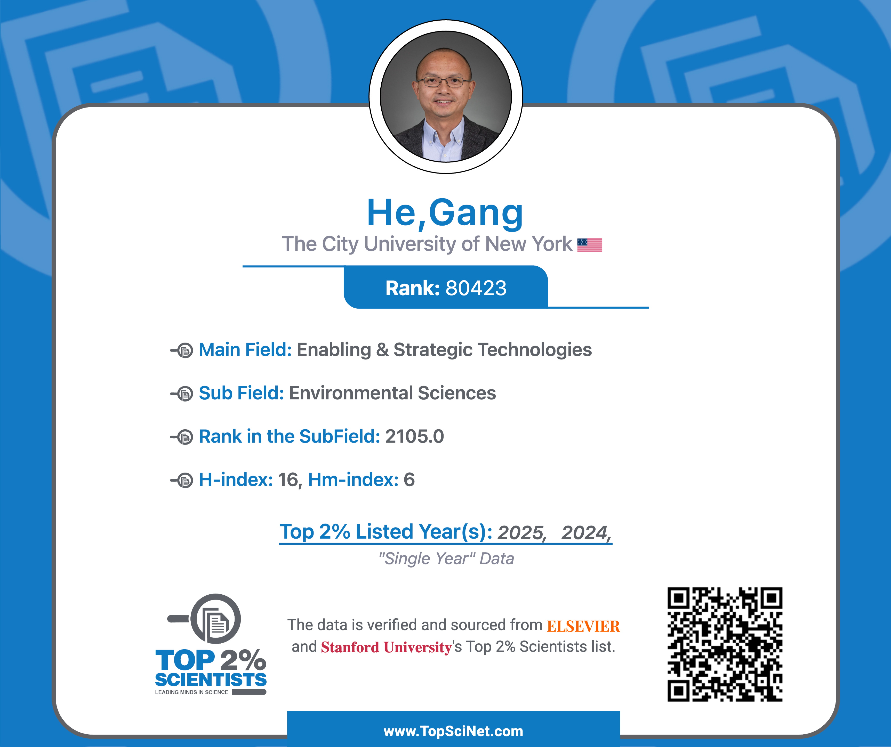

# Included in World’s Top 2% Scientists List 2025

news

recognition

Thank you for supporting our work!

Author

Stanford/Elsevier

Published

September 19, 2025

Grateful to be included in the **[Stanford/Elsevier Top 2% Scientists List 2025](https://topscinet.com/scientist_profile/He,%20Gang/2004/?stype=single_year)**:

- Enabling & Strategic Technologies
  - Environmental Sciences
  - Energy

This is the second time I’ve been included in this list. I want to take a moment to thank my family, current and former students, visiting scholars, mentors, collaborators, funders, editors, reviewers, and colleagues for their invaluable support.

## Related Posts

### [Included in World’s Top 2% Scientists List 2024](../../posts/2024-09-16-stanford-elsevier-top-2percent-scientists/index.llms.md)

Thank you for supporting our work!

Sep 17, 2024

Stanford/Elsevier
