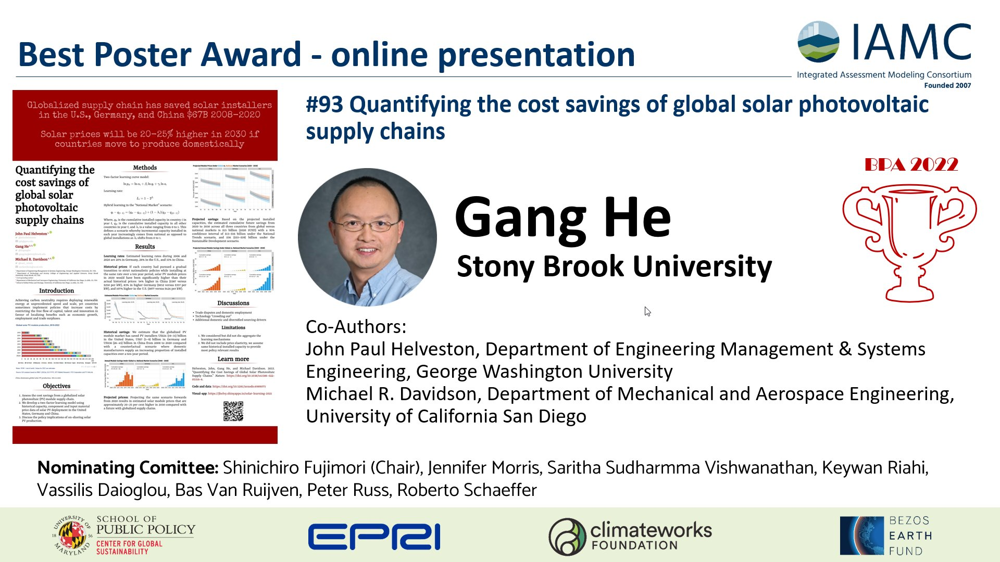

## Summary

During the Fifteenth IAMC Annual Meeting held from 29 November to 1 December 2022, our paper "Quantifying the cost savings of global photovoltaic supply chains" won the "[Best Poster Award](https://www.iamconsortium.org/uncategorized/gang-he-toon-vandyck-mengqi-zhao/)" granted by the Integrated Assessment Modeling Consortium. 368 participants, 191 in person and 177 online, from 29 countries participated the meeting. This award was selected from 144 poster presentations (98 online and 46 in person).^[Source: [IAMC 2022: Conference material and statistics](https://www.iamconsortium.org/iamc-announcements/news-iamc-announcement/iamc-2022-conference-material-and-statistics/).]

## The Poster

{fig-align="left" width=95%}

## Acknowledgment

While I'm the lucky presenter of our collaborative paper, this award should also goes to my wonderful coauthors Dr. [John Helveston](https://www.jhelvy.com/) and Dr. [Michael Davidson](https://www.mdavidson.org), its truly a collaborative effort. Please check their websites and follow them on Twitter/Mastodon to learn more about their amazing work:

<a href="https://twitter.com/JohnHelveston?ref_src=twsrc%5Etfw" class="twitter-follow-button" data-show-count="false">Follow @JohnHelveston</a>

<a href="https://mastodon.social/@jhelvy@fediscience.org/" class="mstdn">jhelvyfediscience.org</a>

<a href="https://twitter.com/east_winds?ref_src=twsrc%5Etfw" class="twitter-follow-button" data-show-count="false">Follow @east_winds</a> 

I also want to thank the nominating committee. Thank you the IAMC community, which has long been an inspiration to work in this field. I hope I will find more opportunities to contribute and payback.

## Twitter Announcement

<blockquote class="twitter-tweet" data-conversation="none">
Two ex-aequo online poster presenters:  🏆<a href="https://twitter.com/DrGangHe?ref_src=twsrc%5Etfw">@DrGangHe</a>, &quot;Quantifying the cost savings of global solar photovoltaic supply chains&quot; <a href="https://t.co/OmPwEMeVEX">pic.twitter.com/OmPwEMeVEX</a>
&mdash; IAMConsortium (@IAMConsortium) <a href="https://twitter.com/IAMConsortium/status/1598658519573544960?ref_src=twsrc%5Etfw">December 2, 2022</a></blockquote> 

## Links

Check [15th IAMC Annual Meeting: Awards](https://www.iamconsortium.org/iamc-announcements/news-iamc-announcement/15th-iamc-annual-meeting-awards/) for the official announcement. 

Read more about the [Best Poster Awardees](https://www.iamconsortium.org/uncategorized/gang-he-toon-vandyck-mengqi-zhao/).

Read more about our [paper](/posts/2022-10-nature-cost-savings-of-global-solar-pv-value-chains/).

Read the paper [summary](/posts/2022-11-nature-solar-paper-summary/).

## IAMC

>The Integrated Assessment Modeling Consortium (IAMC) is an organization of scientific research institutions that pursues scientific understanding of issues associated with integrated assessment modeling and analysis. 
>
>The IAMC was created in 2007 in response to a call from the Intergovernmental Panel on Climate Change (IPCC) for a research organization to lead the integrated assessment modeling community in the development of new scenarios that could be employed by climate modelers in the development of prospective ensemble numerical experiments for both the near term and long term.

More about IAMC: <https://www.iamconsortium.org/about-us/>

<!--Include social share buttons-->


