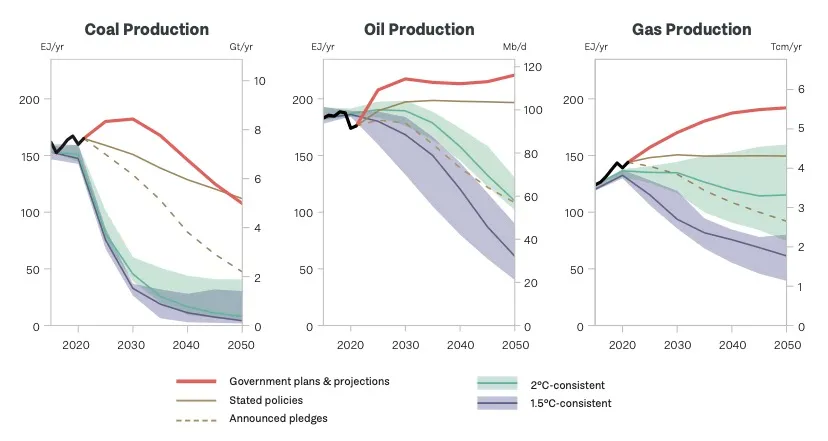
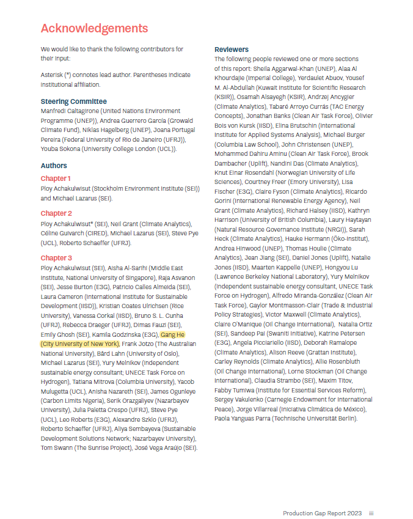

## Summary

>The Production Gap Report tracks the misalignment between governments’ planned and projected production of coal, oil, and gas and the global production levels consistent with the Paris Agreement’s temperature goal. Now, in its fourth edition, this year’s report will feature two major updates to the production gap analysis, drawing on changes in government plans and projections since August 2021 and the new mitigation scenarios database compiled for the Intergovernmental Panel on Climate Change’s Sixth Assessment Report. The report will also provide a more detailed assessment of the global coal, oil, and gas reduction pathways needed to keep the 1.5°C goal in reach.
>
>The report will also feature individual country profiles for 20 major fossil-fuel-producing countries, evaluating governments’ latest climate ambitions and their plans, policies, and strategies that support fossil fuel production or the transition away from it: Australia, Brazil, Canada, China, Colombia, Germany, India, Indonesia, Kazakhstan, Kuwait, Mexico, Nigeria, Norway, Qatar, the Russian Federation, Saudi Arabia, South Africa, the United Arab Emirates, the United States of America, and the United Kingdom of Great Britain and Northern Ireland.
>
>This report is produced by the Stockholm Environment Institute(SEI), Climate Analytics, E3G, the International Institute for Sustainable Development(IISD), and the UN Environment Programme(UNEP).

## Links

Check UNEP [Production Gap Report 2023](https://productiongap.org/2023report/) for the official release. 

## Key messages

>Taken together, government plans and projections would lead to an increase in global coal production until 2030, and in global oil and gas production until at least 2050. This conflicts with government commitments under the Paris Agreement, and clashes with expectations that global demand for coal, oil, and gas will peak within this decade even without new policies.

## Contributors

<!--Include social share buttons-->


