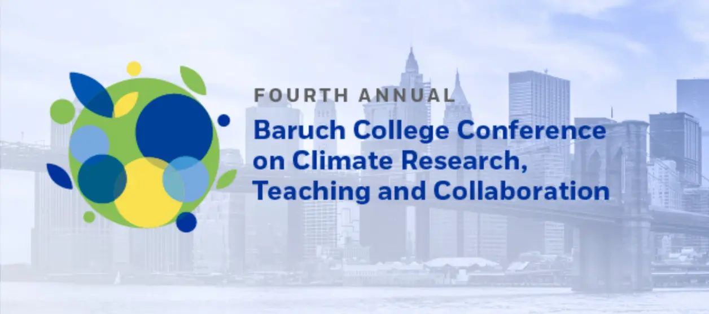

## Fourth Annual Conference on Climate Research, Teaching, and Collaboration

Wednesday, April 15, 2026   
9:30 am – 3:30 pm  
Information and Technology Building  
Rackow Conference Center, Room 750  

**Multidisciplinary Climate Research and Teaching**

>We will highlight the innovative climate research of our Baruch and CUNY faculty from the Austin W. Marxe School of Public and International Affairs, Weissman School of Arts and Sciences, and Zicklin School of Business. 

## Registration

9:30–9:50 am

## Welcome

9:50–10 am

Chester Zarnoch, Weissman School of Arts and Sciences, Baruch College, CUNY

## Group 1: Research Presentations

10–10:45 am

- Extreme heat, occupational segregation, and disparities in older adult disability, Mara Sheftel, Instructor, Department of Health Behavior, Society and Policy, Rutgers University
- Interdisciplinary Collaboration at the Science and Resilience Institute at Jamaica Bay, Brett Branco, Associate Professor, Brooklyn College, CUNY; Director, Science and Resilience, Institute at Jamaica Bay
- The reporting of greenhouse gas emissions: evidence from the GHG protocol scope 2 standard, Svenja Dube, Associate Professor, Stan Ross Dpt. of Accountancy, Zicklin School of Business

## Networking Break

10:45–11:15am

## Group 2: Research Presentations

11:15 am–12:00 pm

- Student and Community Led Research with the NYC Climate Justice Hub, Katherine Silverman, Assistant Director, Sustainability in the Urban Environment, City College of New York, CUNY 
- Watch the label! Consumers’ preferences, willingness to pay and understanding of plant-based food, Patrycja Sleboda, Assistant Professor, Psychology, Weissman School of Arts and Sciences 
- **Balancing Sustainability, Import Dependence & Economic Opportunity in Global vs. National Solar PV Supply Chains, Gange He, Associate Professor, Marxe School of Public and International Affairs**

## Lunch

12:00–1:00 pm

## Group 3: Research Presentations

1:00–2:00 pm

- Building Sustainability Capabilities through Place-Based, Stakeholder-Embedded Learning: Evidence from a Municipal Living Lab in Crete, Greece, Tania Ploumi, Assistant Professor, Narendra Paul Loomba Department of Management, Zicklin School of Business
- Adaptive Strategies for Collaborative Watershed Management, Yixin Liu, Assistant Professor, Marxe School of Public and International Affairs 
- Using 3000 Level Courses to Introduce Students to Graduate Studies: Astrobiology as a case study, Ana Gonzalez-Nayeck, Assistant Professor, Natural Sciences, Weissman School of Arts and Sciences 
- Inspiring student resilience and growth through climate education and program leadership, Brian Haggerty, Adjunct Lecturer, Natural Sciences, Weissman School of Arts and Sciences; Visiting Assistant Professor, Mercy University

## Networking Break

2:00–2:30 pm

## Group 4: Research Presentations

2:30–3:45 pm

- NISAR: Imaging Radar Unveiling the Changing Earth, Kyle McDonald, Professor, Earth and Atmospheric Sciences, City College of New York 
- Pricing Wildfire Risk in Residential Real Estate—Invasive Grass Fire Cycle, Preston Wong, Adjunct Lecturer, William Newman Department of Real Estate, Zicklin School of Business; PhD Student, CUNY Graduate Center
- Beans and Screens, Potatoes and Plastic: Consumption Studies in Writing 2150, Evelyn Adler, Adjunct Professor, English, Weissman School of Arts and Sciences
- Hudson River Park: A Field-Based Site for Urban Climate Research, Beryl Kahn, Research Coordinator, Hudson River Park Trust
- Seawalls & Bulkheads as Habitat Supports Sara Ellen Durand, Associate Professor, Natural Sciences, LaGuardia Community College, CUNY

Welcome to join us to learn more about climate-related activities at CUNY.

## Conference Website

<https://www.baruch.cuny.edu/climateconference/>

<!--Include social share buttons-->


