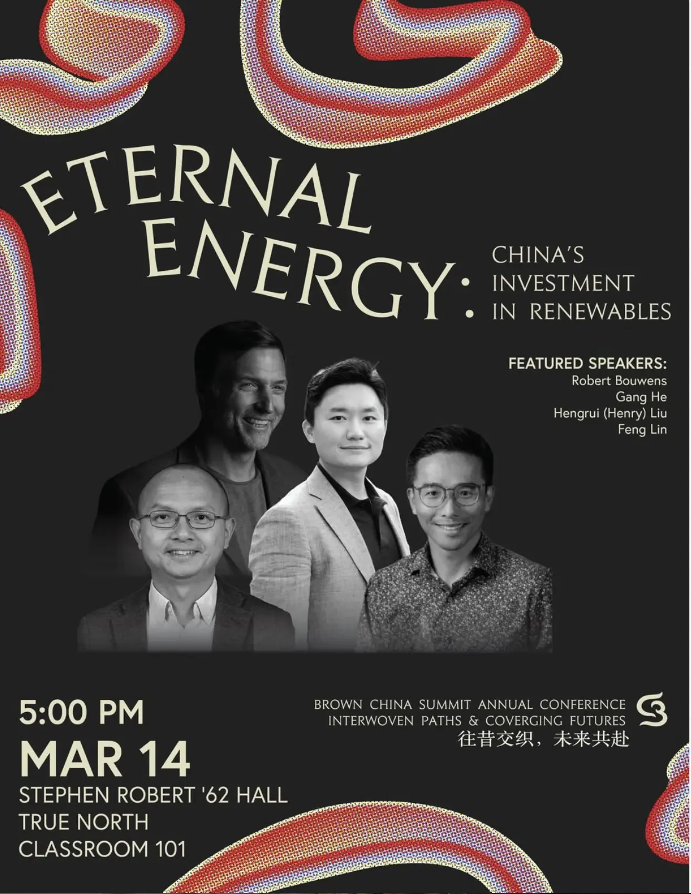

[{fig-align="center"}](https://www.brownchinasummit.org/all-summits/2026-upcoming)

**Renewable Energy Panel: Eternal Energy: China’s Investment in Renewables**

5:00 PM - 6:30 PM

Dr. Gang He, Associate Professor of Energy and Climate Policy at Baruch College, City University of New York

Dr. Feng Lin, Associate Professor of Engineering, Brown University

Dr. Hengrui (Henry) Liu, Postdoctoral Scholar, Tufts University

Robert Bouwens, Head of Global Sales at Siemens Energy

<!--Include social share buttons-->


